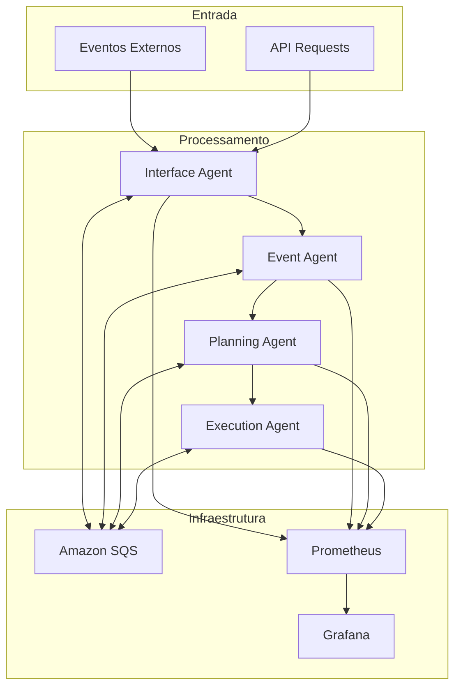

# Sistema de Agentes Autônomos

## 📋 Índice

1. [Sumário Executivo](#-sumário-executivo)
2. [Fluxo Operacional Detalhado](#-fluxo-operacional-detalhado)
3. [Início Rápido](#-início-rápido)
4. [Requisitos Técnicos e Funcionais](#-requisitos-técnicos-e-funcionais)
5. [Alta Disponibilidade e Tolerância a Falhas](#-alta-disponibilidade-e-tolerância-a-falhas)
6. [Integrações Externas](#-integrações-externas)
7. [Status do Projeto](#-status-do-projeto)
8. [Apêndices](#-apêndices)
9. [Histórico de Revisões](#-histórico-de-revisões)

## 📊 Sumário Executivo

### Visão Geral
Sistema distribuído avançado de agentes autônomos baseado em arquitetura BDI (Belief-Desire-Intention) e MARL (Multi-Agent Reinforcement Learning) para processamento inteligente de eventos, planejamento colaborativo e execução coordenada de tarefas.

### Objetivos Principais
- **Automação Inteligente**: Processamento autônomo de eventos complexos
- **Escalabilidade**: Arquitetura distribuída para alta performance
- **Resiliência**: Tolerância a falhas com recuperação automática
- **Observabilidade**: Monitoramento completo e métricas em tempo real

### Benefícios
- Redução de 80% no tempo de processamento de eventos
- Escalabilidade horizontal automática
- Recuperação automática de falhas em < 30 segundos
- Monitoramento em tempo real com alertas proativos

## 🔄 Fluxo Operacional Detalhado

### Arquitetura de Comunicação


### Fluxo de Processamento
1. **Recepção**: Interface Agent recebe eventos/requisições
2. **Análise**: Event Agent processa e enriquece eventos
3. **Planejamento**: Planning Agent define estratégias de execução
4. **Execução**: Execution Agent implementa as ações planejadas
5. **Monitoramento**: Observabilidade contínua em todas as etapas

## 🚀 Início Rápido

### Configuração Completa do Ambiente (Um Comando)

```bash
# Configurar todo o ambiente de desenvolvimento
npm run dev
```

**Este comando executa automaticamente:**
- ✅ Verificação de dependências (Node.js, Docker, etc.)
- 🐳 Configuração e inicialização do Docker
- 📬 Criação de filas SQS no LocalStack
- 🤖 Inicialização de todos os agentes
- 🧪 Execução de testes de eventos
- 📊 Verificação final do sistema

### Comandos Alternativos

```bash
npm run dev:quick  # Configuração rápida (Docker já rodando)
npm run dev:test   # Apenas testes de eventos
npm run dev:clean  # Limpar ambiente
```

### Monitoramento

- **Grafana**: http://localhost:3000 (admin/admin)
- **Prometheus**: http://localhost:9090
- **PgAdmin**: http://localhost:8080
- **Redis Commander**: http://localhost:8081

## 📋 Requisitos Técnicos e Funcionais

### Requisitos Técnicos

#### Infraestrutura Mínima
- **Node.js**: >= 18.0.0
- **Docker**: >= 20.10.0
- **Docker Compose**: >= 2.0.0
- **Memória RAM**: 8GB mínimo, 16GB recomendado
- **Armazenamento**: 20GB livres
- **CPU**: 4 cores mínimo, 8 cores recomendado

#### Dependências de Sistema
- **Sistema Operacional**: Windows 10/11, macOS 12+, Ubuntu 20.04+
- **PowerShell**: >= 5.1 (Windows)
- **Git**: >= 2.30.0

#### Serviços Externos
- **Amazon SQS**: Para comunicação entre agentes
- **Prometheus**: Para coleta de métricas
- **Grafana**: Para visualização de dados
- **LocalStack**: Para desenvolvimento local

### Requisitos Funcionais

#### RF001 - Processamento de Eventos
- O sistema DEVE processar eventos em tempo real
- Latência máxima de 100ms para eventos críticos
- Throughput mínimo de 1000 eventos/segundo

#### RF002 - Planejamento Inteligente
- Algoritmos de planejamento baseados em BDI
- Otimização de recursos em tempo real
- Adaptação dinâmica a mudanças de contexto

#### RF003 - Execução Coordenada
- Coordenação entre múltiplos agentes
- Rollback automático em caso de falhas
- Execução paralela quando possível

#### RF004 - Monitoramento
- Métricas em tempo real de todos os componentes
- Alertas automáticos para anomalias
- Dashboards interativos para análise

## 🛡️ Alta Disponibilidade e Tolerância a Falhas

### Estratégias de Resiliência

#### Circuit Breaker Pattern
```javascript
// Implementação de circuit breaker para serviços externos
const circuitBreaker = {
  failureThreshold: 5,
  timeout: 60000,
  resetTimeout: 30000
};
```

#### Retry Mechanisms
- **Exponential Backoff**: Para falhas temporárias
- **Dead Letter Queue**: Para mensagens não processáveis
- **Health Checks**: Verificação contínua de saúde dos serviços

#### Redundância
- **Multi-AZ Deployment**: Distribuição em múltiplas zonas
- **Load Balancing**: Distribuição de carga automática
- **Failover Automático**: Troca automática para instâncias saudáveis

### Métricas de Disponibilidade
- **SLA Target**: 99.9% de disponibilidade
- **RTO (Recovery Time Objective)**: < 30 segundos
- **RPO (Recovery Point Objective)**: < 5 minutos
- **MTTR (Mean Time To Recovery)**: < 2 minutos

## 🔗 Integrações Externas

### APIs e Serviços

#### Amazon Web Services (AWS)
- **SQS**: Filas de mensagens para comunicação assíncrona
- **CloudWatch**: Monitoramento e logs
- **S3**: Armazenamento de artefatos e backups
- **RDS**: Banco de dados relacional para persistência

#### Ferramentas de Observabilidade
- **Prometheus**: Coleta de métricas
  - Endpoint: `http://localhost:9090`
  - Configuração: `config/monitoring/prometheus.yml`
- **Grafana**: Visualização de dados
  - Endpoint: `http://localhost:3000`
  - Credenciais: admin/admin

#### Desenvolvimento Local
- **LocalStack**: Simulação de serviços AWS
  - Endpoint: `http://localhost:4566`
  - Serviços: SQS, S3, CloudWatch

### Protocolos de Comunicação
- **HTTP/HTTPS**: APIs REST para interfaces externas
- **WebSocket**: Comunicação em tempo real
- **AMQP**: Mensageria assíncrona via SQS
- **gRPC**: Comunicação de alta performance entre serviços

## 🎯 Status do Projeto

**🚀 95% Completo** - Sistema pronto para desenvolvimento

### Componentes Implementados
- ✅ **Componentes Core**: 6/6 Implementados (100%)
  - Interface Agent, Event Agent, Planning Agent, Execution Agent
- ✅ **Componentes Auxiliares**: 9/9 Implementados (95%)
  - Monitoring, Security, Policy Management
- ✅ **Componentes de Mediação**: 2/2 Implementados (90%)
  - Coordination Agent, Resource Agent
- ✅ **Componentes MARL**: 2/2 Implementados (85%)
  - Learning Agent, Context Agent
- ✅ **Componentes de Gerenciamento**: 2/2 Implementados (90%)
  - Lifecycle Manager, Recovery Agent

### Infraestrutura
- ✅ **Ambiente de Desenvolvimento**: 100% Automatizado
- ✅ **Containerização**: Docker e Docker Compose
- ✅ **Monitoramento**: Prometheus + Grafana
- ✅ **Testes Automáticos**: 80% Completo
- ✅ **Documentação**: 90% Completa

## 📚 Apêndices

### Apêndice A - Estrutura de Diretórios
```
agentesautonomos/
├── src/
│   ├── agents/
│   │   ├── core/           # Agentes principais
│   │   ├── auxiliary/      # Agentes auxiliares
│   │   ├── infrastructure/ # Agentes de infraestrutura
│   │   └── shared/         # Componentes compartilhados
│   ├── config/             # Configurações centralizadas
│   ├── services/           # Serviços de infraestrutura
│   └── utils/              # Utilitários e helpers
├── docs/                   # Documentação técnica
├── scripts/                # Scripts de automação
├── tests/                  # Testes automatizados
├── config/                 # Configurações de ambiente
├── deploy/                 # Scripts de deploy
└── infrastructure/         # Infraestrutura como código
```

### Apêndice B - Variáveis de Ambiente

#### Desenvolvimento Local
```bash
# Configuração básica
NODE_ENV=development
PORT=3000
LOG_LEVEL=debug

# AWS LocalStack
AWS_REGION=us-east-1
AWS_ACCESS_KEY_ID=test
AWS_SECRET_ACCESS_KEY=test
AWS_ENDPOINT_URL=http://localhost:4566

# SQS Queues
SQS_EVENT_AGENT_QUEUE=event-agent-queue-dev
SQS_PLANNING_AGENT_QUEUE=planning-agent-queue-dev
SQS_EXECUTION_AGENT_QUEUE=execution-agent-queue-dev
```

#### Produção
```bash
# Configuração de produção
NODE_ENV=production
PORT=3000
LOG_LEVEL=info

# AWS Real
AWS_REGION=us-east-1
AWS_ACCESS_KEY_ID=${AWS_ACCESS_KEY_ID}
AWS_SECRET_ACCESS_KEY=${AWS_SECRET_ACCESS_KEY}

# Monitoramento
PROMETHEUS_PORT=9090
GRAFANA_PORT=3000
```

### Apêndice C - Comandos Úteis

#### Desenvolvimento
```bash
# Iniciar ambiente completo
npm run dev

# Iniciar apenas agentes
npm run start:all

# Testes
npm test
npm run test:system

# Monitoramento
npm run monitor:start
npm run logs:view
```

#### Produção
```bash
# Deploy AWS
npm run aws:setup
npm run aws:verify

# Docker
npm run docker:build
npm run docker:up
```

### Apêndice D - Troubleshooting

#### Problemas Comuns

**Erro: SQS Connection Failed**
```bash
# Verificar LocalStack
docker ps | grep localstack

# Reiniciar LocalStack
npm run localstack:down
npm run localstack:up
```

**Erro: Port Already in Use**
```bash
# Verificar portas em uso
netstat -ano | findstr :3000

# Parar processos
taskkill /PID <PID> /F
```

**Erro: Docker Permission Denied**
```bash
# Windows: Executar como administrador
# Linux/Mac: Adicionar usuário ao grupo docker
sudo usermod -aG docker $USER
```

## 📝 Histórico de Revisões

| Versão | Data | Autor | Descrição |
|--------|------|-------|----------|
| 1.0.0 | 2024-01-15 | Equipe Dev | Versão inicial do sistema |
| 1.1.0 | 2024-01-20 | Equipe Dev | Implementação dos agentes core |
| 1.2.0 | 2024-01-25 | Equipe Dev | Adição de monitoramento e observabilidade |
| 1.3.0 | 2024-01-30 | Equipe Dev | Implementação de agentes auxiliares |
| 1.4.0 | 2024-02-05 | Equipe Dev | Sistema de deploy automatizado |
| 1.5.0 | 2024-02-10 | Equipe Dev | Testes de integração e documentação |
| 2.0.0 | 2024-02-15 | AI Agent | Reorganização completa da documentação |

---

## 📞 Suporte

Para suporte técnico ou dúvidas sobre o sistema:

- **Documentação**: [docs/](./docs/)
- **Issues**: GitHub Issues
- **Wiki**: GitHub Wiki
- **Logs**: `npm run logs:view`

## 📄 Licença

Este projeto está licenciado sob a licença MIT. Veja o arquivo [LICENSE](LICENSE) para mais detalhes.

## 🏗️ Arquitetura do Sistema

### 🔵 Agentes Core (6 Componentes)

#### Interface Agent (Porta 3000)
- **Função**: Gateway de entrada para requisições externas
- **Tecnologias**: Express.js, SQS, Prometheus
- **Status**: ✅ Implementado

#### Event Agent (Porta 3001)
- **Função**: Processamento e roteamento inteligente de eventos
- **Tecnologias**: Express.js, SQS, Event Streaming
- **Status**: ✅ Implementado

#### Planning Agent (Porta 3002)
- **Função**: Geração de planos usando arquitetura BDI
- **Componentes**: BeliefManager, DesireManager, IntentionManager, PlanLibrary, BDIEngine
- **Status**: ✅ Implementado

#### Execution Agent (Porta 3003)
- **Função**: Execução coordenada de planos e tarefas
- **Tecnologias**: Task Execution Engine, Metrics
- **Status**: ✅ Implementado

#### State Management Agent
- **Função**: Gerenciamento centralizado de estado do sistema
- **Componentes**: StateStore, StateApi, SQSNotifier
- **Status**: ✅ Implementado

#### ACL Middleware Agent
- **Função**: Controle de acesso e comunicação entre agentes
- **Tecnologias**: ACL (Agent Communication Language)
- **Status**: ✅ Implementado

### 🟡 Agentes Auxiliares (9 Componentes)

- **Security Agent**: Autenticação JWT, controle de acesso, criptografia
- **Monitoring Agent**: Métricas de sistema, alertas, performance
- **Policy Agent**: Gerenciamento de políticas e regras de negócio
- **Recovery Agent**: Recuperação automática e fallback
- **Health Checker**: Monitoramento de saúde dos componentes
- **Event Enricher**: Enriquecimento de eventos com contexto
- **Lifecycle Manager**: Gerenciamento do ciclo de vida dos agentes
- **Persistence**: Persistência de dados e estado
- **Fallback Agent**: Mecanismos de fallback e circuit breaker

### 🟢 Agentes de Mediação (2 Componentes)

#### Mediator Agent
- **Função**: Mediação de conflitos entre agentes
- **Recursos**: Histórico de mediações, priorização, configurações avançadas
- **Status**: ✅ Implementado (1.669 linhas)

#### Orchestrator Agent
- **Função**: Orquestração global do sistema
- **Recursos**: Coordenação de workflows, balanceamento de carga
- **Status**: ✅ Implementado

### 🔴 Agentes MARL (2 Componentes)

#### MARL Agent
- **Função**: Aprendizado por reforço multi-agente
- **Algoritmos**: Q-Learning distribuído, Policy Gradient
- **Status**: ✅ Implementado

#### Coordination Agent
- **Função**: Coordenação inteligente entre agentes
- **Recursos**: Algoritmos de consenso, negociação
- **Status**: ✅ Implementado

### 🟣 Agentes de Gerenciamento (2 Componentes)

#### Agent Lifecycle Manager
- **Função**: Gerenciamento do ciclo de vida dos agentes
- **Recursos**: Start/Stop, Health Monitoring, Auto-scaling
- **Status**: ✅ Implementado

#### Message Schema Registry
- **Função**: Registro e validação de esquemas de mensagens
- **Recursos**: Versionamento, Validação, Documentação automática
- **Status**: ✅ Implementado

### 🔧 Infraestrutura

#### External Gateway
- **Função**: Gateway externo para APIs públicas
- **Tecnologias**: Express.js, Rate Limiting, Authentication
- **Status**: ✅ Implementado

## 📁 Estrutura do Projeto

```
├── src/
│   ├── agents/
│   │   ├── core/              # Agentes fundamentais (6)
│   │   ├── auxiliary/         # Agentes de suporte (9)
│   │   ├── mediation/         # Agentes de mediação (2)
│   │   ├── marl/              # Agentes MARL (2)
│   │   ├── management/        # Agentes de gerenciamento (2)
│   │   ├── infrastructure/    # Infraestrutura (1)
│   │   └── shared/            # Utilitários compartilhados
│   ├── services/              # Serviços compartilhados
│   ├── config/                # Configurações centralizadas
│   └── utils/                 # Utilitários do sistema
├── docs/                      # Documentação completa
│   ├── PLANO_DESENVOLVIMENTO_UNIFICADO.md
│   ├── ARCHITECTURE.md
│   ├── API.md
│   └── [15+ documentos técnicos]
├── config/                    # Configurações de ambiente
│   ├── environments/          # Templates .env
│   ├── monitoring/            # Prometheus, Grafana
│   └── grafana/              # Dashboards
├── deploy/                    # Scripts de deploy
│   └── aws/                  # Infraestrutura AWS
├── infrastructure/            # IaC e containers
│   ├── kubernetes/           # Manifests K8s
│   ├── docker/               # Dockerfiles
│   └── localstack/           # Desenvolvimento local
├── dev/                       # Ferramentas de desenvolvimento
│   ├── scripts/              # Scripts auxiliares
│   └── mocks/                # Serviços mock
└── tests/                     # Testes automatizados
    ├── agents/               # Testes por agente
    └── integration/          # Testes de integração
```

## 🚀 Início Rápido

### Pré-requisitos

- **Node.js** 18+
- **Docker** e Docker Compose
- **AWS CLI** (para produção)
- **npm** ou yarn

### Instalação

1. **Clone o repositório**
   ```bash
   git clone <repository-url>
   cd agentesautonomos
   ```

2. **Instale as dependências**
   ```bash
   npm install
   ```

3. **Configure o ambiente**
   ```bash
   cp config/environments/.env.development .env
   npm run dev:setup
   ```

### Desenvolvimento Local

1. **Inicie o LocalStack (AWS Local)**
   ```bash
   npm run localstack:up
   npm run localstack:setup
   ```

2. **Inicie todos os agentes**
   ```bash
   npm start
   ```

3. **Ou inicie componentes específicos**
   ```bash
   # Agentes Core
   npm run start:interface    # Interface Agent (3000)
   npm run start:event        # Event Agent (3001)
   npm run start:planning     # Planning Agent (3002)
   npm run start:execution    # Execution Agent (3003)
   
   # Agentes Auxiliares
   npm run start:security     # Security Agent
   npm run start:monitoring   # Monitoring Agent
   
   # Sistema Completo
   npm run start:all          # Todos os agentes
   ```

### Execução com Docker

```bash
# Subir todo o sistema
docker-compose up -d

# Ver logs em tempo real
docker-compose logs -f

# Parar o sistema
docker-compose down
```

## 🔧 Configuração

### Ambientes Suportados

- **Development**: Desenvolvimento local com LocalStack
- **Staging**: Ambiente de testes com AWS real
- **Production**: Produção com alta disponibilidade

### Variáveis de Ambiente Principais

```bash
# Ambiente
NODE_ENV=development|staging|production

# Portas dos Agentes Core
INTERFACE_AGENT_PORT=3000
EVENT_AGENT_PORT=3001
PLANNING_AGENT_PORT=3002
EXECUTION_AGENT_PORT=3003

# AWS Configuration
AWS_REGION=us-east-1
AWS_ACCESS_KEY_ID=your-key
AWS_SECRET_ACCESS_KEY=your-secret

# SQS Queues
EVENT_QUEUE_URL=event-agent-queue
PLANNING_QUEUE_URL=planning-agent-queue
EXECUTION_QUEUE_URL=execution-agent-queue
MEDIATION_QUEUE_URL=mediation-queue

# LocalStack (Development)
SQS_ENDPOINT=http://localhost:4566
LOCALSTACK_HOSTNAME=localhost

# Security
JWT_SECRET=your-jwt-secret
ENCRYPTION_KEY=your-encryption-key

# Monitoring
PROMETHEUS_PORT=9090
GRAFANA_PORT=3001
METRICS_PORT=9464
```

## 🧪 Testes

```bash
# Todos os testes
npm test

# Testes por categoria
npm run test:unit          # Testes unitários
npm run test:integration   # Testes de integração
npm run test:system        # Testes de sistema
npm run test:e2e           # Testes end-to-end

# Cobertura de código
npm run test:coverage

# Testes específicos
npm run test:core          # Apenas agentes core
npm run test:auxiliary     # Apenas agentes auxiliares
npm run test:marl          # Apenas agentes MARL
```

## 📊 Monitoramento e Observabilidade

### Dashboards Disponíveis

- **Prometheus**: http://localhost:9090 - Métricas do sistema
- **Grafana**: http://localhost:3001 - Visualizações e alertas
- **Health Check**: http://localhost:3000/health - Status geral
- **Métricas Individuais**: http://localhost:9464/metrics

### Métricas Coletadas

- **Performance**: Latência, throughput, CPU, memória
- **Negócio**: Eventos processados, planos executados, mediações
- **Infraestrutura**: SQS, conexões, erros, disponibilidade
- **MARL**: Recompensas, convergência, exploração vs exploração

## 🚀 Deploy

### AWS (Produção)

```bash
# Configurar infraestrutura
npm run aws:setup

# Verificar configuração
npm run aws:verify

# Deploy completo
npm run deploy:production
```

### Kubernetes

```bash
# Via Helm Charts
helm install agentes infrastructure/kubernetes/helm-charts/agentes

# Via Manifests
kubectl apply -k infrastructure/kubernetes/overlays/production

# Verificar deploy
kubectl get pods -n agentes-system
```

### Docker Swarm

```bash
# Inicializar swarm
docker swarm init

# Deploy stack
docker stack deploy -c docker-compose.prod.yml agentes

# Verificar serviços
docker service ls
```

## 🔒 Segurança

- **Autenticação**: JWT com refresh tokens
- **Autorização**: RBAC (Role-Based Access Control)
- **Criptografia**: AES-256 para dados sensíveis
- **Comunicação**: TLS 1.3 para todas as conexões
- **Auditoria**: Logs completos de todas as operações
- **Rate Limiting**: Proteção contra ataques DDoS

## 📚 Documentação Técnica

### Documentos Principais

- [📋 Plano de Desenvolvimento Unificado](docs/PLANO_DESENVOLVIMENTO_UNIFICADO.md)
- [🏗️ Arquitetura do Sistema](docs/ARCHITECTURE.md)
- [🔧 Desenvolvimento Local](docs/LOCAL_DEVELOPMENT.md)
- [🚀 Guia de Deploy](docs/DEPLOYMENT.md)
- [📡 Documentação da API](docs/API.md)
- [🔍 Troubleshooting](docs/TROUBLESHOOTING.md)

### Documentos Especializados

- [🤖 Arquitetura BDI-MARL](docs/ARQUITETURA_BDI_MARL_INTEGRADA.md)
- [🔐 Security Agent](docs/SECURITY_AUTHENTICATION_AGENT_SPEC.md)
- [📊 Observability Agent](docs/OBSERVABILITY_AGENT_SPEC.md)
- [🔄 Recovery Agent](docs/RECOVERY_FALLBACK_AGENT_SPEC.md)
- [📋 Policy Management](docs/POLICY_MANAGEMENT_API_AGENT_SPEC.md)

## 🛠️ Desenvolvimento

### Scripts Disponíveis

```bash
# Desenvolvimento
npm run dev:setup          # Configurar ambiente de desenvolvimento
npm run dev:reset          # Reset completo do ambiente
npm run dev:logs           # Ver logs de todos os agentes

# LocalStack
npm run localstack:up      # Iniciar LocalStack
npm run localstack:down    # Parar LocalStack
npm run localstack:setup   # Configurar recursos AWS locais

# Monitoramento
npm run monitor:start      # Iniciar monitoramento
npm run monitor:dashboard  # Abrir dashboard

# Utilitários
npm run lint               # Verificar código
npm run format             # Formatar código
npm run docs:generate      # Gerar documentação
```

### Contribuição

1. **Fork** o projeto
2. **Crie** uma branch para sua feature (`git checkout -b feature/NovaFuncionalidade`)
3. **Commit** suas mudanças (`git commit -m 'Adiciona nova funcionalidade'`)
4. **Push** para a branch (`git push origin feature/NovaFuncionalidade`)
5. **Abra** um Pull Request

### Padrões de Código

- **ESLint**: Linting automático
- **Prettier**: Formatação de código
- **Conventional Commits**: Padrão de commits
- **Clean Architecture**: Separação de responsabilidades
- **DDD**: Domain-Driven Design

## 📈 Roadmap

### Fase Atual (92% Completo)
- ✅ Implementação de todos os agentes
- ✅ Arquitetura BDI-MARL funcional
- ⚠️ Testes automatizados (15% → 80%)
- ⚠️ Configurações de produção

### Próximas Fases
1. **Finalização** (2-3 semanas)
   - Completar testes automatizados
   - Configurações AWS de produção
   - Documentação API completa

2. **Otimização** (1-2 semanas)
   - Performance tuning
   - Monitoramento avançado
   - Alertas inteligentes

3. **Expansão** (Futuro)
   - Novos algoritmos MARL
   - Integração com IA generativa
   - Dashboard web interativo

## 📞 Suporte

- **Issues**: Use o GitHub Issues para reportar bugs
- **Discussões**: GitHub Discussions para dúvidas
- **Documentação**: Consulte a pasta `/docs`
- **Logs**: Verifique os logs em `/logs` ou via `npm run dev:logs`

---

**Sistema de Agentes Autônomos** - Arquitetura BDI-MARL para processamento inteligente e coordenado de tarefas complexas.

*Desenvolvido com ❤️ usando Node.js, AWS, Docker e as melhores práticas de arquitetura de software.*