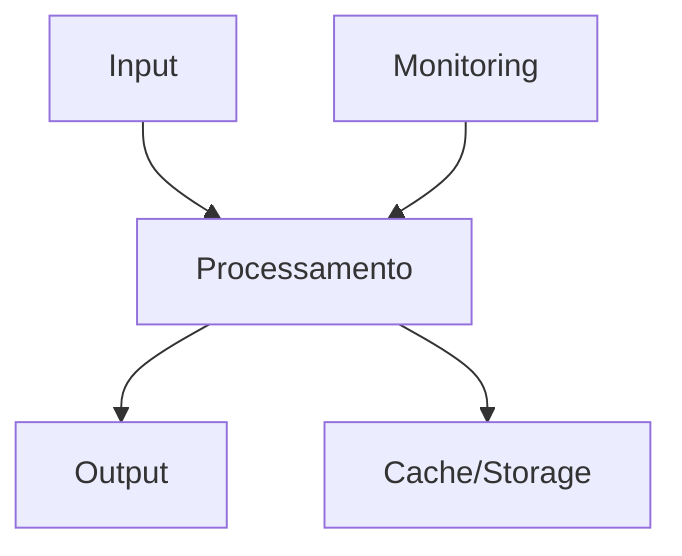

# [Nome do Agente] Agent

## 📋 Visão Geral

Descrição concisa do agente, seu propósito principal e como ele se encaixa na arquitetura geral do sistema.

**Tipo**: [Core/Auxiliary/Infrastructure/Management/MARL/Mediation]
**Categoria**: [Categoria específica]
**Status**: [Ativo/Em Desenvolvimento/Deprecated]
**Versão**: [Versão atual]

## 🚀 Funcionalidades Principais

### 🔧 [Funcionalidade 1]
- Descrição detalhada da funcionalidade
- Casos de uso específicos
- Benefícios e valor agregado

### 📊 [Funcionalidade 2]
- Descrição detalhada da funcionalidade
- Casos de uso específicos
- Benefícios e valor agregado

### 🔍 [Funcionalidade 3]
- Descrição detalhada da funcionalidade
- Casos de uso específicos
- Benefícios e valor agregado

## 🏗️ Arquitetura

### Componentes Principais

```
[Nome do Agente]/
├── index.js                 # Ponto de entrada principal
├── config/
│   └── [agente]Config.js    # Configurações específicas
├── services/
│   ├── [servico1].js        # Serviço principal
│   ├── [servico2].js        # Serviço auxiliar
│   └── [servico3].js        # Serviço de integração
├── routes/
│   └── [agente]Routes.js    # Rotas da API REST
├── middleware/
│   └── [middleware].js      # Middlewares específicos
├── tests/
│   ├── unit/                # Testes unitários
│   └── integration/         # Testes de integração
└── README.md               # Esta documentação
```

### Diagrama de Arquitetura



### Fluxo de Dados

1. **Entrada**: Descrição do que o agente recebe
2. **Processamento**: Como os dados são processados
3. **Saída**: O que o agente produz
4. **Persistência**: Como os dados são armazenados (se aplicável)

## ⚙️ Configuração

### Variáveis de Ambiente

| Variável | Descrição | Padrão | Obrigatória |
|----------|-----------|--------|-------------|
| `[AGENTE]_PORT` | Porta do serviço | `3000` | Não |
| `[AGENTE]_LOG_LEVEL` | Nível de log | `info` | Não |
| `[AGENTE]_CACHE_TTL` | TTL do cache (segundos) | `300` | Não |

### Arquivo de Configuração

```javascript
// config/[agente]Config.js
module.exports = {
  port: process.env.[AGENTE]_PORT || 3000,
  logLevel: process.env.[AGENTE]_LOG_LEVEL || 'info',
  cache: {
    ttl: parseInt(process.env.[AGENTE]_CACHE_TTL) || 300
  },
  // Outras configurações específicas
};
```

## 🔌 API

### Endpoints Principais

#### GET /health
Verifica a saúde do agente

**Response:**
```json
{
  "status": "healthy",
  "timestamp": "2024-02-15T10:30:00Z",
  "version": "1.0.0",
  "uptime": 3600
}
```

#### POST /[endpoint-principal]
Descrição do endpoint principal

**Request:**
```json
{
  "campo1": "valor1",
  "campo2": "valor2"
}
```

**Response:**
```json
{
  "resultado": "processado",
  "id": "uuid-gerado",
  "timestamp": "2024-02-15T10:30:00Z"
}
```

### Códigos de Status

| Código | Descrição |
|--------|----------|
| 200 | Sucesso |
| 400 | Requisição inválida |
| 500 | Erro interno |
| 503 | Serviço indisponível |

## 📦 Instalação e Execução

### Pré-requisitos

- Node.js >= 16.0.0
- npm >= 8.0.0
- [Outros pré-requisitos específicos]

### Instalação

```bash
# Navegar para o diretório do agente
cd src/agents/[categoria]/[nome-agente]

# Instalar dependências
npm install

# Configurar variáveis de ambiente
cp .env.example .env
# Editar .env com suas configurações
```

### Execução

```bash
# Desenvolvimento
npm run dev

# Produção
npm start

# Com Docker
docker build -t [nome-agente] .
docker run -p 3000:3000 [nome-agente]
```

## 🧪 Testes

### Executar Testes

```bash
# Todos os testes
npm test

# Testes unitários
npm run test:unit

# Testes de integração
npm run test:integration

# Cobertura
npm run test:coverage
```

### Estrutura de Testes

```
tests/
├── unit/
│   ├── services/
│   └── utils/
├── integration/
│   ├── api/
│   └── workflows/
└── fixtures/
    └── sample-data.json
```

## 📊 Monitoramento

### Métricas Coletadas

- **Performance**: Tempo de resposta, throughput
- **Disponibilidade**: Uptime, health checks
- **Erros**: Taxa de erro, tipos de erro
- **Recursos**: CPU, memória, I/O

### Dashboards

- **Grafana**: Dashboard específico do agente
- **Prometheus**: Métricas detalhadas
- **Logs**: Agregação via ELK Stack

### Alertas

| Métrica | Threshold | Ação |
|---------|-----------|------|
| Tempo de resposta | > 5s | Alerta |
| Taxa de erro | > 5% | Alerta crítico |
| CPU | > 80% | Investigar |
| Memória | > 90% | Alerta |

## 🔧 Troubleshooting

### Problemas Comuns

#### Agente não inicia

**Sintomas**: Erro ao inicializar o serviço

**Possíveis causas**:
- Porta já em uso
- Configuração inválida
- Dependências não instaladas

**Solução**:
```bash
# Verificar porta
netstat -tulpn | grep :3000

# Verificar configuração
npm run config:validate

# Reinstalar dependências
rm -rf node_modules package-lock.json
npm install
```

#### Performance degradada

**Sintomas**: Tempo de resposta alto

**Possíveis causas**:
- Cache inválido
- Sobrecarga de memória
- Problemas de rede

**Solução**:
```bash
# Limpar cache
npm run cache:clear

# Verificar métricas
npm run metrics:check

# Reiniciar serviço
npm run restart
```

### Logs Úteis

```bash
# Logs em tempo real
npm run logs:tail

# Logs de erro
npm run logs:error

# Logs de debug
DEBUG=* npm start
```

## 🔗 Dependências

### Agentes Relacionados

- **[Agente A]**: Descrição da relação
- **[Agente B]**: Descrição da relação
- **[Agente C]**: Descrição da relação

### Serviços Externos

- **SQS**: Comunicação assíncrona
- **Redis**: Cache distribuído
- **PostgreSQL**: Persistência de dados

## 📚 Referências

- [Documentação da Arquitetura](../ARCHITECTURE.md)
- [Guia de Desenvolvimento](../DEVELOPMENT.md)
- [API Reference](../api/)
- [Troubleshooting Geral](../TROUBLESHOOTING.md)

---

**Última Atualização**: [Data]
**Versão da Documentação**: [Versão]
**Responsável**: [Nome/Equipe]