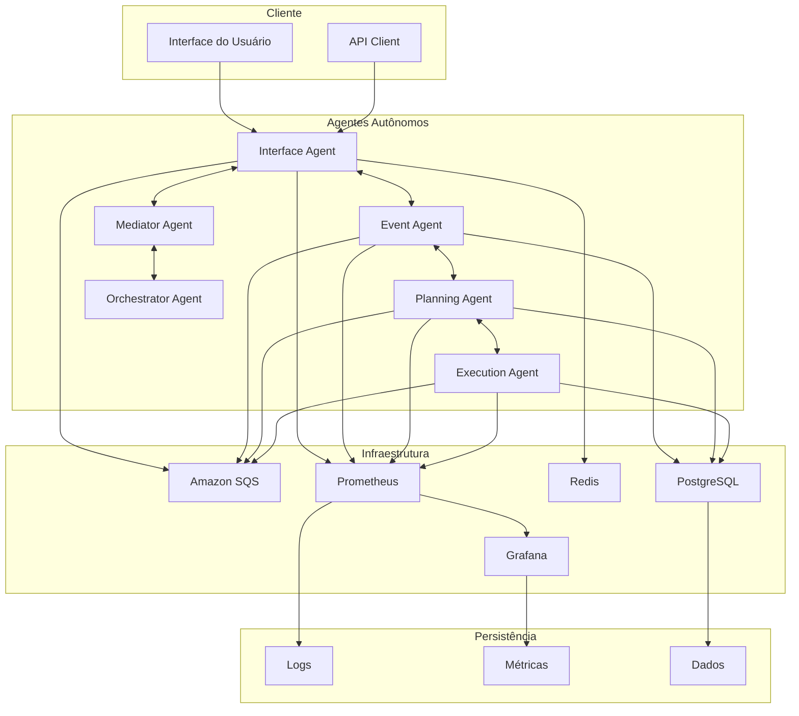
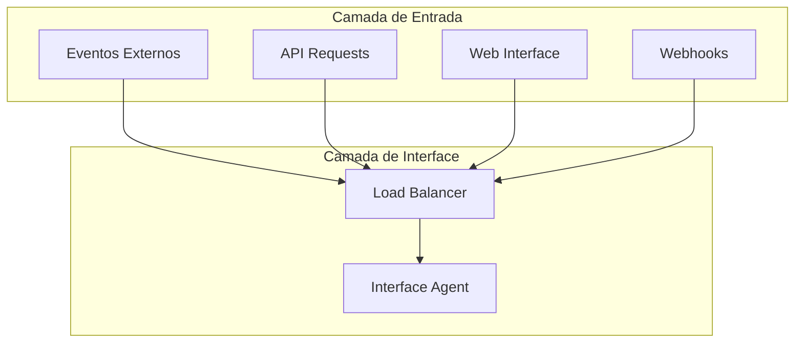
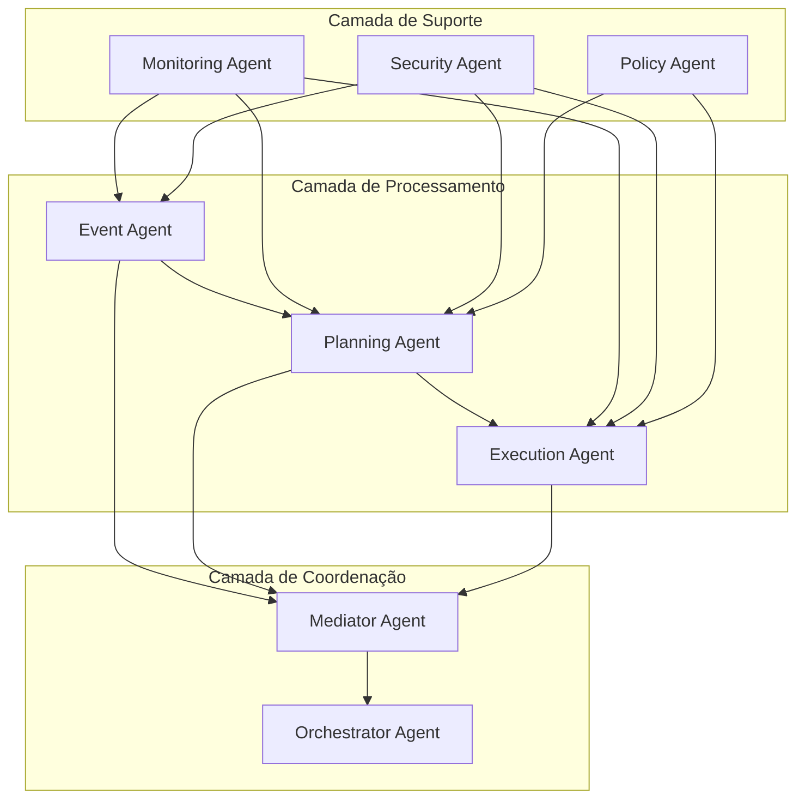
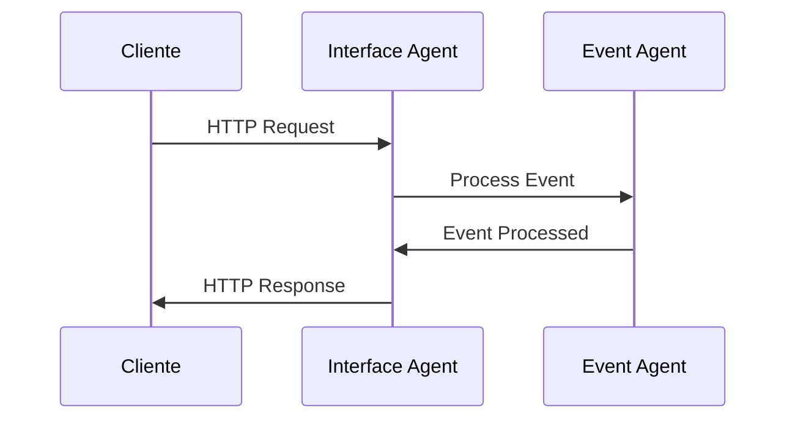
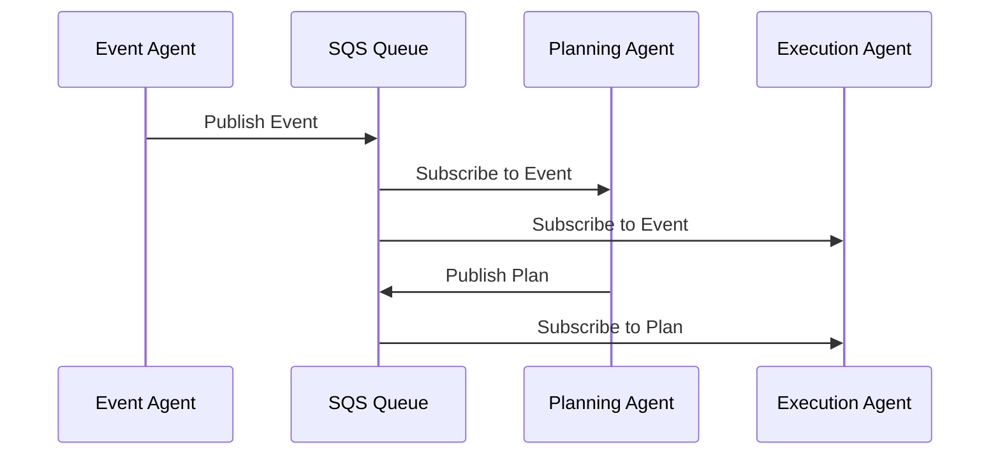
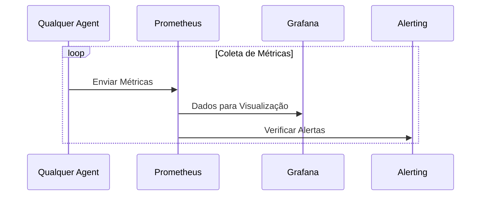
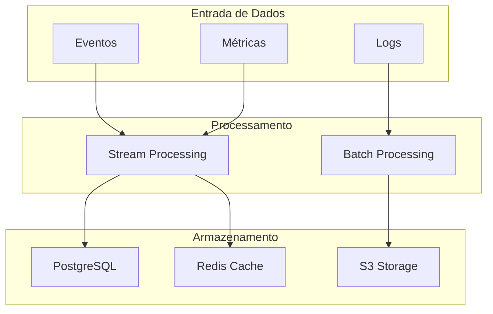

# 🏗️ Arquitetura - Sistema de Agentes Autônomos

Este documento descreve a arquitetura técnica completa do sistema de agentes autônomos, incluindo componentes, padrões de comunicação, fluxos de dados, infraestrutura e decisões de design.

## 📋 Índice

- [Visão Geral](#visão-geral)
- [Princípios Arquiteturais](#princípios-arquiteturais)
- [Componentes Principais](#componentes-principais)
- [Topologia da Arquitetura](#topologia-da-arquitetura)
- [Padrões de Comunicação](#padrões-de-comunicação)
- [Fluxos de Dados](#fluxos-de-dados)
- [Infraestrutura](#infraestrutura)
- [Segurança](#segurança)
- [Escalabilidade](#escalabilidade)
- [Monitoramento](#monitoramento)
- [Decisões de Design](#decisões-de-design)

## 🌐 Visão Geral

### Arquitetura de Alto Nível

O sistema implementa uma arquitetura distribuída baseada em agentes autônomos que colaboram para processar eventos, planejar ações e executar tarefas de forma coordenada.



## 🎯 Princípios Arquiteturais

### Event-Driven Architecture (EDA)
O sistema é fundamentalmente baseado em eventos, onde cada ação gera eventos que são processados de forma assíncrona pelos agentes especializados.

### Microserviços Autônomos
Cada agente opera como um microserviço independente com:
- **Responsabilidade única**: Cada agente tem uma função específica
- **Autonomia**: Capacidade de tomar decisões locais
- **Comunicação assíncrona**: Via filas de mensagens
- **Tolerância a falhas**: Recuperação automática e graceful degradation

### Arquitetura BDI (Belief-Desire-Intention)
- **Beliefs**: Estado atual do sistema e conhecimento
- **Desires**: Objetivos e metas a serem alcançados
- **Intentions**: Planos e ações para atingir os objetivos

### MARL (Multi-Agent Reinforcement Learning)
- **Aprendizado colaborativo**: Agentes aprendem uns com os outros
- **Otimização distribuída**: Melhoria contínua de performance
- **Adaptação dinâmica**: Ajuste automático a mudanças no ambiente

## 🔧 Componentes Principais

### Interface Agent (Porta 3000)
**Responsabilidades:**
- Recepção de requisições HTTP/REST
- Validação e sanitização de entrada
- Roteamento para agentes apropriados
- Gerenciamento de sessões de usuário
- Agregação de respostas

**Tecnologias:**
- Express.js para servidor HTTP
- JWT para autenticação
- Joi para validação
- Rate limiting com express-rate-limit

### Event Agent (Porta 3001)
**Responsabilidades:**
- Processamento e enriquecimento de eventos
- Análise de padrões e correlações
- Classificação de complexidade
- Roteamento inteligente
- Detecção de anomalias

**Tecnologias:**
- Machine Learning para análise de padrões
- Stream processing para eventos em tempo real
- Pattern matching engines

### Planning Agent (Porta 3002)
**Responsabilidades:**
- Criação de planos de execução
- Otimização de recursos
- Análise de dependências
- Estimativa de tempo e custo
- Validação de viabilidade

**Tecnologias:**
- Algoritmos de planejamento (A*, STRIPS)
- Otimização com programação linear
- Análise de grafos para dependências

### Execution Agent (Porta 3003)
**Responsabilidades:**
- Execução de tarefas planejadas
- Monitoramento de progresso
- Controle de recursos
- Recuperação de falhas
- Relatórios de execução

**Tecnologias:**
- Task scheduling e queue management
- Resource pooling
- Circuit breakers para tolerância a falhas

### Mediator Agent (Porta 3012)
**Responsabilidades:**
- Mediação de comunicação entre agentes
- Resolução de conflitos
- Coordenação de workflows
- Balanceamento de carga

### Orchestrator Agent
**Responsabilidades:**
- Orquestração de workflows complexos
- Coordenação de múltiplos agentes
- Gerenciamento de estado global
- Supervisão de execução

## 🌐 Topologia da Arquitetura

### Camada de Entrada


### Camada de Processamento


## 📡 Padrões de Comunicação

### Comunicação Síncrona
- **HTTP/REST**: Para operações que requerem resposta imediata
- **gRPC**: Para comunicação interna de alta performance
- **WebSockets**: Para atualizações em tempo real

### Comunicação Assíncrona
- **Amazon SQS**: Filas de mensagens para processamento assíncrono
- **Event Sourcing**: Armazenamento de eventos para auditoria
- **CQRS**: Separação de comandos e consultas

### Padrões de Mensageria

#### Request-Reply


#### Publish-Subscribe


## 🌊 Fluxos de Dados

### Fluxo Principal de Processamento

1. **Recepção**: Interface Agent recebe evento/requisição
2. **Validação**: Validação de dados e autenticação
3. **Roteamento**: Envio para Event Agent via SQS
4. **Análise**: Event Agent processa e enriquece evento
5. **Planejamento**: Planning Agent cria plano de execução
6. **Execução**: Execution Agent executa tarefas planejadas
7. **Resposta**: Resultado retornado ao cliente

### Fluxo de Monitoramento



### Fluxo de Dados Persistentes



## 🏗️ Infraestrutura

### Ambiente Local (Desenvolvimento)

#### Containerização
```yaml
# docker-compose.yml
version: '3.8'
services:
  postgres:
    image: postgres:15
    environment:
      POSTGRES_DB: agentes_db
      POSTGRES_USER: postgres
      POSTGRES_PASSWORD: postgres123
    ports:
      - "5432:5432"
  
  redis:
    image: redis:7-alpine
    command: redis-server --requirepass redis123
    ports:
      - "6379:6379"
  
  localstack:
    image: localstack/localstack:latest
    environment:
      SERVICES: sqs,s3
      DEBUG: 1
    ports:
      - "4566:4566"
  
  prometheus:
    image: prom/prometheus:latest
    ports:
      - "9090:9090"
  
  grafana:
    image: grafana/grafana:latest
    ports:
      - "3000:3000"
```

#### Configuração de Rede
```yaml
networks:
  agentes-network:
    driver: bridge
    ipam:
      config:
        - subnet: 172.20.0.0/16
```

### Ambiente de Produção (AWS)

#### Infraestrutura como Código
```yaml
# terraform/main.tf
resource "aws_ecs_cluster" "agentes_cluster" {
  name = "agentes-autonomos"
  
  setting {
    name  = "containerInsights"
    value = "enabled"
  }
}

resource "aws_sqs_queue" "events_queue" {
  name                      = "agentes-events"
  delay_seconds             = 0
  max_message_size          = 262144
  message_retention_seconds = 1209600
  receive_wait_time_seconds = 10
}

resource "aws_rds_instance" "postgres" {
  identifier     = "agentes-postgres"
  engine         = "postgres"
  engine_version = "15.3"
  instance_class = "db.t3.micro"
  allocated_storage = 20
  
  db_name  = "agentes_db"
  username = "postgres"
  password = var.db_password
  
  multi_az = true
  backup_retention_period = 7
}
```

## 🔒 Segurança

### Autenticação e Autorização

#### JWT (JSON Web Tokens)
```javascript
// Estrutura do Token
{
  "header": {
    "alg": "HS256",
    "typ": "JWT"
  },
  "payload": {
    "sub": "user-123",
    "iat": 1642248000,
    "exp": 1642251600,
    "roles": ["admin", "operator"],
    "permissions": ["read", "write", "execute"]
  }
}
```

#### RBAC (Role-Based Access Control)
```yaml
roles:
  admin:
    permissions:
      - "*"
  operator:
    permissions:
      - "events:read"
      - "events:create"
      - "plans:read"
      - "executions:read"
  viewer:
    permissions:
      - "events:read"
      - "plans:read"
      - "executions:read"
```

### Segurança de Rede

#### VPC Configuration
```yaml
VPC:
  CIDR: 10.0.0.0/16
  
Subnets:
  Public:
    - 10.0.1.0/24  # Load Balancer
    - 10.0.2.0/24  # NAT Gateway
  
  Private:
    - 10.0.10.0/24 # Application Tier
    - 10.0.11.0/24 # Application Tier
  
  Database:
    - 10.0.20.0/24 # Database Tier
    - 10.0.21.0/24 # Database Tier
```

#### Security Groups
```yaml
Application_SG:
  Inbound:
    - Port: 3000-3012
      Source: Load_Balancer_SG
    - Port: 22
      Source: Bastion_SG
  
  Outbound:
    - Port: 5432
      Destination: Database_SG
    - Port: 6379
      Destination: Redis_SG
    - Port: 443
      Destination: 0.0.0.0/0

Database_SG:
  Inbound:
    - Port: 5432
      Source: Application_SG
  
  Outbound: []
```

## ⚡ Escalabilidade

### Escalabilidade Horizontal

#### Auto Scaling Groups
```yaml
AutoScalingGroup:
  MinSize: 2
  MaxSize: 10
  DesiredCapacity: 3
  
  ScalingPolicies:
    ScaleUp:
      MetricName: CPUUtilization
      Threshold: 70
      ScalingAdjustment: +2
    
    ScaleDown:
      MetricName: CPUUtilization
      Threshold: 30
      ScalingAdjustment: -1
```

#### Load Balancing
```yaml
ApplicationLoadBalancer:
  Type: Application
  Scheme: internet-facing
  
  TargetGroups:
    - Name: interface-agents
      Port: 3000
      HealthCheck:
        Path: /health
        Interval: 30
        Timeout: 5
        HealthyThreshold: 2
        UnhealthyThreshold: 3
```

### Escalabilidade Vertical

#### Resource Allocation
```yaml
ECS_TaskDefinition:
  CPU: 512
  Memory: 1024
  
  ContainerDefinitions:
    - Name: interface-agent
      CPU: 256
      Memory: 512
      MemoryReservation: 256
    
    - Name: event-agent
      CPU: 256
      Memory: 512
      MemoryReservation: 256
```

## 📊 Monitoramento

### Métricas de Sistema

#### Métricas de Performance
```yaml
Metrics:
  System:
    - cpu_usage_percent
    - memory_usage_percent
    - disk_usage_percent
    - network_io_bytes
  
  Application:
    - http_requests_total
    - http_request_duration_seconds
    - active_connections
    - queue_size
  
  Business:
    - events_processed_total
    - plans_created_total
    - executions_completed_total
    - error_rate_percent
```

#### Alertas
```yaml
Alerts:
  Critical:
    - name: HighErrorRate
      condition: error_rate > 5%
      duration: 5m
      action: page_oncall
    
    - name: ServiceDown
      condition: up == 0
      duration: 1m
      action: page_oncall
  
  Warning:
    - name: HighLatency
      condition: p95_latency > 1s
      duration: 10m
      action: slack_notification
    
    - name: HighCPU
      condition: cpu_usage > 80%
      duration: 15m
      action: slack_notification
```

### Observabilidade

#### Distributed Tracing
```javascript
// OpenTelemetry Configuration
const { NodeSDK } = require('@opentelemetry/sdk-node');
const { JaegerExporter } = require('@opentelemetry/exporter-jaeger');

const sdk = new NodeSDK({
  traceExporter: new JaegerExporter({
    endpoint: 'http://jaeger:14268/api/traces'
  }),
  instrumentations: [
    getNodeAutoInstrumentations()
  ]
});

sdk.start();
```

#### Structured Logging
```javascript
// Winston Configuration
const winston = require('winston');

const logger = winston.createLogger({
  level: 'info',
  format: winston.format.combine(
    winston.format.timestamp(),
    winston.format.errors({ stack: true }),
    winston.format.json()
  ),
  defaultMeta: {
    service: 'interface-agent',
    version: process.env.APP_VERSION
  },
  transports: [
    new winston.transports.File({ filename: 'error.log', level: 'error' }),
    new winston.transports.File({ filename: 'combined.log' }),
    new winston.transports.Console()
  ]
});
```

## 🎯 Decisões de Design

### Escolhas Tecnológicas

#### Node.js vs Outras Linguagens
**Escolha**: Node.js  
**Razões**:
- Excelente para I/O assíncrono
- Ecossistema rico (npm)
- Facilidade de desenvolvimento
- Performance adequada para o caso de uso
- Comunidade ativa

#### SQS vs Outras Filas
**Escolha**: Amazon SQS  
**Razões**:
- Gerenciado pela AWS
- Alta disponibilidade
- Escalabilidade automática
- Integração nativa com outros serviços AWS
- Custo-benefício

#### PostgreSQL vs NoSQL
**Escolha**: PostgreSQL  
**Razões**:
- ACID compliance
- Suporte a JSON para flexibilidade
- Maturidade e estabilidade
- Excelente performance
- Ferramentas de administração

### Padrões Arquiteturais

#### Event Sourcing
**Implementação**:
- Todos os eventos são armazenados como log imutável
- Estado atual derivado da reprodução de eventos
- Auditoria completa de todas as mudanças
- Capacidade de replay para debugging

#### CQRS (Command Query Responsibility Segregation)
**Implementação**:
- Separação entre operações de escrita (commands) e leitura (queries)
- Otimização independente de cada lado
- Escalabilidade diferenciada
- Modelos de dados específicos para cada uso

#### Circuit Breaker
**Implementação**:
```javascript
const CircuitBreaker = require('opossum');

const options = {
  timeout: 3000,
  errorThresholdPercentage: 50,
  resetTimeout: 30000
};

const breaker = new CircuitBreaker(callExternalService, options);

breaker.on('open', () => console.log('Circuit breaker is open'));
breaker.on('halfOpen', () => console.log('Circuit breaker is half-open'));
```

### Trade-offs e Limitações

#### Consistência vs Disponibilidade
**Escolha**: Eventual Consistency  
**Trade-off**: Prioriza disponibilidade sobre consistência forte  
**Mitigação**: Implementação de reconciliação e compensação

#### Performance vs Observabilidade
**Escolha**: Observabilidade completa  
**Trade-off**: Overhead de logging e métricas  
**Mitigação**: Sampling inteligente e agregação eficiente

#### Flexibilidade vs Simplicidade
**Escolha**: Flexibilidade através de configuração  
**Trade-off**: Maior complexidade de configuração  
**Mitigação**: Defaults sensatos e documentação clara

---

**Última atualização**: Janeiro 2024  
**Versão da Arquitetura**: v2.0  
**Próxima revisão**: Abril 2024