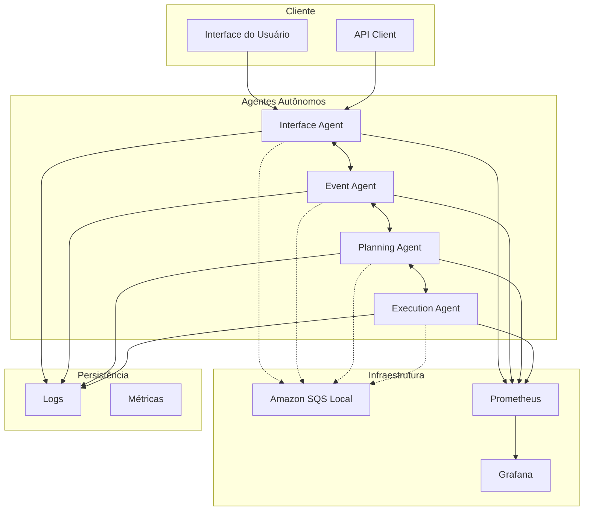
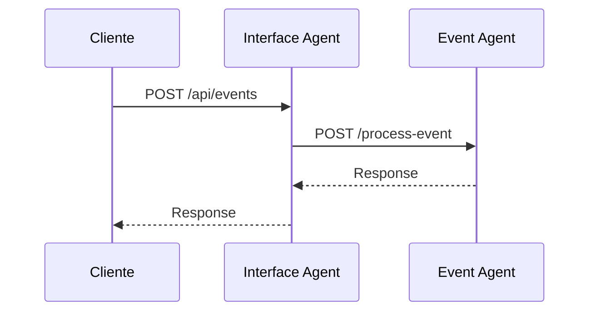
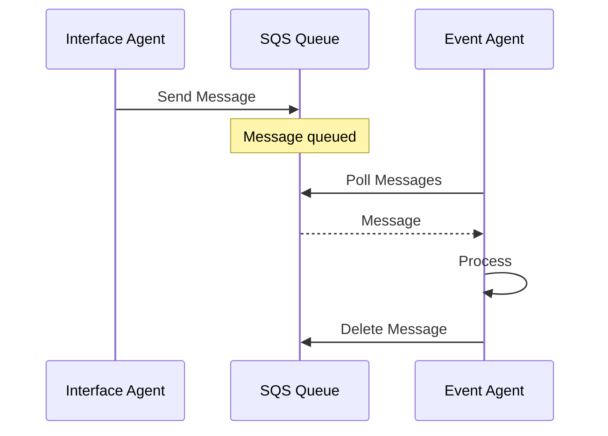
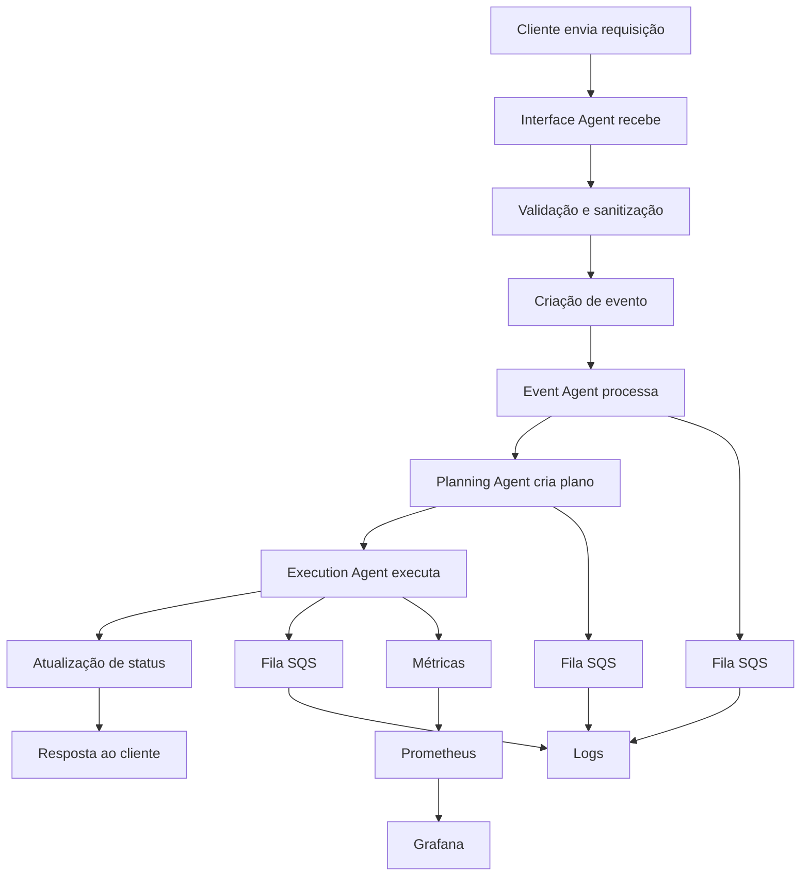
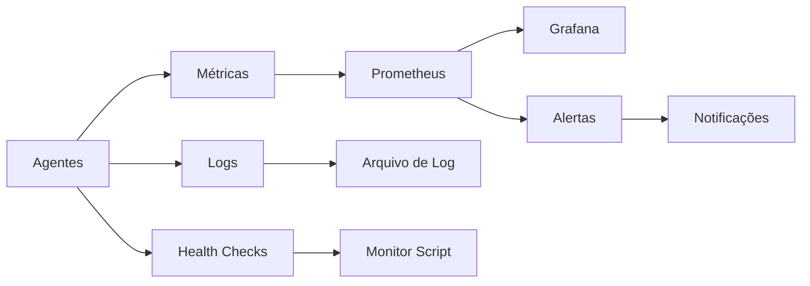
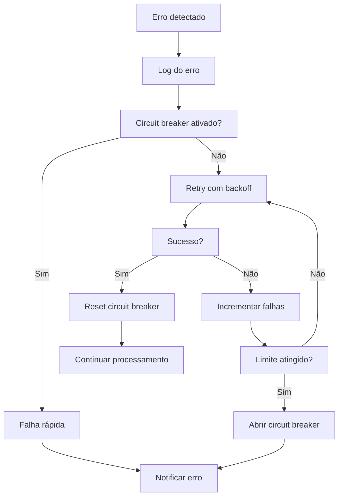

# Arquitetura do Sistema de Agentes Autônomos

Este documento descreve a arquitetura técnica do sistema de agentes autônomos, incluindo componentes, padrões de comunicação, fluxos de dados e decisões de design.

## 📋 Índice

- [Visão Geral](#visão-geral)
- [Componentes Principais](#componentes-principais)
- [Padrões de Comunicação](#padrões-de-comunicação)
- [Fluxos de Dados](#fluxos-de-dados)
- [Infraestrutura](#infraestrutura)
- [Segurança](#segurança)
- [Escalabilidade](#escalabilidade)
- [Monitoramento](#monitoramento)
- [Decisões de Design](#decisões-de-design)

## 🏗️ Visão Geral

### Arquitetura de Alto Nível



### Princípios Arquiteturais

1. **Microserviços**: Cada agente é um serviço independente
2. **Event-Driven**: Comunicação baseada em eventos
3. **Loosely Coupled**: Baixo acoplamento entre componentes
4. **Resilient**: Tolerância a falhas e recuperação automática
5. **Observable**: Monitoramento e logging abrangentes
6. **Scalable**: Capacidade de escalar horizontalmente

## 🧩 Componentes Principais

### 1. Interface Agent

**Responsabilidades**:
- Receber requisições HTTP dos clientes
- Validar e sanitizar entrada
- Coordenar fluxos entre agentes
- Retornar respostas aos clientes
- Gerenciar autenticação e autorização

**Tecnologias**:
- Express.js para servidor HTTP
- Helmet para segurança
- CORS para cross-origin
- Rate limiting para proteção

**Endpoints Principais**:
```
GET  /health          # Health check
GET  /metrics         # Métricas Prometheus
POST /api/events      # Criar eventos
GET  /api/status      # Status do sistema
POST /api/execute     # Executar ações
```

### 2. Event Agent

**Responsabilidades**:
- Processar eventos recebidos
- Validar estrutura dos eventos
- Enriquecer eventos com contexto
- Rotear eventos para agentes apropriados
- Manter histórico de eventos

**Padrões Implementados**:
- Event Sourcing
- Command Query Responsibility Segregation (CQRS)
- Saga Pattern para transações distribuídas

**Estrutura de Eventos**:
```javascript
{
  id: 'uuid',
  type: 'event.type',
  source: 'agent.name',
  timestamp: 'ISO8601',
  data: { /* payload */ },
  metadata: { /* context */ }
}
```

### 3. Planning Agent

**Responsabilidades**:
- Analisar eventos e determinar ações necessárias
- Criar planos de execução
- Otimizar sequência de ações
- Gerenciar dependências entre tarefas
- Adaptar planos baseado em feedback

**Algoritmos**:
- Planejamento hierárquico
- Otimização de recursos
- Análise de dependências
- Heurísticas de priorização

**Estrutura de Planos**:
```javascript
{
  id: 'plan-uuid',
  eventId: 'event-uuid',
  actions: [
    {
      id: 'action-uuid',
      type: 'action.type',
      priority: 1,
      dependencies: ['action-uuid'],
      parameters: { /* config */ },
      timeout: 30000
    }
  ],
  metadata: {
    estimatedDuration: 60000,
    complexity: 'medium',
    resources: ['cpu', 'memory']
  }
}
```

### 4. Execution Agent

**Responsabilidades**:
- Executar ações planejadas
- Gerenciar recursos de execução
- Monitorar progresso das tarefas
- Lidar com falhas e retry
- Reportar status de execução

**Padrões Implementados**:
- Worker Pool Pattern
- Circuit Breaker
- Retry with Exponential Backoff
- Bulkhead Pattern

**Estados de Execução**:
- `pending`: Aguardando execução
- `running`: Em execução
- `completed`: Concluída com sucesso
- `failed`: Falhou
- `cancelled`: Cancelada
- `timeout`: Timeout

## 🔄 Padrões de Comunicação

### 1. Comunicação Síncrona (HTTP)

**Uso**: Operações que requerem resposta imediata



**Características**:
- Timeout configurável
- Retry automático
- Circuit breaker
- Load balancing

### 2. Comunicação Assíncrona (SQS)

**Uso**: Processamento em background e desacoplamento



**Filas Principais**:
- `interface-events`: Eventos do Interface Agent
- `event-processing`: Processamento de eventos
- `planning-requests`: Solicitações de planejamento
- `execution-requests`: Solicitações de execução
- `notifications`: Notificações do sistema
- `status-updates`: Atualizações de status

### 3. Padrão Request-Response

```javascript
// Coordenação entre agentes
class CoordinationUtils {
  async sendToAgent(agentName, endpoint, data) {
    const client = this.getAgentClient(agentName);
    
    // Circuit breaker check
    if (this.circuitBreakers[agentName].isOpen()) {
      throw new Error(`Circuit breaker open for ${agentName}`);
    }
    
    try {
      const response = await client.post(endpoint, data);
      this.circuitBreakers[agentName].recordSuccess();
      return response.data;
    } catch (error) {
      this.circuitBreakers[agentName].recordFailure();
      throw error;
    }
  }
}
```

## 📊 Fluxos de Dados

### 1. Fluxo Principal de Processamento



### 2. Fluxo de Monitoramento



### 3. Fluxo de Erro e Recuperação



## 🏗️ Infraestrutura

### Containerização

**Docker Compose Services**:
```yaml
services:
  # Message Queue
  elasticmq:
    image: softwaremill/elasticmq-native
    ports: ["9324:9324"]
    
  # Agents
  interface-agent:
    build: ./docker/interface-agent.Dockerfile
    ports: ["3000:3000"]
    
  event-agent:
    build: ./docker/event-agent.Dockerfile
    ports: ["3001:3001"]
    
  # Monitoring
  prometheus:
    image: prom/prometheus
    ports: ["9090:9090"]
    
  grafana:
    image: grafana/grafana
    ports: ["3100:3000"]
```

### Configuração de Rede

```yaml
networks:
  agents-network:
    driver: bridge
    ipam:
      config:
        - subnet: 172.20.0.0/16
```

### Volumes e Persistência

```yaml
volumes:
  prometheus-data:
  grafana-data:
  logs-data:
```

## 🔒 Segurança

### 1. Autenticação e Autorização

```javascript
// JWT-based authentication
const authMiddleware = (req, res, next) => {
  const token = req.headers.authorization?.split(' ')[1];
  
  if (!token) {
    return res.status(401).json({ error: 'Token required' });
  }
  
  try {
    const decoded = jwt.verify(token, process.env.JWT_SECRET);
    req.user = decoded;
    next();
  } catch (error) {
    return res.status(401).json({ error: 'Invalid token' });
  }
};
```

### 2. Validação de Entrada

```javascript
// Schema validation with Joi
const eventSchema = Joi.object({
  type: Joi.string().required(),
  data: Joi.object().required(),
  source: Joi.string().optional(),
  metadata: Joi.object().optional()
});

const validateEvent = (req, res, next) => {
  const { error } = eventSchema.validate(req.body);
  if (error) {
    return res.status(400).json({ error: error.details[0].message });
  }
  next();
};
```

### 3. Rate Limiting

```javascript
const rateLimit = require('express-rate-limit');

const limiter = rateLimit({
  windowMs: 15 * 60 * 1000, // 15 minutes
  max: 100, // limit each IP to 100 requests per windowMs
  message: 'Too many requests from this IP'
});
```

### 4. Sanitização

```javascript
const helmet = require('helmet');
const xss = require('xss');

// Security headers
app.use(helmet());

// XSS protection
const sanitizeInput = (req, res, next) => {
  if (req.body) {
    req.body = sanitizeObject(req.body);
  }
  next();
};

function sanitizeObject(obj) {
  for (const key in obj) {
    if (typeof obj[key] === 'string') {
      obj[key] = xss(obj[key]);
    } else if (typeof obj[key] === 'object') {
      obj[key] = sanitizeObject(obj[key]);
    }
  }
  return obj;
}
```

## 📈 Escalabilidade

### 1. Escalonamento Horizontal

```yaml
# Docker Compose scaling
docker-compose up --scale interface-agent=3 --scale event-agent=2
```

### 2. Load Balancing

```nginx
# Nginx configuration
upstream interface_agents {
    server interface-agent-1:3000;
    server interface-agent-2:3000;
    server interface-agent-3:3000;
}

server {
    listen 80;
    location / {
        proxy_pass http://interface_agents;
        proxy_set_header Host $host;
        proxy_set_header X-Real-IP $remote_addr;
    }
}
```

### 3. Auto-scaling

```javascript
// Auto-scaling based on metrics
class AutoScaler {
  async checkMetrics() {
    const cpuUsage = await this.getCPUUsage();
    const queueSize = await this.getQueueSize();
    
    if (cpuUsage > 80 || queueSize > 1000) {
      await this.scaleUp();
    } else if (cpuUsage < 20 && queueSize < 100) {
      await this.scaleDown();
    }
  }
}
```

## 📊 Monitoramento

### 1. Métricas Coletadas

```javascript
// Prometheus metrics
const promClient = require('prom-client');

const httpRequestsTotal = new promClient.Counter({
  name: 'http_requests_total',
  help: 'Total number of HTTP requests',
  labelNames: ['method', 'route', 'status']
});

const httpRequestDuration = new promClient.Histogram({
  name: 'http_request_duration_seconds',
  help: 'Duration of HTTP requests in seconds',
  labelNames: ['method', 'route']
});

const queueSize = new promClient.Gauge({
  name: 'queue_size',
  help: 'Current queue size',
  labelNames: ['queue_name']
});
```

### 2. Health Checks

```javascript
// Health check endpoint
app.get('/health', async (req, res) => {
  const health = {
    status: 'healthy',
    timestamp: new Date().toISOString(),
    uptime: process.uptime(),
    memory: process.memoryUsage(),
    dependencies: {
      sqs: await checkSQSConnection(),
      database: await checkDatabaseConnection()
    }
  };
  
  const isHealthy = Object.values(health.dependencies)
    .every(dep => dep.status === 'healthy');
  
  res.status(isHealthy ? 200 : 503).json(health);
});
```

### 3. Alertas

```yaml
# Prometheus alerting rules
groups:
  - name: agents
    rules:
      - alert: AgentDown
        expr: up == 0
        for: 1m
        labels:
          severity: critical
        annotations:
          summary: "Agent {{ $labels.instance }} is down"
          
      - alert: HighErrorRate
        expr: rate(http_requests_total{status=~"5.."}[5m]) > 0.1
        for: 2m
        labels:
          severity: warning
        annotations:
          summary: "High error rate on {{ $labels.instance }}"
```

## 🎯 Decisões de Design

### 1. Por que Microserviços?

**Vantagens**:
- Isolamento de falhas
- Escalabilidade independente
- Tecnologias específicas por domínio
- Desenvolvimento paralelo
- Deploy independente

**Desvantagens**:
- Complexidade de rede
- Consistência eventual
- Debugging distribuído
- Overhead de comunicação

### 2. Por que Event-Driven?

**Vantagens**:
- Baixo acoplamento
- Escalabilidade
- Flexibilidade
- Auditoria natural
- Recuperação de estado

**Desvantagens**:
- Complexidade de debugging
- Consistência eventual
- Ordenação de eventos
- Duplicação de eventos

### 3. Por que SQS Local (ElasticMQ)?

**Vantagens**:
- Compatibilidade com AWS SQS
- Desenvolvimento local
- Sem custos
- Controle total
- Facilidade de teste

**Desvantagens**:
- Não é produção-ready
- Limitações de features
- Manutenção adicional

### 4. Por que Prometheus + Grafana?

**Vantagens**:
- Padrão da indústria
- Flexibilidade de queries
- Alertas integrados
- Visualizações ricas
- Comunidade ativa

**Desvantagens**:
- Curva de aprendizado
- Configuração complexa
- Uso de recursos

## 🔮 Evolução Futura

### Próximas Funcionalidades

1. **Service Mesh** (Istio/Linkerd)
2. **Event Streaming** (Apache Kafka)
3. **Distributed Tracing** (Jaeger/Zipkin)
4. **API Gateway** (Kong/Ambassador)
5. **Machine Learning** para otimização

### Melhorias de Arquitetura

1. **CQRS completo** com Event Store
2. **Saga Orchestration** para transações
3. **Multi-tenancy** para isolamento
4. **Edge Computing** para latência
5. **Chaos Engineering** para resiliência

---

**Última atualização**: $(date)
**Versão da Arquitetura**: 1.0.0
**Revisores**: Equipe de Arquitetura