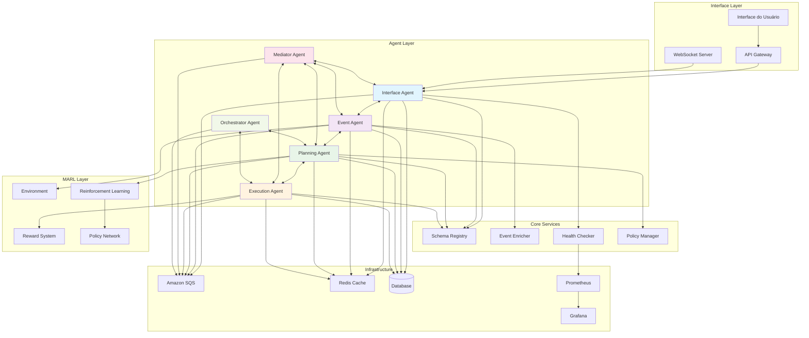
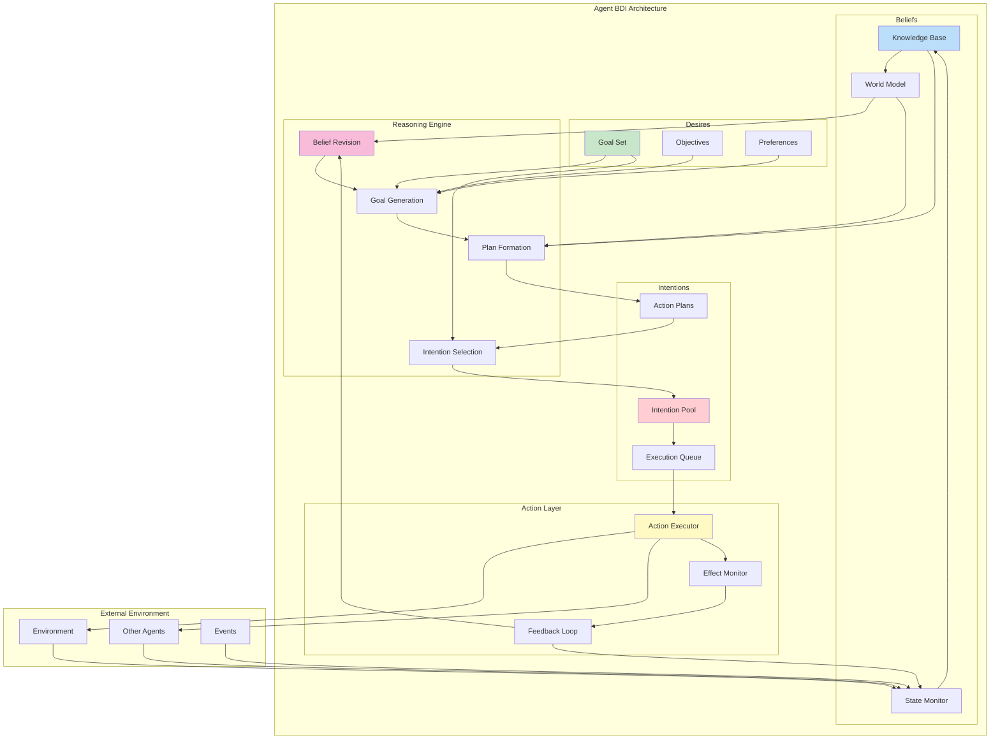
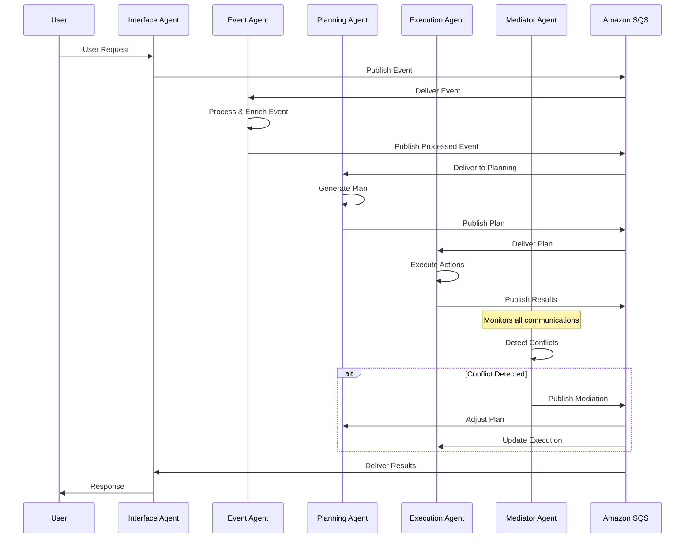
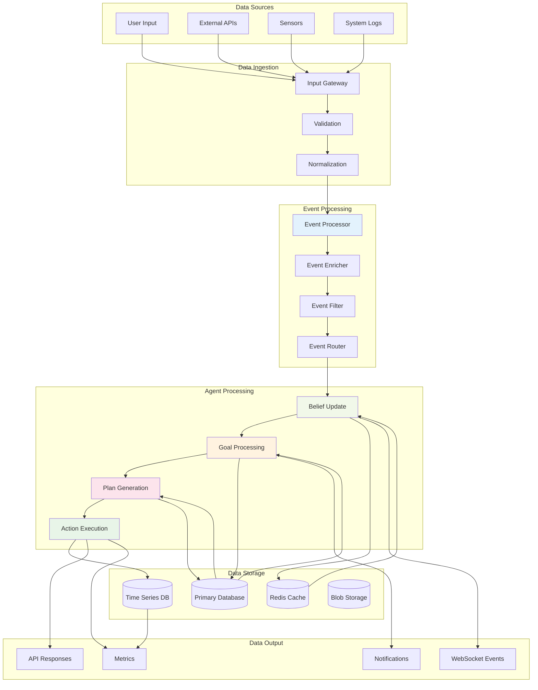
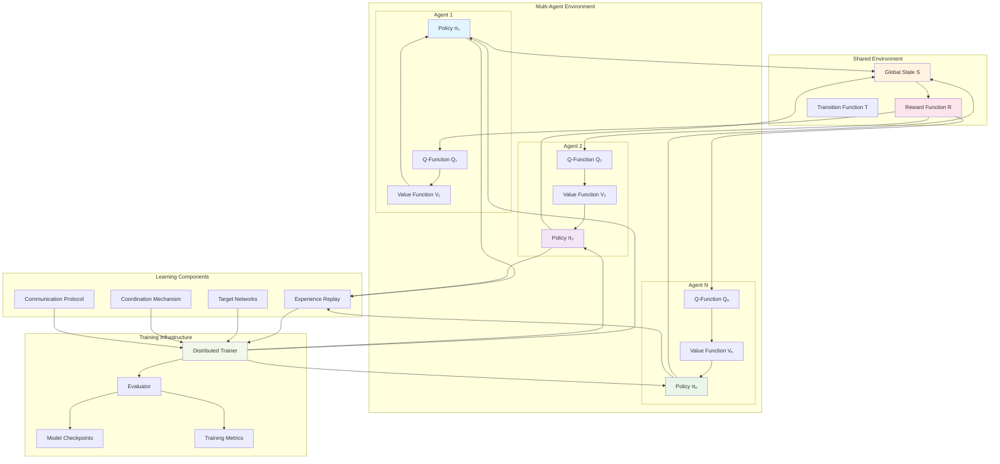
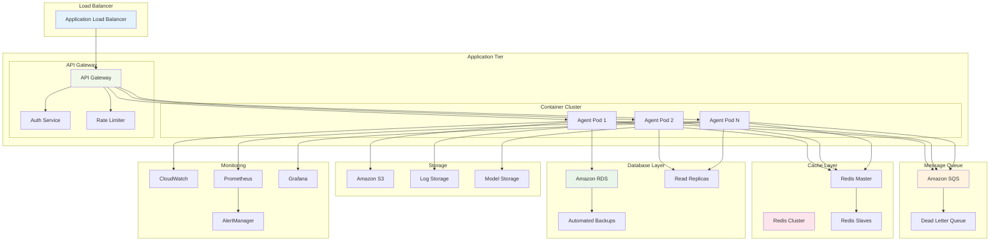
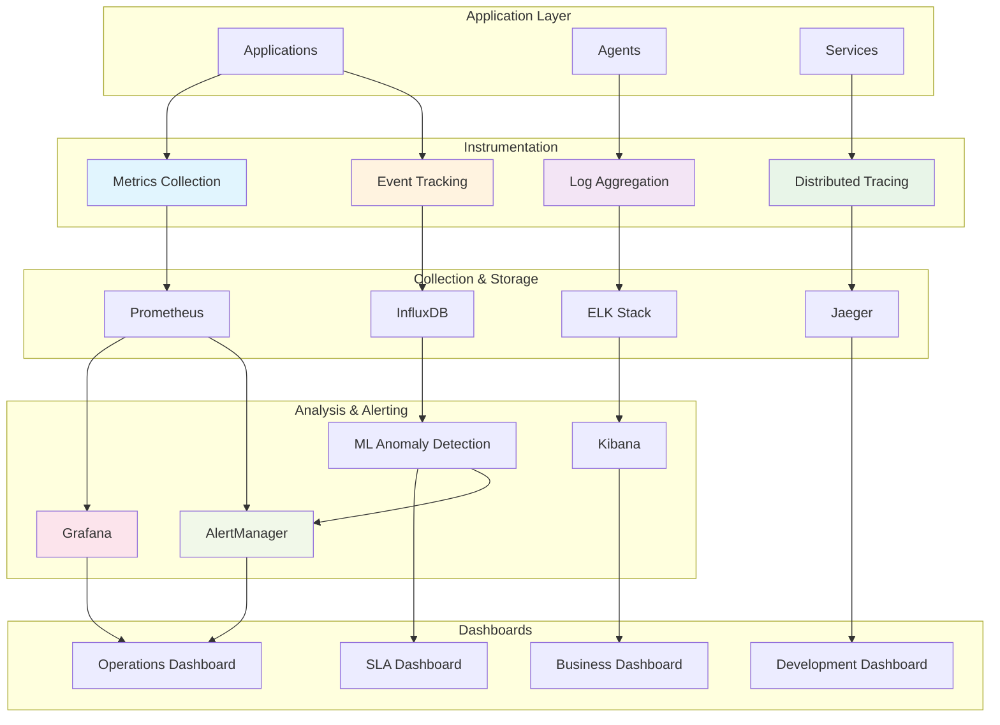

# Diagramas de Arquitetura - Sistema de Agentes Autônomos

Este documento contém os diagramas de arquitetura do sistema de agentes autônomos baseado em BDI (Belief-Desire-Intention) com Multi-Agent Reinforcement Learning (MARL).

## Índice

1. [Arquitetura Geral do Sistema](#arquitetura-geral-do-sistema)
2. [Arquitetura BDI dos Agentes](#arquitetura-bdi-dos-agentes)
3. [Comunicação entre Agentes](#comunicação-entre-agentes)
4. [Fluxo de Dados](#fluxo-de-dados)
5. [Arquitetura MARL](#arquitetura-marl)
6. [Infraestrutura e Deployment](#infraestrutura-e-deployment)
7. [Monitoramento e Observabilidade](#monitoramento-e-observabilidade)

---

## Arquitetura Geral do Sistema

## Arquitetura BDI dos Agentes

## Comunicação entre Agentes

## Fluxo de Dados

## Arquitetura MARL

## Infraestrutura e Deployment

## Monitoramento e Observabilidade

---

## Convenções dos Diagramas

### Cores
- **Azul claro**: Componentes de interface e entrada
- **Rosa claro**: Componentes de processamento de eventos
- **Verde claro**: Componentes de planejamento e execução
- **Laranja claro**: Componentes de dados e armazenamento
- **Roxo claro**: Componentes de mediação e coordenação
- **Amarelo claro**: Componentes de monitoramento e observabilidade

### Símbolos
- **Retângulos**: Serviços e componentes
- **Cilindros**: Bancos de dados e armazenamento
- **Losangos**: Pontos de decisão
- **Círculos**: Pontos de entrada/saída
- **Setas**: Fluxo de dados/controle

### Agrupamentos
- **Subgrafos**: Camadas lógicas da arquitetura
- **Clusters**: Componentes relacionados
- **Namespaces**: Separação de responsabilidades

---

*Última atualização: 2024-12-19*
*Versão: 1.0.0*