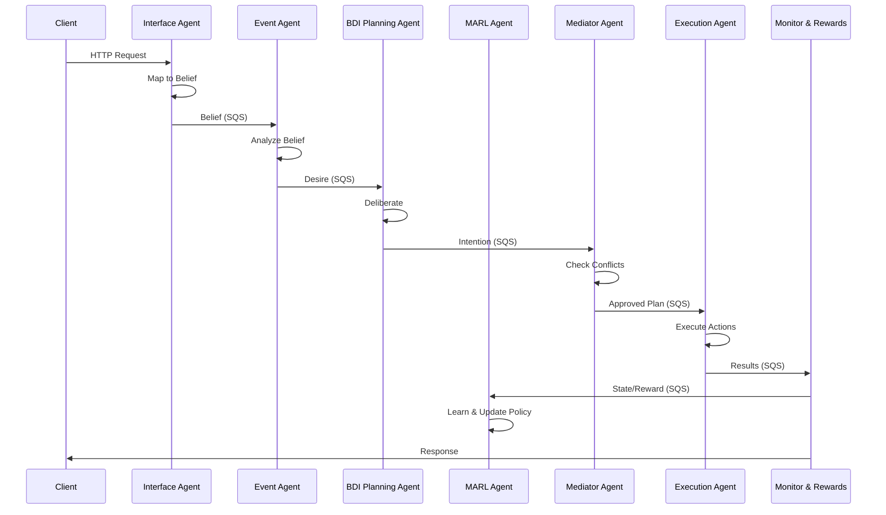

# Arquitetura BDI+MARL Integrada - Sistema de Agentes Autônomos

## Visão Geral

Este documento detalha a evolução da arquitetura atual baseada em SQS para uma arquitetura híbrida BDI (Belief-Desire-Intention) + MARL (Multi-Agent Reinforcement Learning), mantendo compatibilidade com a implementação existente.

## Arquitetura Atual vs. Proposta

### Arquitetura Atual (Implementada)
- **Interface Agent**: Recebe requisições HTTP e converte para eventos SQS
- **Event Agent**: Processa eventos e gera intenções
- **Planning Agent**: Cria planos de execução
- **Execution Agent**: Executa ações
- **State Management Agent**: Gerencia estado dos agentes
- **ACL Middleware Agent**: Controle de acesso

### Arquitetura Proposta (BDI+MARL)
- **Interface Agent** (evoluído): Mantém funcionalidade + mapeamento para crenças
- **Event Agent** (evoluído): Observer Pattern + regras de trigger avançadas
- **BDI Planning Agent** (evoluído): Incorpora lógica BDI completa
- **MARL Agent** (novo): Aprendizado por reforço multi-agente
- **Mediator Agent** (novo): Resolução de conflitos e arbitragem
- **Monitor & Rewards Engine** (novo): Sistema de métricas e recompensas
- **State Management Agent** (evoluído): Gerenciamento de crenças, desejos e intenções

## Componentes da Arquitetura Integrada

### 1. Interface Agent (Evoluído)

#### Responsabilidades Atuais Mantidas
- Recepção de requisições HTTP
- Validação de entrada
- Conversão para eventos SQS
- Rate limiting e segurança

#### Novas Responsabilidades BDI
- Mapeamento de entrada para crenças (beliefs)
- Geração de estruturas BDI padronizadas
- Validação de esquemas de crenças
- Métricas de qualidade de entrada

#### Estrutura de Mensagem BDI
```json
{
  "messageType": "belief",
  "timestamp": "2024-01-15T10:30:00Z",
  "source": "interface-agent",
  "belief": {
    "type": "user_request",
    "content": {
      "action": "process_document",
      "parameters": {
        "documentId": "doc123",
        "priority": "high"
      }
    },
    "confidence": 0.95,
    "context": {
      "userId": "user456",
      "sessionId": "session789"
    }
  },
  "metadata": {
    "correlationId": "corr-123",
    "traceId": "trace-456"
  }
}
```

### 2. Event Agent (Evoluído)

#### Responsabilidades Atuais Mantidas
- Processamento de eventos SQS
- Geração de intenções
- Logging e métricas

#### Novas Responsabilidades BDI
- Análise de crenças recebidas
- Aplicação de regras de trigger avançadas
- Geração de desejos (desires) baseados em crenças
- Priorização de desejos

#### Regras de Trigger BDI
```json
{
  "triggerRules": [
    {
      "id": "high_priority_document",
      "condition": {
        "belief.type": "user_request",
        "belief.content.action": "process_document",
        "belief.content.parameters.priority": "high"
      },
      "desire": {
        "type": "urgent_processing",
        "priority": 9,
        "deadline": "+5m"
      }
    }
  ]
}
```

### 3. BDI Planning Agent (Evoluído)

#### Arquitetura Interna BDI
```
┌─────────────────────────────────────────────────────────────┐
│                    BDI Planning Agent                       │
├─────────────────────────────────────────────────────────────┤
│  ┌─────────────┐  ┌─────────────┐  ┌─────────────────────┐  │
│  │   Beliefs   │  │   Desires   │  │     Intentions      │  │
│  │   Manager   │  │   Manager   │  │      Manager        │  │
│  └─────────────┘  └─────────────┘  └─────────────────────┘  │
│         │                 │                    │            │
│         └─────────────────┼────────────────────┘            │
│                           │                                 │
│  ┌─────────────────────────────────────────────────────────┐  │
│  │              Plan Generator Engine                     │  │
│  │  ┌─────────────┐  ┌─────────────┐  ┌─────────────────┐  │  │
│  │  │ Precondition│  │   Action    │  │   Postcondition │  │  │
│  │  │  Evaluator  │  │  Sequencer  │  │    Validator    │  │  │
│  │  └─────────────┘  └─────────────┘  └─────────────────┘  │  │
│  └─────────────────────────────────────────────────────────┘  │
└─────────────────────────────────────────────────────────────┘
```

#### Modelo BDI Interno
```javascript
class BDIModel {
  constructor() {
    this.beliefs = new Map(); // Estado atual do mundo
    this.desires = new Set();  // Objetivos desejados
    this.intentions = new Queue(); // Planos comprometidos
    this.plans = new Map();    // Biblioteca de planos
  }

  updateBeliefs(newBelief) {
    this.beliefs.set(newBelief.key, newBelief.value);
    this.triggerDeliberation();
  }

  addDesire(desire) {
    this.desires.add(desire);
    this.triggerDeliberation();
  }

  deliberate() {
    // Processo de deliberação BDI
    const compatibleDesires = this.filterCompatibleDesires();
    const selectedDesires = this.selectDesires(compatibleDesires);
    const intentions = this.formIntentions(selectedDesires);
    this.commitToIntentions(intentions);
  }
}
```

### 4. MARL Agent (Novo Componente)

#### Visão Geral
O MARL Agent implementa aprendizado por reforço multi-agente para otimização contínua do sistema.

#### Arquitetura Interna
```
┌─────────────────────────────────────────────────────────────┐
│                      MARL Agent                            │
├─────────────────────────────────────────────────────────────┤
│  ┌─────────────┐  ┌─────────────┐  ┌─────────────────────┐  │
│  │    State    │  │   Action    │  │       Reward        │  │
│  │   Manager   │  │   Manager   │  │      Calculator     │  │
│  └─────────────┘  └─────────────┘  └─────────────────────┘  │
│         │                 │                    │            │
│         └─────────────────┼────────────────────┘            │
│                           │                                 │
│  ┌─────────────────────────────────────────────────────────┐  │
│  │                Learning Engine                         │  │
│  │  ┌─────────────┐  ┌─────────────┐  ┌─────────────────┐  │  │
│  │  │    Q-Net    │  │   Policy    │  │     Experience  │  │  │
│  │  │   Network   │  │   Network   │  │      Replay     │  │  │
│  │  └─────────────┘  └─────────────┘  └─────────────────┘  │  │
│  └─────────────────────────────────────────────────────────┘  │
└─────────────────────────────────────────────────────────────┘
```

#### Estados, Ações e Recompensas
```json
{
  "state": {
    "systemLoad": 0.75,
    "queueDepth": 150,
    "responseTime": 250,
    "errorRate": 0.02,
    "agentUtilization": {
      "interface": 0.8,
      "event": 0.6,
      "planning": 0.9,
      "execution": 0.7
    }
  },
  "actions": {
    "scaleUp": {"agent": "execution", "factor": 1.5},
    "adjustPriority": {"queue": "planning", "priority": "high"},
    "redistributeLoad": {"from": "planning", "to": "execution"}
  },
  "reward": {
    "performance": 0.85,
    "efficiency": 0.90,
    "cost": -0.10,
    "total": 0.75
  }
}
```

### 5. Mediator Agent (Novo Componente)

#### Responsabilidades
- Resolução de conflitos entre agentes
- Arbitragem de recursos
- Coordenação de ações concorrentes
- Otimização global do sistema

#### Regras de Arbitragem
```json
{
  "arbitrationRules": [
    {
      "id": "resource_conflict",
      "condition": {
        "type": "resource_contention",
        "resource": "execution_queue",
        "contenders": ">= 2"
      },
      "resolution": {
        "strategy": "priority_based",
        "criteria": ["urgency", "business_value", "deadline"]
      }
    },
    {
      "id": "action_conflict",
      "condition": {
        "type": "conflicting_actions",
        "actions": ["scale_up", "scale_down"]
      },
      "resolution": {
        "strategy": "temporal_separation",
        "delay": "5m"
      }
    }
  ]
}
```

### 6. Monitor & Rewards Engine (Novo Componente)

#### Métricas de Sistema
```json
{
  "systemMetrics": {
    "performance": {
      "throughput": {"value": 1500, "unit": "requests/min"},
      "latency": {"p50": 100, "p95": 250, "p99": 500, "unit": "ms"},
      "errorRate": {"value": 0.02, "unit": "percentage"}
    },
    "efficiency": {
      "resourceUtilization": 0.75,
      "queueEfficiency": 0.85,
      "agentBalance": 0.90
    },
    "business": {
      "slaCompliance": 0.98,
      "customerSatisfaction": 0.92,
      "costEfficiency": 0.88
    }
  }
}
```

## Filas SQS Evoluídas

### Filas Existentes (Mantidas)
- `interface-to-event`
- `event-to-planning`
- `planning-to-execution`
- `execution-results`
- `state-updates`

### Novas Filas BDI+MARL
- `beliefs-queue`: Crenças do sistema
- `desires-queue`: Desejos identificados
- `intentions-queue`: Intenções formadas
- `marl-states`: Estados para aprendizado
- `marl-actions`: Ações do MARL
- `marl-rewards`: Recompensas calculadas
- `mediation-requests`: Solicitações de mediação
- `arbitration-results`: Resultados de arbitragem

## Fluxo de Execução BDI+MARL



## Tecnologias e Frameworks

### Mantidas da Implementação Atual
- **Node.js**: Runtime principal
- **Express**: Framework web
- **Amazon SQS**: Sistema de filas
- **Docker**: Containerização
- **Prometheus**: Métricas
- **Winston**: Logging

### Novas Tecnologias BDI+MARL
- **TensorFlow.js**: Redes neurais para MARL
- **Jason**: Framework BDI (adaptado para Node.js)
- **Redis**: Cache para estados e políticas
- **GraphQL**: API para consultas complexas
- **Apache Kafka**: Streaming para dados de aprendizado

## Plano de Migração

### Fase 1: Preparação (Semanas 1-2)
- [ ] Documentação técnica detalhada
- [ ] Especificações de API
- [ ] Esquemas JSON para mensagens BDI
- [ ] Configuração de novas filas SQS

### Fase 2: Evolução dos Agentes Existentes (Semanas 3-4)
- [ ] Interface Agent: Mapeamento para crenças
- [ ] Event Agent: Regras de trigger BDI
- [ ] Planning Agent: Lógica BDI básica
- [ ] State Management: Suporte a BDI

### Fase 3: Novos Componentes Core (Semanas 5-6)
- [ ] MARL Agent: Implementação básica
- [ ] Mediator Agent: Resolução de conflitos
- [ ] Monitor & Rewards: Métricas avançadas

### Fase 4: Integração e Otimização (Semanas 7-8)
- [ ] Integração completa BDI+MARL
- [ ] Testes de performance
- [ ] Ajustes de configuração
- [ ] Documentação final

## Considerações de Segurança

- **Autenticação**: JWT tokens para comunicação entre agentes
- **Autorização**: RBAC para ações de agentes
- **Criptografia**: TLS 1.3 para todas as comunicações
- **Auditoria**: Log completo de todas as decisões BDI
- **Isolamento**: Containers separados para cada agente

## Monitoramento e Observabilidade

- **Métricas BDI**: Crenças, desejos, intenções por agente
- **Métricas MARL**: Taxa de aprendizado, recompensas, convergência
- **Métricas de Sistema**: Performance, disponibilidade, recursos
- **Dashboards**: Grafana com painéis específicos para BDI+MARL
- **Alertas**: Prometheus alerts para anomalias

## Conclusão

Esta arquitetura integrada mantém a robustez da implementação atual baseada em SQS enquanto adiciona capacidades avançadas de BDI e MARL. A migração gradual garante continuidade operacional e permite validação incremental dos novos componentes.