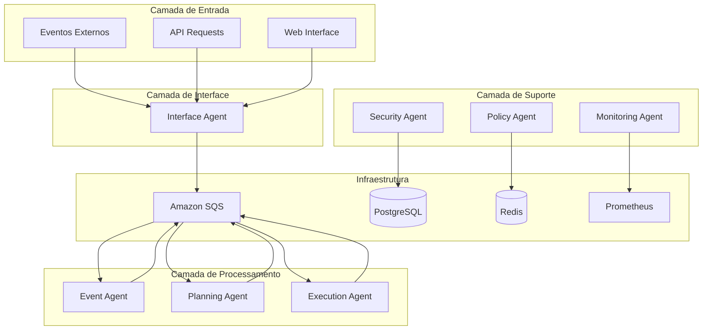
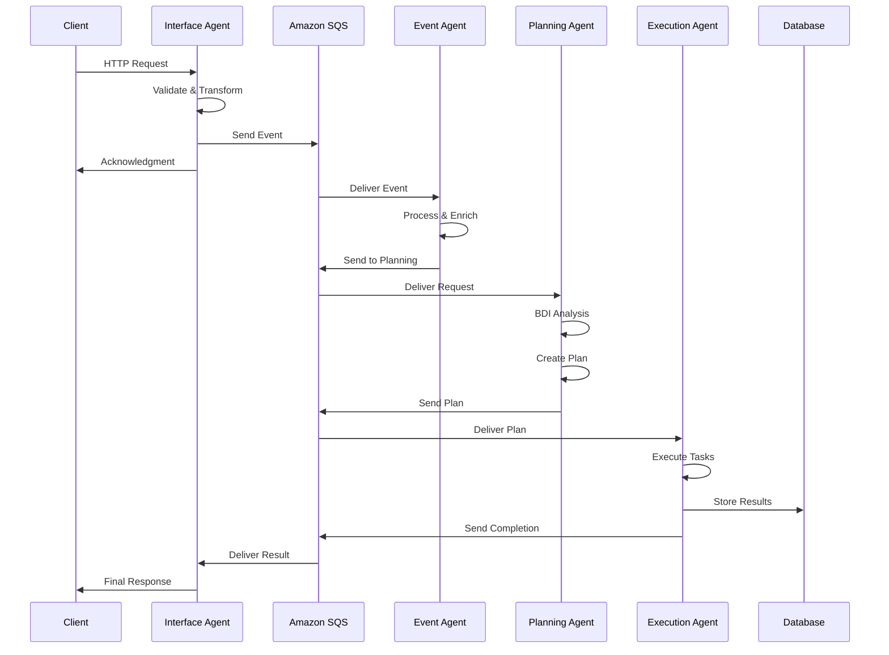
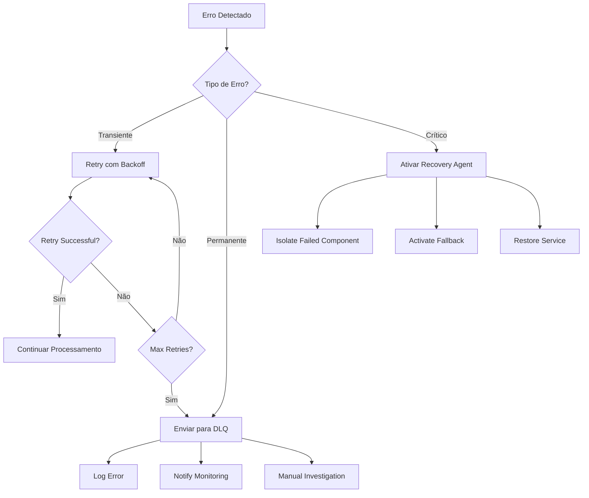
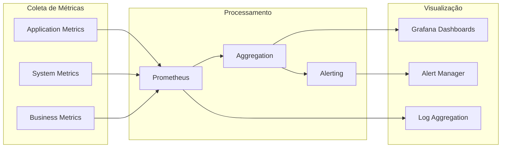

# Arquitetura Detalhada do Sistema de Agentes Autônomos

## 📋 Sumário

- [Visão Arquitetural](#visão-arquitetural)
- [Topologia da Arquitetura](#topologia-da-arquitetura)
- [Componentes Principais](#componentes-principais)
- [Fluxos de Dados](#fluxos-de-dados)
- [Padrões Arquiteturais](#padrões-arquiteturais)
- [Decisões de Design](#decisões-de-design)

## 🏗️ Visão Arquitetural

### Princípios Fundamentais

#### 🎯 Event-Driven Architecture (EDA)
O sistema é fundamentalmente baseado em eventos, onde cada ação gera eventos que são processados de forma assíncrona pelos agentes especializados.



#### 🧠 BDI (Belief-Desire-Intention) Architecture
Cada agente implementa a arquitetura BDI para tomada de decisão inteligente:

- **Beliefs**: Estado atual do mundo conhecido pelo agente
- **Desires**: Objetivos que o agente deseja alcançar
- **Intentions**: Planos específicos para alcançar os objetivos

#### 🤝 MARL (Multi-Agent Reinforcement Learning)
Os agentes aprendem e se coordenam através de algoritmos de aprendizado por reforço multiagente.

## 🌐 Topologia da Arquitetura

### Arquitetura em Camadas

```
┌─────────────────────────────────────────────────────────────┐
│                    CAMADA DE APRESENTAÇÃO                   │
├─────────────────────────────────────────────────────────────┤
│  Web UI  │  REST API  │  GraphQL  │  WebSocket  │  gRPC     │
└─────────────────────────────────────────────────────────────┘
                                │
┌─────────────────────────────────────────────────────────────┐
│                    CAMADA DE INTERFACE                      │
├─────────────────────────────────────────────────────────────┤
│              Interface Agent (Port 3000)                   │
│  • Request Validation  • Rate Limiting  • Authentication   │
└─────────────────────────────────────────────────────────────┘
                                │
┌─────────────────────────────────────────────────────────────┐
│                   CAMADA DE MESSAGE BROKER                  │
├─────────────────────────────────────────────────────────────┤
│                        Amazon SQS                          │
│  • Event Queues  • DLQ  • Retry Logic  • Ordering         │
└─────────────────────────────────────────────────────────────┘
                                │
┌─────────────────────────────────────────────────────────────┐
│                  CAMADA DE PROCESSAMENTO                    │
├─────────────────────────────────────────────────────────────┤
│ Event Agent │ Planning Agent │ Execution Agent │ State Mgmt │
│ (Port 3001) │  (Port 3002)   │  (Port 3003)    │ (Port 3004)│
└─────────────────────────────────────────────────────────────┘
                                │
┌─────────────────────────────────────────────────────────────┐
│                    CAMADA DE SUPORTE                        │
├─────────────────────────────────────────────────────────────┤
│ Monitoring │ Security │ Policy │ Recovery │ Lifecycle Mgmt  │
└─────────────────────────────────────────────────────────────┘
                                │
┌─────────────────────────────────────────────────────────────┐
│                  CAMADA DE PERSISTÊNCIA                     │
├─────────────────────────────────────────────────────────────┤
│ PostgreSQL │   Redis   │   S3   │ ElasticSearch │ InfluxDB  │
└─────────────────────────────────────────────────────────────┘
```

### Distribuição de Responsabilidades

#### 🎭 Agentes Core (Processamento Principal)
- **Interface Agent**: Gateway de entrada e validação
- **Event Agent**: Processamento e enriquecimento de eventos
- **Planning Agent**: Análise e criação de planos de execução
- **Execution Agent**: Execução coordenada de tarefas
- **State Management Agent**: Gerenciamento de estado distribuído

#### 🛠️ Agentes Auxiliares (Suporte)
- **Monitoring Agent**: Coleta de métricas e health checks
- **Security Agent**: Autenticação, autorização e auditoria
- **Policy Agent**: Aplicação de políticas e regras de negócio
- **Recovery Agent**: Recuperação automática de falhas
- **Lifecycle Manager**: Gerenciamento do ciclo de vida dos agentes

#### 🏗️ Agentes de Infraestrutura
- **External Gateway**: Interface com sistemas externos
- **Message Schema Registry**: Versionamento de schemas de mensagens
- **Agent Lifecycle Manager**: Orquestração de agentes

## 🔧 Componentes Principais

### Interface Agent

```javascript
// Estrutura do Interface Agent
class InterfaceAgent {
  constructor() {
    this.port = 3000;
    this.middleware = [
      helmet(),           // Segurança
      cors(),            // CORS
      rateLimit(),       // Rate limiting
      compression(),     // Compressão
      bodyParser()       // Parsing
    ];
  }
  
  async processRequest(request) {
    // 1. Validação de entrada
    // 2. Autenticação/Autorização
    // 3. Transformação para evento
    // 4. Envio para Event Agent via SQS
    // 5. Retorno de acknowledgment
  }
}
```

**Responsabilidades**:
- Validação de requests de entrada
- Rate limiting e throttling
- Autenticação e autorização inicial
- Transformação de requests em eventos
- Roteamento para agentes apropriados

### Event Agent

```javascript
// Estrutura do Event Agent
class EventAgent {
  constructor() {
    this.bdiEngine = new BDIEngine();
    this.eventProcessor = new EventProcessor();
    this.enricher = new EventEnricher();
  }
  
  async processEvent(event) {
    // 1. Validação de schema
    // 2. Enriquecimento de dados
    // 3. Análise BDI
    // 4. Decisão de roteamento
    // 5. Envio para Planning Agent
  }
}
```

**Responsabilidades**:
- Processamento e validação de eventos
- Enriquecimento com dados contextuais
- Análise de padrões e anomalias
- Coordenação com Planning Agent
- Implementação de retry e DLQ

### Planning Agent

```javascript
// Estrutura do Planning Agent
class PlanningAgent {
  constructor() {
    this.beliefManager = new BeliefManager();
    this.desireManager = new DesireManager();
    this.intentionManager = new IntentionManager();
    this.planLibrary = new PlanLibrary();
    this.optimizer = new PlanOptimizer();
  }
  
  async createPlan(request) {
    // 1. Análise de beliefs atuais
    // 2. Identificação de desires
    // 3. Formação de intentions
    // 4. Geração de plano otimizado
    // 5. Envio para Execution Agent
  }
}
```

**Responsabilidades**:
- Implementação completa da arquitetura BDI
- Criação de planos de execução otimizados
- Gerenciamento de dependências entre tarefas
- Cache inteligente de planos
- Coordenação com Execution Agent

### Execution Agent

```javascript
// Estrutura do Execution Agent
class ExecutionAgent {
  constructor() {
    this.executor = new TaskExecutor();
    this.coordinator = new ExecutionCoordinator();
    this.monitor = new ExecutionMonitor();
  }
  
  async executePlan(plan) {
    // 1. Validação de pré-condições
    // 2. Execução coordenada de tarefas
    // 3. Monitoramento de progresso
    // 4. Tratamento de falhas
    // 5. Relatório de resultados
  }
}
```

**Responsabilidades**:
- Execução coordenada de planos
- Gerenciamento de execuções concorrentes
- Monitoramento de progresso e status
- Tratamento de falhas e rollback
- Relatório de resultados e métricas

## 🌊 Fluxos de Dados

### Fluxo Principal de Processamento



### Fluxo de Tratamento de Erros



### Fluxo de Monitoramento



## 🎨 Padrões Arquiteturais

### Event Sourcing
- Todos os eventos são armazenados como log imutável
- Estado é derivado através de replay de eventos
- Auditoria completa e rastreabilidade
- Possibilidade de time travel para debugging

### CQRS (Command Query Responsibility Segregation)
- Separação entre operações de leitura e escrita
- Otimização independente para cada tipo de operação
- Escalabilidade diferenciada por workload
- Modelos de dados especializados

### Saga Pattern
- Transações distribuídas através de múltiplos agentes
- Compensação automática em caso de falha
- Coordenação sem lock distribuído
- Garantia de consistência eventual

### Circuit Breaker
- Proteção contra falhas em cascata
- Detecção automática de serviços indisponíveis
- Fallback para operações degradadas
- Recuperação automática quando serviço volta

## 🎯 Decisões de Design

### Comunicação Assíncrona
**Decisão**: Usar apenas comunicação assíncrona via message queues

**Justificativa**:
- Desacoplamento temporal entre agentes
- Maior resiliência a falhas
- Melhor escalabilidade
- Garantia de entrega de mensagens

**Trade-offs**:
- ✅ Alta disponibilidade e resiliência
- ✅ Escalabilidade horizontal
- ❌ Maior complexidade de debugging
- ❌ Latência adicional

### Amazon SQS vs Apache Kafka
**Decisão**: Usar Amazon SQS como message broker principal

**Justificativa**:
- Managed service com alta disponibilidade
- Integração nativa com AWS
- DLQ built-in
- Menor overhead operacional

**Trade-offs**:
- ✅ Zero manutenção de infraestrutura
- ✅ Escalabilidade automática
- ❌ Vendor lock-in
- ❌ Menor throughput que Kafka

### BDI vs Reactive Architecture
**Decisão**: Implementar arquitetura BDI para agentes inteligentes

**Justificativa**:
- Tomada de decisão mais sofisticada
- Adaptabilidade a mudanças
- Comportamento mais previsível
- Melhor para domínios complexos

**Trade-offs**:
- ✅ Inteligência e adaptabilidade
- ✅ Comportamento explicável
- ❌ Maior complexidade de implementação
- ❌ Overhead computacional

### Microserviços vs Monolito
**Decisão**: Arquitetura de microserviços com agentes independentes

**Justificativa**:
- Escalabilidade independente por agente
- Tecnologias especializadas por domínio
- Deployment independente
- Isolamento de falhas

**Trade-offs**:
- ✅ Escalabilidade e flexibilidade
- ✅ Isolamento de falhas
- ❌ Complexidade de coordenação
- ❌ Overhead de rede

---

## 📚 Referências

- [Event-Driven Architecture Patterns](https://microservices.io/patterns/data/event-driven-architecture.html)
- [BDI Architecture for Intelligent Agents](https://en.wikipedia.org/wiki/Belief%E2%80%93desire%E2%80%93intention_software_model)
- [Multi-Agent Reinforcement Learning](https://arxiv.org/abs/1911.10635)
- [Amazon SQS Best Practices](https://docs.aws.amazon.com/AWSSimpleQueueService/latest/SQSDeveloperGuide/sqs-best-practices.html)
- [Microservices Patterns](https://microservices.io/patterns/)

---

*Documentação gerada automaticamente - Última atualização: $(date)*