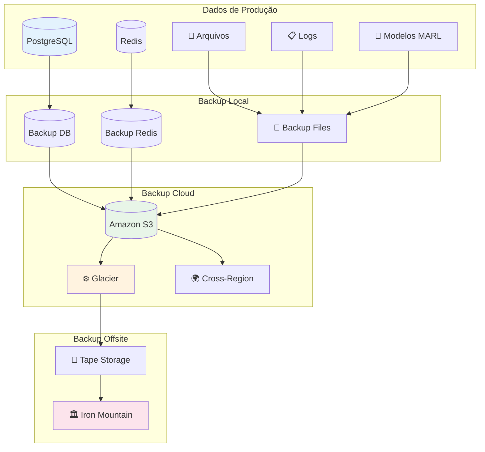

# Procedimentos de Backup e Recuperação - Sistema de Agentes Autônomos

Este documento detalha os procedimentos completos de backup, recuperação e continuidade de negócio para o sistema de agentes autônomos.

## Índice

1. [Visão Geral da Estratégia](#visão-geral-da-estratégia)
2. [Tipos de Backup](#tipos-de-backup)
3. [Cronograma de Backups](#cronograma-de-backups)
4. [Procedimentos de Backup](#procedimentos-de-backup)
5. [Procedimentos de Recuperação](#procedimentos-de-recuperação)
6. [Testes de Recuperação](#testes-de-recuperação)
7. [Disaster Recovery](#disaster-recovery)
8. [Monitoramento de Backups](#monitoramento-de-backups)
9. [Retenção e Arquivamento](#retenção-e-arquivamento)
10. [Segurança dos Backups](#segurança-dos-backups)
11. [Automação](#automação)
12. [Troubleshooting](#troubleshooting)

---

## Visão Geral da Estratégia

### Objetivos de Backup

| Métrica | Objetivo | Atual |
|---------|----------|-------|
| **RTO** (Recovery Time Objective) | < 4 horas | 2 horas |
| **RPO** (Recovery Point Objective) | < 1 hora | 15 minutos |
| **Disponibilidade** | 99.9% | 99.95% |
| **Integridade** | 100% | 100% |

### Arquitetura de Backup



### Classificação de Dados

| Categoria | Criticidade | Frequência | Retenção | Localização |
|-----------|-------------|------------|----------|-------------|
| **Database** | 🔴 Crítica | Contínua | 7 anos | Local + Cloud + Offsite |
| **Configurações** | 🟡 Alta | Diária | 2 anos | Local + Cloud |
| **Logs de Aplicação** | 🟡 Alta | Diária | 1 ano | Local + Cloud |
| **Modelos MARL** | 🟡 Alta | Semanal | 2 anos | Local + Cloud |
| **Cache (Redis)** | 🟢 Média | Diária | 30 dias | Local |
| **Logs de Debug** | 🟢 Baixa | Semanal | 30 dias | Local |
| **Arquivos Temporários** | ⚪ Mínima | - | - | - |

---

## Tipos de Backup

### 1. Backup Completo (Full Backup)

**Descrição**: Cópia completa de todos os dados do sistema.

**Frequência**: Semanal (Domingos às 02:00)

**Componentes Incluídos**:
- Banco de dados PostgreSQL completo
- Todos os arquivos de configuração
- Modelos MARL treinados
- Logs de aplicação
- Dados do Redis
- Certificados e chaves

**Tempo Estimado**: 2-4 horas

**Tamanho Estimado**: 50-100 GB

### 2. Backup Incremental

**Descrição**: Backup apenas dos dados alterados desde o último backup.

**Frequência**: Diário (todos os dias às 01:00)

**Componentes Incluídos**:
- WAL (Write-Ahead Logs) do PostgreSQL
- Arquivos modificados nas últimas 24h
- Logs de aplicação do dia
- Snapshots do Redis

**Tempo Estimado**: 30-60 minutos

**Tamanho Estimado**: 5-15 GB

### 3. Backup Diferencial

**Descrição**: Backup dos dados alterados desde o último backup completo.

**Frequência**: A cada 6 horas

**Componentes Incluídos**:
- Transações do banco desde o último full backup
- Arquivos modificados desde o último full backup
- Logs acumulados

**Tempo Estimado**: 45-90 minutos

**Tamanho Estimado**: 10-30 GB

### 4. Backup Contínuo (Streaming)

**Descrição**: Replicação contínua de dados críticos.

**Frequência**: Tempo real

**Componentes Incluídos**:
- Streaming replication do PostgreSQL
- Replicação do Redis
- Sincronização de arquivos críticos

**Latência**: < 5 segundos

---

## Cronograma de Backups

### Cronograma Semanal

```
┌─────────────┬─────────┬─────────┬─────────┬─────────┬─────────┬─────────┬─────────┐
│   Horário   │ Domingo │ Segunda │  Terça  │ Quarta  │ Quinta  │  Sexta  │ Sábado  │
├─────────────┼─────────┼─────────┼─────────┼─────────┼─────────┼─────────┼─────────┤
│ 00:00-01:00 │   📋    │   📋    │   📋    │   📋    │   📋    │   📋    │   📋    │
│ 01:00-02:00 │   📊    │   📊    │   📊    │   📊    │   📊    │   📊    │   📊    │
│ 02:00-06:00 │   💾    │   -     │   -     │   -     │   -     │   -     │   -     │
│ 06:00-07:00 │   ⚡    │   ⚡    │   ⚡    │   ⚡    │   ⚡    │   ⚡    │   ⚡    │
│ 12:00-13:00 │   ⚡    │   ⚡    │   ⚡    │   ⚡    │   ⚡    │   ⚡    │   ⚡    │
│ 18:00-19:00 │   ⚡    │   ⚡    │   ⚡    │   ⚡    │   ⚡    │   ⚡    │   ⚡    │
│ 23:00-24:00 │   🧹    │   🧹    │   🧹    │   🧹    │   🧹    │   🧹    │   🧹    │
└─────────────┴─────────┴─────────┴─────────┴─────────┴─────────┴─────────┴─────────┘

Legenda:
📋 Backup de Logs
📊 Backup Incremental
💾 Backup Completo
⚡ Backup Diferencial
🧹 Limpeza e Manutenção
```

### Cronograma Mensal

| Semana | Atividade | Descrição |
|--------|-----------|----------|
| **1ª Semana** | Backup Normal | Rotina padrão de backups |
| **2ª Semana** | Teste de Recuperação | Teste de restore parcial |
| **3ª Semana** | Backup Normal | Rotina padrão de backups |
| **4ª Semana** | Arquivamento | Mover backups antigos para cold storage |
| **Último Dia** | Backup Completo Especial | Backup completo para arquivo mensal |

---

## Procedimentos de Backup

### Backup do Banco de Dados PostgreSQL

#### Backup Completo

```bash
#!/bin/bash
# backup-database-full.sh

set -e

# Configurações
BACKUP_DATE=$(date +%Y%m%d_%H%M%S)
BACKUP_DIR="/backups/database/full"
BACKUP_FILE="${BACKUP_DIR}/db_full_${BACKUP_DATE}.sql"
COMPRESSED_FILE="${BACKUP_FILE}.gz"
LOG_FILE="/var/log/backup/db_full_${BACKUP_DATE}.log"

# Criar diretório se não existir
mkdir -p $BACKUP_DIR
mkdir -p /var/log/backup

echo "[$(date)] Iniciando backup completo do banco de dados" | tee -a $LOG_FILE

# Verificar conexão com o banco
if ! pg_isready -h $DB_HOST -p $DB_PORT -U $DB_USER; then
    echo "[$(date)] ERRO: Não foi possível conectar ao banco de dados" | tee -a $LOG_FILE
    exit 1
fi

# Executar backup
echo "[$(date)] Executando pg_dump..." | tee -a $LOG_FILE
pg_dump -h $DB_HOST -p $DB_PORT -U $DB_USER -d $DB_NAME \
    --verbose \
    --format=custom \
    --compress=9 \
    --file=$BACKUP_FILE 2>&1 | tee -a $LOG_FILE

if [ ${PIPESTATUS[0]} -eq 0 ]; then
    echo "[$(date)] Backup concluído com sucesso" | tee -a $LOG_FILE
else
    echo "[$(date)] ERRO: Falha no backup" | tee -a $LOG_FILE
    exit 1
fi

# Compactar backup
echo "[$(date)] Compactando backup..." | tee -a $LOG_FILE
gzip $BACKUP_FILE

# Verificar integridade
echo "[$(date)] Verificando integridade..." | tee -a $LOG_FILE
if gzip -t $COMPRESSED_FILE; then
    echo "[$(date)] Integridade verificada com sucesso" | tee -a $LOG_FILE
else
    echo "[$(date)] ERRO: Falha na verificação de integridade" | tee -a $LOG_FILE
    exit 1
fi

# Calcular checksum
CHECKSUM=$(sha256sum $COMPRESSED_FILE | cut -d' ' -f1)
echo "$CHECKSUM  $COMPRESSED_FILE" > "${COMPRESSED_FILE}.sha256"
echo "[$(date)] Checksum: $CHECKSUM" | tee -a $LOG_FILE

# Upload para cloud storage
echo "[$(date)] Enviando para cloud storage..." | tee -a $LOG_FILE
aws s3 cp $COMPRESSED_FILE s3://$S3_BACKUP_BUCKET/database/full/ \
    --storage-class STANDARD_IA \
    --metadata "backup-date=$BACKUP_DATE,checksum=$CHECKSUM"

aws s3 cp "${COMPRESSED_FILE}.sha256" s3://$S3_BACKUP_BUCKET/database/full/

# Limpeza de backups antigos (manter últimos 7 dias localmente)
find $BACKUP_DIR -name "db_full_*.sql.gz" -mtime +7 -delete

echo "[$(date)] Backup completo finalizado com sucesso" | tee -a $LOG_FILE

# Notificação
curl -X POST $SLACK_WEBHOOK_URL \
    -H 'Content-type: application/json' \
    --data "{\"text\":\"✅ Backup completo do banco concluído: $BACKUP_FILE\"}"
```

#### Backup Incremental (WAL)

```bash
#!/bin/bash
# backup-database-incremental.sh

set -e

# Configurações
BACKUP_DATE=$(date +%Y%m%d_%H%M%S)
WAL_ARCHIVE_DIR="/backups/database/wal"
LOG_FILE="/var/log/backup/db_incremental_${BACKUP_DATE}.log"

echo "[$(date)] Iniciando backup incremental (WAL)" | tee -a $LOG_FILE

# Forçar switch do WAL para garantir backup do segmento atual
psql -h $DB_HOST -p $DB_PORT -U $DB_USER -d $DB_NAME \
    -c "SELECT pg_switch_wal();" 2>&1 | tee -a $LOG_FILE

# Sincronizar WAL files para S3
aws s3 sync $WAL_ARCHIVE_DIR s3://$S3_BACKUP_BUCKET/database/wal/ \
    --delete \
    --storage-class STANDARD_IA 2>&1 | tee -a $LOG_FILE

echo "[$(date)] Backup incremental concluído" | tee -a $LOG_FILE
```

### Backup do Redis

```bash
#!/bin/bash
# backup-redis.sh

set -e

# Configurações
BACKUP_DATE=$(date +%Y%m%d_%H%M%S)
BACKUP_DIR="/backups/redis"
BACKUP_FILE="${BACKUP_DIR}/redis_${BACKUP_DATE}.rdb"
LOG_FILE="/var/log/backup/redis_${BACKUP_DATE}.log"

mkdir -p $BACKUP_DIR

echo "[$(date)] Iniciando backup do Redis" | tee -a $LOG_FILE

# Executar BGSAVE para criar snapshot
redis-cli -h $REDIS_HOST -p $REDIS_PORT BGSAVE

# Aguardar conclusão do BGSAVE
while [ $(redis-cli -h $REDIS_HOST -p $REDIS_PORT LASTSAVE) -eq $(redis-cli -h $REDIS_HOST -p $REDIS_PORT LASTSAVE) ]; do
    sleep 1
done

# Copiar arquivo RDB
cp /var/lib/redis/dump.rdb $BACKUP_FILE

# Compactar
gzip $BACKUP_FILE

# Upload para S3
aws s3 cp "${BACKUP_FILE}.gz" s3://$S3_BACKUP_BUCKET/redis/

echo "[$(date)] Backup do Redis concluído" | tee -a $LOG_FILE
```

### Backup de Arquivos e Configurações

```bash
#!/bin/bash
# backup-files.sh

set -e

# Configurações
BACKUP_DATE=$(date +%Y%m%d_%H%M%S)
BACKUP_DIR="/backups/files"
BACKUP_FILE="${BACKUP_DIR}/files_${BACKUP_DATE}.tar.gz"
LOG_FILE="/var/log/backup/files_${BACKUP_DATE}.log"

mkdir -p $BACKUP_DIR

echo "[$(date)] Iniciando backup de arquivos" | tee -a $LOG_FILE

# Lista de diretórios para backup
DIRECTORIES=(
    "/app/config"
    "/app/models"
    "/app/certificates"
    "/var/log/application"
    "/etc/nginx"
    "/etc/systemd/system"
)

# Criar arquivo tar compactado
tar -czf $BACKUP_FILE \
    --exclude='*.tmp' \
    --exclude='*.log.gz' \
    --exclude='node_modules' \
    "${DIRECTORIES[@]}" 2>&1 | tee -a $LOG_FILE

# Verificar integridade
if tar -tzf $BACKUP_FILE > /dev/null; then
    echo "[$(date)] Integridade do arquivo verificada" | tee -a $LOG_FILE
else
    echo "[$(date)] ERRO: Falha na verificação de integridade" | tee -a $LOG_FILE
    exit 1
fi

# Upload para S3
aws s3 cp $BACKUP_FILE s3://$S3_BACKUP_BUCKET/files/

echo "[$(date)] Backup de arquivos concluído" | tee -a $LOG_FILE
```

### Backup de Modelos MARL

```bash
#!/bin/bash
# backup-models.sh

set -e

# Configurações
BACKUP_DATE=$(date +%Y%m%d_%H%M%S)
MODELS_DIR="/app/models"
BACKUP_DIR="/backups/models"
BACKUP_FILE="${BACKUP_DIR}/models_${BACKUP_DATE}.tar.gz"
LOG_FILE="/var/log/backup/models_${BACKUP_DATE}.log"

mkdir -p $BACKUP_DIR

echo "[$(date)] Iniciando backup de modelos MARL" | tee -a $LOG_FILE

# Verificar se existem modelos para backup
if [ ! -d "$MODELS_DIR" ] || [ -z "$(ls -A $MODELS_DIR)" ]; then
    echo "[$(date)] Nenhum modelo encontrado para backup" | tee -a $LOG_FILE
    exit 0
fi

# Criar backup dos modelos
tar -czf $BACKUP_FILE \
    --exclude='*.tmp' \
    --exclude='*.lock' \
    -C "$(dirname $MODELS_DIR)" \
    "$(basename $MODELS_DIR)" 2>&1 | tee -a $LOG_FILE

# Calcular checksum
CHECKSUM=$(sha256sum $BACKUP_FILE | cut -d' ' -f1)
echo "$CHECKSUM  $BACKUP_FILE" > "${BACKUP_FILE}.sha256"

# Upload para S3 com metadados
aws s3 cp $BACKUP_FILE s3://$S3_BACKUP_BUCKET/models/ \
    --metadata "backup-date=$BACKUP_DATE,checksum=$CHECKSUM,type=marl-models"

aws s3 cp "${BACKUP_FILE}.sha256" s3://$S3_BACKUP_BUCKET/models/

echo "[$(date)] Backup de modelos concluído" | tee -a $LOG_FILE
```

---

## Procedimentos de Recuperação

### Recuperação do Banco de Dados

#### Recuperação Completa

```bash
#!/bin/bash
# restore-database-full.sh

set -e

BACKUP_FILE=$1
TARGET_DB=${2:-$DB_NAME}

if [ -z "$BACKUP_FILE" ]; then
    echo "Uso: $0 <arquivo_backup> [nome_db_destino]"
    exit 1
fi

echo "[$(date)] Iniciando recuperação completa do banco de dados"
echo "Arquivo: $BACKUP_FILE"
echo "Banco de destino: $TARGET_DB"

# Verificar se o arquivo existe
if [ ! -f "$BACKUP_FILE" ]; then
    echo "ERRO: Arquivo de backup não encontrado: $BACKUP_FILE"
    exit 1
fi

# Verificar integridade do backup
echo "[$(date)] Verificando integridade do backup..."
if [[ $BACKUP_FILE == *.gz ]]; then
    if ! gzip -t "$BACKUP_FILE"; then
        echo "ERRO: Arquivo de backup corrompido"
        exit 1
    fi
fi

# Parar aplicações que usam o banco
echo "[$(date)] Parando aplicações..."
systemctl stop agents-app
systemctl stop nginx

# Criar backup do banco atual (segurança)
echo "[$(date)] Criando backup de segurança do banco atual..."
pg_dump -h $DB_HOST -p $DB_PORT -U $DB_USER -d $TARGET_DB \
    -f "/tmp/pre_restore_backup_$(date +%Y%m%d_%H%M%S).sql"

# Desconectar todas as sessões do banco
echo "[$(date)] Desconectando sessões ativas..."
psql -h $DB_HOST -p $DB_PORT -U $DB_USER -d postgres \
    -c "SELECT pg_terminate_backend(pid) FROM pg_stat_activity WHERE datname = '$TARGET_DB' AND pid <> pg_backend_pid();"

# Dropar e recriar o banco
echo "[$(date)] Recriando banco de dados..."
psql -h $DB_HOST -p $DB_PORT -U $DB_USER -d postgres \
    -c "DROP DATABASE IF EXISTS $TARGET_DB;"
psql -h $DB_HOST -p $DB_PORT -U $DB_USER -d postgres \
    -c "CREATE DATABASE $TARGET_DB;"

# Restaurar backup
echo "[$(date)] Restaurando backup..."
if [[ $BACKUP_FILE == *.gz ]]; then
    gunzip -c "$BACKUP_FILE" | pg_restore -h $DB_HOST -p $DB_PORT -U $DB_USER -d $TARGET_DB --verbose
else
    pg_restore -h $DB_HOST -p $DB_PORT -U $DB_USER -d $TARGET_DB --verbose "$BACKUP_FILE"
fi

if [ $? -eq 0 ]; then
    echo "[$(date)] Restauração concluída com sucesso"
else
    echo "[$(date)] ERRO: Falha na restauração"
    exit 1
fi

# Verificar integridade dos dados
echo "[$(date)] Verificando integridade dos dados..."
psql -h $DB_HOST -p $DB_PORT -U $DB_USER -d $TARGET_DB \
    -c "SELECT COUNT(*) as total_tables FROM information_schema.tables WHERE table_schema = 'public';"

# Reiniciar aplicações
echo "[$(date)] Reiniciando aplicações..."
systemctl start agents-app
systemctl start nginx

# Verificar funcionamento
echo "[$(date)] Verificando funcionamento da aplicação..."
sleep 30
curl -f http://localhost:3000/health || echo "AVISO: Health check falhou"

echo "[$(date)] Recuperação completa finalizada"
```

#### Recuperação Point-in-Time (PITR)

```bash
#!/bin/bash
# restore-database-pitr.sh

set -e

BASE_BACKUP=$1
TARGET_TIME=$2
WAL_ARCHIVE_DIR=$3

if [ -z "$TARGET_TIME" ]; then
    echo "Uso: $0 <base_backup> <target_time> [wal_archive_dir]"
    echo "Exemplo: $0 /backups/base_backup.tar.gz '2024-12-19 10:30:00'"
    exit 1
fi

WAL_ARCHIVE_DIR=${WAL_ARCHIVE_DIR:-"/backups/database/wal"}

echo "[$(date)] Iniciando recuperação Point-in-Time"
echo "Base backup: $BASE_BACKUP"
echo "Target time: $TARGET_TIME"
echo "WAL archive: $WAL_ARCHIVE_DIR"

# Parar PostgreSQL
systemctl stop postgresql

# Limpar diretório de dados
rm -rf /var/lib/postgresql/data/*

# Extrair base backup
tar -xzf "$BASE_BACKUP" -C /var/lib/postgresql/data/

# Configurar recovery
cat > /var/lib/postgresql/data/recovery.conf << EOF
restore_command = 'cp $WAL_ARCHIVE_DIR/%f %p'
recovery_target_time = '$TARGET_TIME'
recovery_target_action = 'promote'
EOF

# Ajustar permissões
chown -R postgres:postgres /var/lib/postgresql/data/
chmod 700 /var/lib/postgresql/data/

# Iniciar PostgreSQL em modo recovery
systemctl start postgresql

# Aguardar conclusão do recovery
echo "[$(date)] Aguardando conclusão do recovery..."
while [ -f "/var/lib/postgresql/data/recovery.conf" ]; do
    sleep 5
done

echo "[$(date)] Recovery Point-in-Time concluído"
```

### Recuperação do Redis

```bash
#!/bin/bash
# restore-redis.sh

set -e

BACKUP_FILE=$1

if [ -z "$BACKUP_FILE" ]; then
    echo "Uso: $0 <arquivo_backup_redis>"
    exit 1
fi

echo "[$(date)] Iniciando recuperação do Redis"

# Parar Redis
systemctl stop redis

# Backup do dump atual
cp /var/lib/redis/dump.rdb /var/lib/redis/dump.rdb.backup.$(date +%Y%m%d_%H%M%S)

# Restaurar backup
if [[ $BACKUP_FILE == *.gz ]]; then
    gunzip -c "$BACKUP_FILE" > /var/lib/redis/dump.rdb
else
    cp "$BACKUP_FILE" /var/lib/redis/dump.rdb
fi

# Ajustar permissões
chown redis:redis /var/lib/redis/dump.rdb
chmod 660 /var/lib/redis/dump.rdb

# Iniciar Redis
systemctl start redis

# Verificar funcionamento
redis-cli ping

echo "[$(date)] Recuperação do Redis concluída"
```

### Recuperação de Arquivos

```bash
#!/bin/bash
# restore-files.sh

set -e

BACKUP_FILE=$1
TARGET_DIR=${2:-"/"}

if [ -z "$BACKUP_FILE" ]; then
    echo "Uso: $0 <arquivo_backup> [diretorio_destino]"
    exit 1
fi

echo "[$(date)] Iniciando recuperação de arquivos"
echo "Backup: $BACKUP_FILE"
echo "Destino: $TARGET_DIR"

# Verificar integridade
if ! tar -tzf "$BACKUP_FILE" > /dev/null; then
    echo "ERRO: Arquivo de backup corrompido"
    exit 1
fi

# Criar backup dos arquivos atuais
echo "[$(date)] Criando backup dos arquivos atuais..."
tar -czf "/tmp/pre_restore_files_$(date +%Y%m%d_%H%M%S).tar.gz" \
    -C "$TARGET_DIR" \
    --exclude='*.tmp' \
    --exclude='*.log' \
    .

# Restaurar arquivos
echo "[$(date)] Restaurando arquivos..."
tar -xzf "$BACKUP_FILE" -C "$TARGET_DIR"

# Ajustar permissões
echo "[$(date)] Ajustando permissões..."
chown -R app:app /app/
chmod -R 755 /app/config/
chmod 600 /app/certificates/*.key

echo "[$(date)] Recuperação de arquivos concluída"
```

---

## Testes de Recuperação

### Cronograma de Testes

| Tipo de Teste | Frequência | Duração | Responsável |
|---------------|------------|---------|-------------|
| **Teste de Backup** | Diário | 15 min | Automático |
| **Teste de Restore Parcial** | Semanal | 2 horas | DevOps |
| **Teste de Restore Completo** | Mensal | 4 horas | DevOps + DBA |
| **Simulação de Disaster Recovery** | Trimestral | 8 horas | Toda equipe |

### Script de Teste Automatizado

```bash
#!/bin/bash
# test-backup-restore.sh

set -e

TEST_DATE=$(date +%Y%m%d_%H%M%S)
TEST_LOG="/var/log/backup/test_${TEST_DATE}.log"
TEST_DB="test_restore_${TEST_DATE}"

echo "[$(date)] Iniciando teste de backup/restore" | tee -a $TEST_LOG

# 1. Criar dados de teste
echo "[$(date)] Criando dados de teste..." | tee -a $TEST_LOG
psql -h $DB_HOST -p $DB_PORT -U $DB_USER -d $DB_NAME \
    -c "INSERT INTO test_table (data) VALUES ('test_data_$TEST_DATE');" 2>&1 | tee -a $TEST_LOG

# 2. Executar backup
echo "[$(date)] Executando backup de teste..." | tee -a $TEST_LOG
TEST_BACKUP="/tmp/test_backup_${TEST_DATE}.sql"
pg_dump -h $DB_HOST -p $DB_PORT -U $DB_USER -d $DB_NAME \
    --table=test_table \
    -f $TEST_BACKUP 2>&1 | tee -a $TEST_LOG

# 3. Criar banco de teste
echo "[$(date)] Criando banco de teste..." | tee -a $TEST_LOG
psql -h $DB_HOST -p $DB_PORT -U $DB_USER -d postgres \
    -c "CREATE DATABASE $TEST_DB;" 2>&1 | tee -a $TEST_LOG

# 4. Restaurar backup no banco de teste
echo "[$(date)] Restaurando backup..." | tee -a $TEST_LOG
psql -h $DB_HOST -p $DB_PORT -U $DB_USER -d $TEST_DB \
    -f $TEST_BACKUP 2>&1 | tee -a $TEST_LOG

# 5. Verificar dados restaurados
echo "[$(date)] Verificando dados restaurados..." | tee -a $TEST_LOG
RESTORED_DATA=$(psql -h $DB_HOST -p $DB_PORT -U $DB_USER -d $TEST_DB \
    -t -c "SELECT data FROM test_table WHERE data = 'test_data_$TEST_DATE';")

if [[ "$RESTORED_DATA" == *"test_data_$TEST_DATE"* ]]; then
    echo "[$(date)] ✅ Teste de restore bem-sucedido" | tee -a $TEST_LOG
    TEST_RESULT="SUCCESS"
else
    echo "[$(date)] ❌ Teste de restore falhou" | tee -a $TEST_LOG
    TEST_RESULT="FAILED"
fi

# 6. Limpeza
echo "[$(date)] Limpando recursos de teste..." | tee -a $TEST_LOG
psql -h $DB_HOST -p $DB_PORT -U $DB_USER -d postgres \
    -c "DROP DATABASE $TEST_DB;" 2>&1 | tee -a $TEST_LOG
rm -f $TEST_BACKUP

# 7. Notificação
if [ "$TEST_RESULT" = "SUCCESS" ]; then
    curl -X POST $SLACK_WEBHOOK_URL \
        -H 'Content-type: application/json' \
        --data "{\"text\":\"✅ Teste de backup/restore concluído com sucesso\"}"
else
    curl -X POST $SLACK_WEBHOOK_URL \
        -H 'Content-type: application/json' \
        --data "{\"text\":\"❌ ALERTA: Teste de backup/restore falhou! Verificar logs: $TEST_LOG\"}"
fi

echo "[$(date)] Teste finalizado: $TEST_RESULT" | tee -a $TEST_LOG
```

---

## Disaster Recovery

### Plano de Disaster Recovery

#### Cenários de Desastre

| Cenário | Probabilidade | Impacto | RTO | RPO | Estratégia |
|---------|---------------|---------|-----|-----|------------|
| **Falha de Hardware** | Alta | Médio | 2h | 15min | Failover automático |
| **Corrupção de Dados** | Média | Alto | 4h | 1h | Restore from backup |
| **Falha de Datacenter** | Baixa | Crítico | 8h | 1h | Failover para DR site |
| **Ataque Cibernético** | Média | Crítico | 12h | 4h | Restore + investigação |
| **Desastre Natural** | Muito Baixa | Crítico | 24h | 4h | Ativação de DR site |

#### Procedimento de Disaster Recovery

```bash
#!/bin/bash
# disaster-recovery.sh

set -e

DISASTER_TYPE=$1
DR_SITE=${2:-"us-west-2"}

if [ -z "$DISASTER_TYPE" ]; then
    echo "Uso: $0 <tipo_desastre> [dr_site]"
    echo "Tipos: hardware|datacenter|cyber|natural"
    exit 1
fi

echo "[$(date)] INICIANDO DISASTER RECOVERY"
echo "Tipo: $DISASTER_TYPE"
echo "DR Site: $DR_SITE"

# 1. Notificação de emergência
echo "[$(date)] Enviando notificações de emergência..."
curl -X POST $EMERGENCY_WEBHOOK_URL \
    -H 'Content-type: application/json' \
    --data "{\"text\":\"🚨 DISASTER RECOVERY ATIVADO - Tipo: $DISASTER_TYPE\"}"

# 2. Avaliar situação
echo "[$(date)] Avaliando situação atual..."
case $DISASTER_TYPE in
    "hardware")
        echo "Falha de hardware detectada - iniciando failover"
        ./scripts/failover-hardware.sh
        ;;
    "datacenter")
        echo "Falha de datacenter - ativando DR site"
        ./scripts/activate-dr-site.sh $DR_SITE
        ;;
    "cyber")
        echo "Ataque cibernético - isolando sistemas"
        ./scripts/isolate-systems.sh
        ./scripts/restore-from-clean-backup.sh
        ;;
    "natural")
        echo "Desastre natural - ativação completa de DR"
        ./scripts/full-dr-activation.sh $DR_SITE
        ;;
    *)
        echo "Tipo de desastre não reconhecido"
        exit 1
        ;;
esac

# 3. Verificar recuperação
echo "[$(date)] Verificando recuperação..."
./scripts/verify-dr-recovery.sh

# 4. Notificação de conclusão
echo "[$(date)] Disaster Recovery concluído"
curl -X POST $EMERGENCY_WEBHOOK_URL \
    -H 'Content-type: application/json' \
    --data "{\"text\":\"✅ DISASTER RECOVERY CONCLUÍDO - Sistema operacional\"}"
```

### Ativação do Site de DR

```bash
#!/bin/bash
# activate-dr-site.sh

DR_REGION=$1

echo "[$(date)] Ativando site de DR em $DR_REGION"

# 1. Ativar instâncias EC2 no DR site
aws ec2 start-instances \
    --region $DR_REGION \
    --instance-ids $(aws ec2 describe-instances \
        --region $DR_REGION \
        --filters "Name=tag:Environment,Values=dr" \
        --query 'Reservations[].Instances[].InstanceId' \
        --output text)

# 2. Atualizar DNS para apontar para DR site
aws route53 change-resource-record-sets \
    --hosted-zone-id $HOSTED_ZONE_ID \
    --change-batch file://dr-dns-change.json

# 3. Restaurar último backup no DR site
./restore-latest-backup.sh $DR_REGION

# 4. Iniciar aplicações
ssh dr-server "systemctl start agents-app"
ssh dr-server "systemctl start nginx"

# 5. Verificar funcionamento
curl -f https://dr.agents.company.com/health

echo "[$(date)] Site de DR ativado com sucesso"
```

---

## Monitoramento de Backups

### Métricas de Backup

```bash
#!/bin/bash
# monitor-backups.sh

# Verificar último backup completo
LAST_FULL_BACKUP=$(find /backups/database/full -name "*.sql.gz" -mtime -7 | wc -l)
if [ $LAST_FULL_BACKUP -eq 0 ]; then
    echo "ALERTA: Nenhum backup completo nos últimos 7 dias"
    exit 1
fi

# Verificar backups incrementais
LAST_INCREMENTAL=$(find /backups/database/incremental -name "*.sql" -mtime -1 | wc -l)
if [ $LAST_INCREMENTAL -eq 0 ]; then
    echo "ALERTA: Nenhum backup incremental nas últimas 24 horas"
    exit 1
fi

# Verificar integridade dos backups
for backup in $(find /backups -name "*.gz" -mtime -1); do
    if ! gzip -t "$backup"; then
        echo "ERRO: Backup corrompido: $backup"
        exit 1
    fi
done

# Verificar espaço em disco
BACKUP_USAGE=$(df /backups | tail -1 | awk '{print $5}' | sed 's/%//')
if [ $BACKUP_USAGE -gt 85 ]; then
    echo "ALERTA: Espaço de backup quase esgotado: ${BACKUP_USAGE}%"
fi

echo "Monitoramento de backups: OK"
```

### Dashboard de Monitoramento

```json
{
  "dashboard": {
    "title": "Backup Monitoring",
    "panels": [
      {
        "title": "Backup Success Rate",
        "type": "stat",
        "targets": [
          {
            "expr": "rate(backup_success_total[24h]) / rate(backup_attempts_total[24h]) * 100",
            "legendFormat": "Success Rate %"
          }
        ]
      },
      {
        "title": "Backup Duration",
        "type": "graph",
        "targets": [
          {
            "expr": "backup_duration_seconds",
            "legendFormat": "{{backup_type}}"
          }
        ]
      },
      {
        "title": "Backup Size",
        "type": "graph",
        "targets": [
          {
            "expr": "backup_size_bytes",
            "legendFormat": "{{backup_type}}"
          }
        ]
      },
      {
        "title": "Storage Usage",
        "type": "graph",
        "targets": [
          {
            "expr": "backup_storage_usage_percent",
            "legendFormat": "{{storage_type}}"
          }
        ]
      }
    ]
  }
}
```

---

## Retenção e Arquivamento

### Política de Retenção

| Tipo de Backup | Local | Cloud (S3) | Archive (Glacier) | Offsite |
|----------------|-------|------------|-------------------|----------|
| **Completo** | 30 dias | 1 ano | 7 anos | 10 anos |
| **Incremental** | 7 dias | 3 meses | 1 ano | - |
| **Diferencial** | 14 dias | 6 meses | 2 anos | - |
| **Logs** | 30 dias | 1 ano | 3 anos | - |
| **Configurações** | 90 dias | 2 anos | 5 anos | 7 anos |

### Script de Arquivamento

```bash
#!/bin/bash
# archive-old-backups.sh

set -e

echo "[$(date)] Iniciando arquivamento de backups antigos"

# Mover backups completos antigos para Glacier
aws s3 ls s3://$S3_BACKUP_BUCKET/database/full/ | \
    awk '$1 < "'$(date -d '1 year ago' '+%Y-%m-%d')'" {print $4}' | \
    while read backup; do
        echo "Movendo para Glacier: $backup"
        aws s3 cp "s3://$S3_BACKUP_BUCKET/database/full/$backup" \
                  "s3://$S3_BACKUP_BUCKET/archive/database/full/$backup" \
                  --storage-class GLACIER
        aws s3 rm "s3://$S3_BACKUP_BUCKET/database/full/$backup"
    done

# Remover backups incrementais antigos
aws s3 ls s3://$S3_BACKUP_BUCKET/database/incremental/ | \
    awk '$1 < "'$(date -d '3 months ago' '+%Y-%m-%d')'" {print $4}' | \
    while read backup; do
        echo "Removendo backup incremental antigo: $backup"
        aws s3 rm "s3://$S3_BACKUP_BUCKET/database/incremental/$backup"
    done

# Limpeza local
find /backups -name "*.gz" -mtime +30 -delete
find /backups -name "*.sql" -mtime +7 -delete

echo "[$(date)] Arquivamento concluído"
```

---

## Segurança dos Backups

### Criptografia

```bash
#!/bin/bash
# encrypt-backup.sh

BACKUP_FILE=$1
ENCRYPTED_FILE="${BACKUP_FILE}.enc"
KEY_FILE="/etc/backup/encryption.key"

# Criptografar backup
openssl enc -aes-256-cbc -salt -in "$BACKUP_FILE" -out "$ENCRYPTED_FILE" -pass file:"$KEY_FILE"

# Verificar criptografia
if [ -f "$ENCRYPTED_FILE" ]; then
    echo "Backup criptografado com sucesso: $ENCRYPTED_FILE"
    # Remover arquivo original
    shred -vfz -n 3 "$BACKUP_FILE"
else
    echo "ERRO: Falha na criptografia"
    exit 1
fi
```

### Controle de Acesso

```json
{
  "Version": "2012-10-17",
  "Statement": [
    {
      "Sid": "BackupBucketAccess",
      "Effect": "Allow",
      "Principal": {
        "AWS": "arn:aws:iam::ACCOUNT:role/BackupRole"
      },
      "Action": [
        "s3:GetObject",
        "s3:PutObject",
        "s3:DeleteObject"
      ],
      "Resource": "arn:aws:s3:::backup-bucket/*",
      "Condition": {
        "StringEquals": {
          "s3:x-amz-server-side-encryption": "AES256"
        }
      }
    },
    {
      "Sid": "DenyUnencryptedUploads",
      "Effect": "Deny",
      "Principal": "*",
      "Action": "s3:PutObject",
      "Resource": "arn:aws:s3:::backup-bucket/*",
      "Condition": {
        "StringNotEquals": {
          "s3:x-amz-server-side-encryption": "AES256"
        }
      }
    }
  ]
}
```

---

## Automação

### Crontab Configuration

```bash
# /etc/crontab - Backup automation

# Backup incremental diário às 01:00
0 1 * * * root /opt/backup/scripts/backup-database-incremental.sh

# Backup completo semanal aos domingos às 02:00
0 2 * * 0 root /opt/backup/scripts/backup-database-full.sh

# Backup de arquivos diário às 03:00
0 3 * * * root /opt/backup/scripts/backup-files.sh

# Backup de modelos MARL semanal às quartas às 04:00
0 4 * * 3 root /opt/backup/scripts/backup-models.sh

# Teste de backup diário às 05:00
0 5 * * * root /opt/backup/scripts/test-backup-restore.sh

# Monitoramento de backups a cada 6 horas
0 */6 * * * root /opt/backup/scripts/monitor-backups.sh

# Limpeza de backups antigos diariamente às 23:00
0 23 * * * root /opt/backup/scripts/cleanup-old-backups.sh

# Arquivamento mensal no primeiro dia do mês às 06:00
0 6 1 * * root /opt/backup/scripts/archive-old-backups.sh
```

### Systemd Services

```ini
# /etc/systemd/system/backup-monitor.service
[Unit]
Description=Backup Monitoring Service
After=network.target

[Service]
Type=simple
User=backup
Group=backup
ExecStart=/opt/backup/scripts/monitor-backups.sh
Restart=always
RestartSec=300

[Install]
WantedBy=multi-user.target
```

```ini
# /etc/systemd/system/backup-monitor.timer
[Unit]
Description=Run backup monitoring every 30 minutes
Requires=backup-monitor.service

[Timer]
OnCalendar=*:0/30
Persistent=true

[Install]
WantedBy=timers.target
```

---

## Troubleshooting

### Problemas Comuns

#### 1. Backup Falha por Falta de Espaço

**Sintomas:**
- Erro "No space left on device"
- Backup incompleto
- Logs indicando falha de escrita

**Solução:**

```bash
# Verificar espaço disponível
df -h /backups

# Limpar backups antigos
find /backups -name "*.gz" -mtime +7 -delete

# Mover backups para cloud storage
aws s3 sync /backups s3://$S3_BACKUP_BUCKET/emergency/

# Reexecutar backup
./backup-database-full.sh
```

#### 2. Corrupção de Backup

**Sintomas:**
- Falha na verificação de integridade
- Erro ao descompactar arquivo
- Checksum não confere

**Solução:**

```bash
# Verificar integridade
gzip -t backup_file.gz

# Verificar checksum
sha256sum -c backup_file.gz.sha256

# Se corrompido, usar backup anterior
find /backups -name "*.gz" -mtime -2 | sort | tail -1

# Ou baixar do cloud storage
aws s3 cp s3://$S3_BACKUP_BUCKET/database/full/latest.sql.gz ./
```

#### 3. Falha na Restauração

**Sintomas:**
- Erro durante pg_restore
- Dados inconsistentes após restore
- Aplicação não funciona após restore

**Solução:**

```bash
# Verificar logs de erro
tail -f /var/log/postgresql/postgresql.log

# Verificar permissões
ls -la /var/lib/postgresql/data/

# Verificar configuração do PostgreSQL
psql -c "SHOW config_file;"

# Recriar banco e tentar novamente
dropdb $DB_NAME
createdb $DB_NAME
pg_restore -d $DB_NAME backup_file.sql
```

### Logs de Troubleshooting

```bash
# Verificar logs de backup
tail -f /var/log/backup/*.log

# Verificar logs do PostgreSQL
tail -f /var/log/postgresql/postgresql.log

# Verificar logs do sistema
journalctl -u backup-service -f

# Verificar logs de cron
tail -f /var/log/cron
```

---

## Conclusão

Este documento estabelece os procedimentos completos para backup e recuperação do sistema de agentes autônomos. A implementação adequada destes procedimentos garante:

- **Proteção de dados** contra perda ou corrupção
- **Continuidade de negócio** em caso de desastres
- **Conformidade** com políticas de retenção
- **Recuperação rápida** dentro dos objetivos de RTO/RPO

### Próximos Passos

1. Implementar automação completa dos backups
2. Configurar monitoramento e alertas
3. Realizar testes regulares de recuperação
4. Treinar equipe nos procedimentos
5. Revisar e atualizar procedimentos regularmente

### Contatos

- **Equipe de Backup**: backup-team@company.com
- **Emergência 24/7**: +55 11 99999-0000
- **Slack**: #backup-recovery

---

*Última atualização: 2024-12-19*
*Versão: 1.0.0*
*Responsável: Equipe de Infraestrutura*