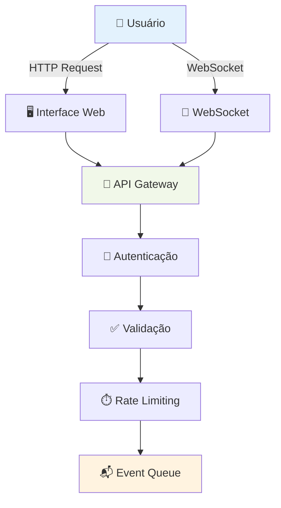
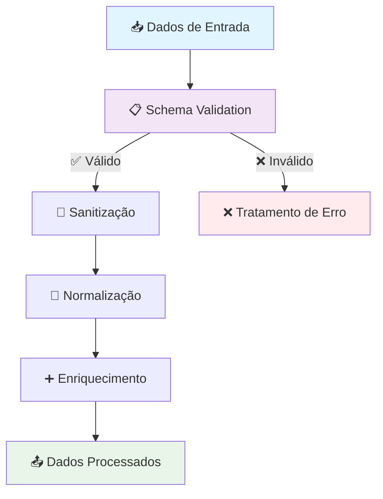
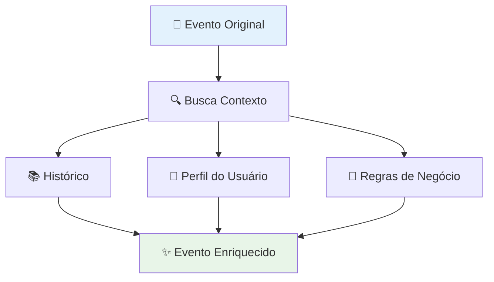
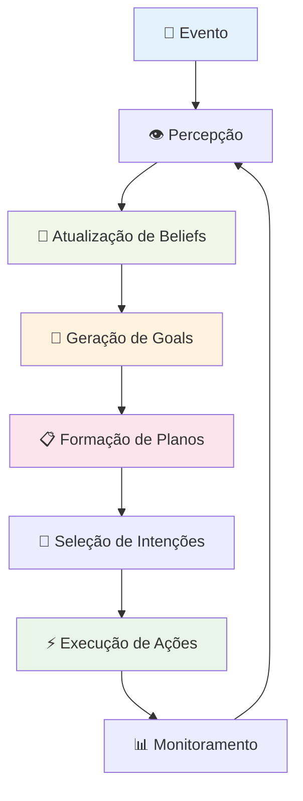
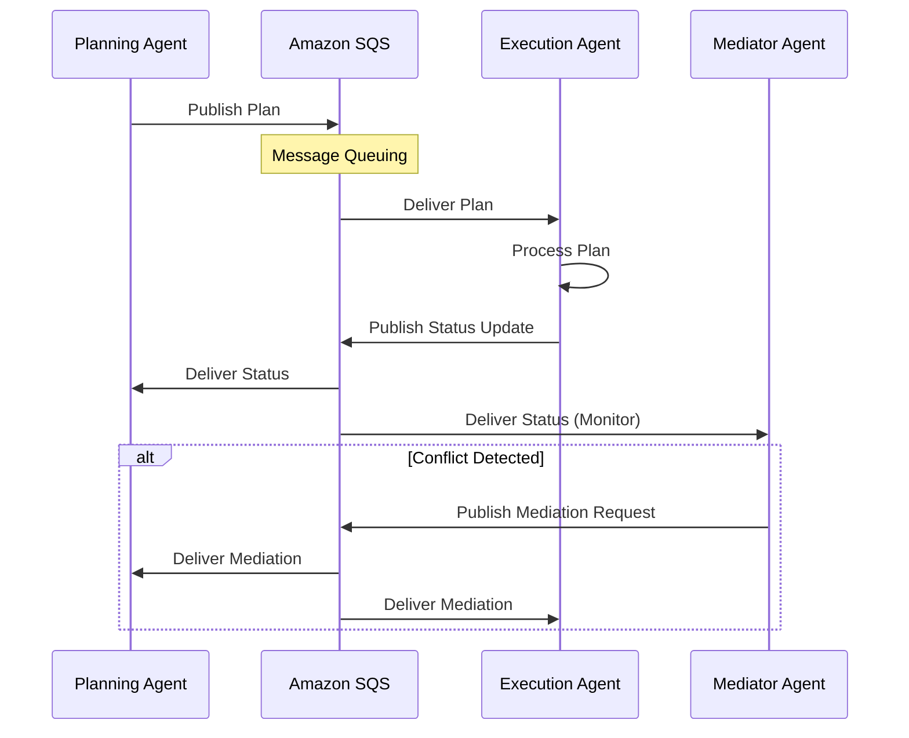
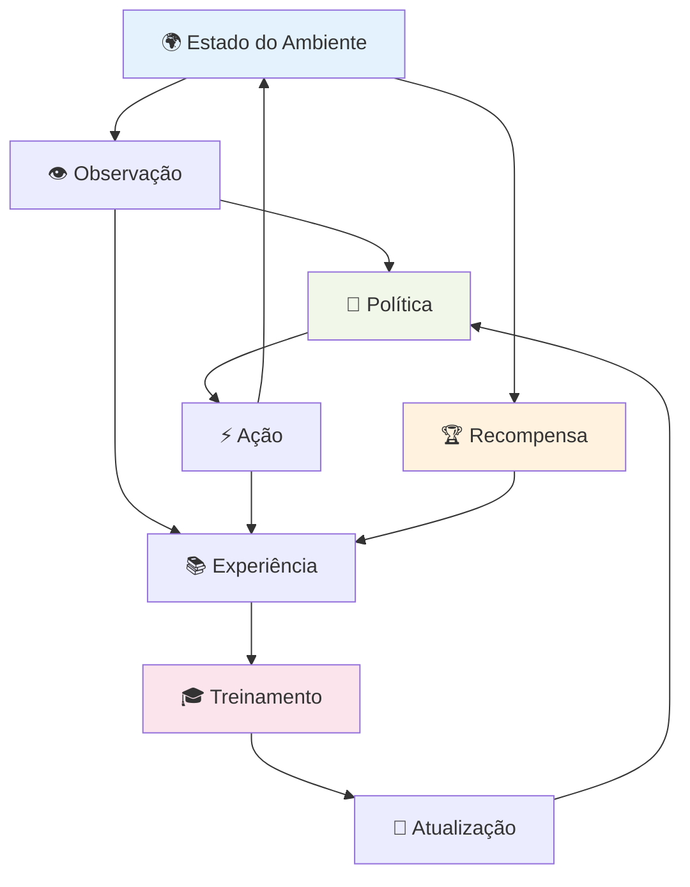
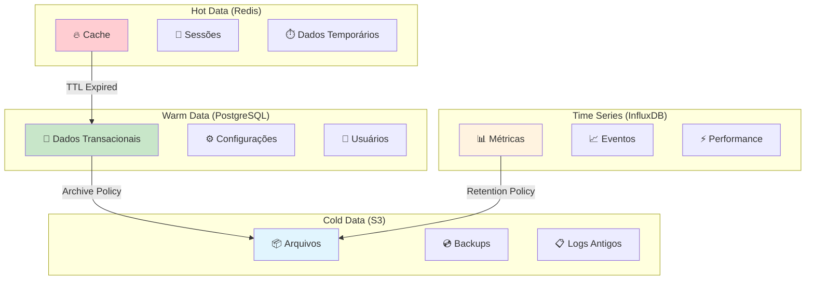
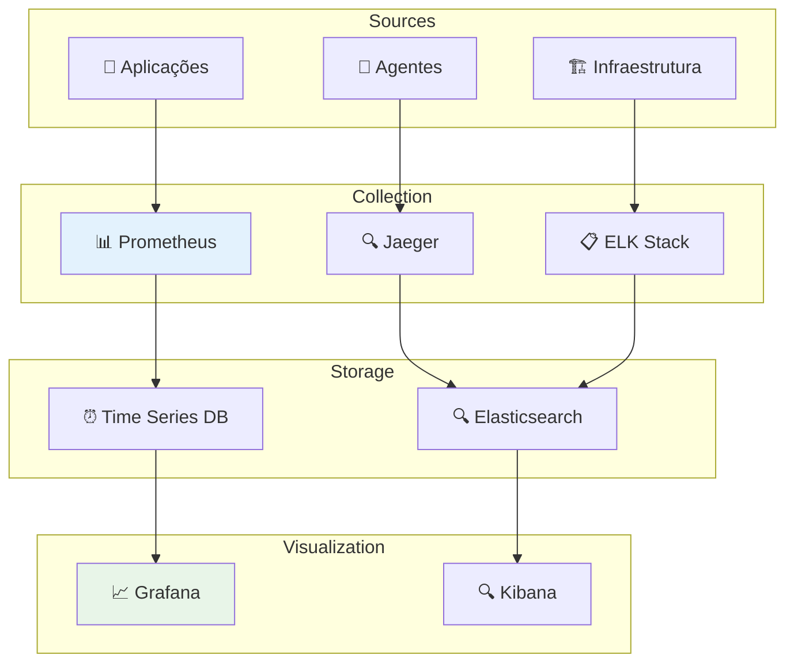
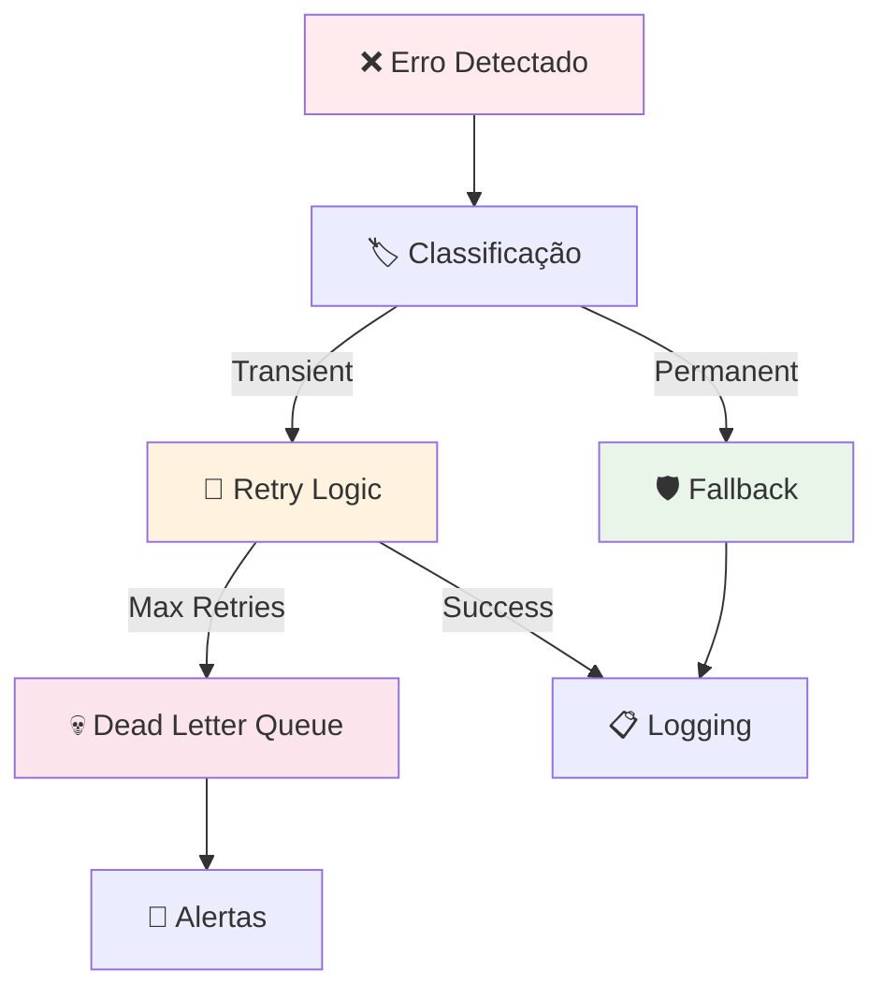

# Fluxos de Dados - Sistema de Agentes Autônomos

Este documento descreve os fluxos de dados no sistema de agentes autônomos, incluindo entrada, processamento, transformação e saída de dados em todas as camadas da arquitetura.

## Índice

1. [Visão Geral dos Fluxos](#visão-geral-dos-fluxos)
2. [Fluxo de Entrada de Dados](#fluxo-de-entrada-de-dados)
3. [Processamento de Eventos](#processamento-de-eventos)
4. [Fluxo BDI dos Agentes](#fluxo-bdi-dos-agentes)
5. [Comunicação Inter-Agentes](#comunicação-inter-agentes)
6. [Fluxo MARL](#fluxo-marl)
7. [Persistência de Dados](#persistência-de-dados)
8. [Monitoramento e Métricas](#monitoramento-e-métricas)
9. [Tratamento de Erros](#tratamento-de-erros)
10. [Otimizações de Performance](#otimizações-de-performance)

---

## Visão Geral dos Fluxos

### Principais Tipos de Dados

| Tipo | Descrição | Formato | Persistência |
|------|-----------|---------|-------------|
| **Eventos** | Dados de entrada do usuário e sistema | JSON | SQS + Database |
| **Beliefs** | Estado de conhecimento dos agentes | JSON/Binary | Redis + Database |
| **Goals** | Objetivos e metas dos agentes | JSON | Database |
| **Plans** | Planos de ação gerados | JSON | Database |
| **Actions** | Ações executadas pelos agentes | JSON | Database + Logs |
| **Rewards** | Sinais de recompensa MARL | Float | Time Series DB |
| **Metrics** | Métricas de sistema e performance | Time Series | Prometheus |
| **Logs** | Logs de aplicação e auditoria | Text/JSON | ELK Stack |

### Fluxo de Dados Principal

```
Usuário → Interface → Event Processing → Agent BDI → Action Execution → Resultado
    ↓         ↓              ↓              ↓              ↓            ↓
  Logs    Validation    Enrichment    Reasoning    Monitoring    Feedback
```

---

## Fluxo de Entrada de Dados

### 1. Interface do Usuário



**Estrutura de Dados de Entrada:**

```json
{
  "eventId": "uuid-v4",
  "timestamp": "2024-12-19T10:30:00Z",
  "userId": "user-123",
  "sessionId": "session-456",
  "eventType": "user_request",
  "payload": {
    "action": "create_task",
    "parameters": {
      "title": "Analisar dados de vendas",
      "priority": "high",
      "deadline": "2024-12-20T18:00:00Z"
    }
  },
  "metadata": {
    "source": "web_ui",
    "version": "1.0.0",
    "userAgent": "Mozilla/5.0..."
  }
}
```

### 2. Validação e Normalização



**Processo de Validação:**

1. **Schema Validation**: Verificação contra JSON Schema
2. **Sanitização**: Remoção de caracteres maliciosos
3. **Normalização**: Padronização de formatos (datas, números)
4. **Enriquecimento**: Adição de metadados contextuais

---

## Processamento de Eventos

### Event Enricher



**Dados Adicionados no Enriquecimento:**

```json
{
  "originalEvent": { /* evento original */ },
  "enrichment": {
    "userContext": {
      "preferences": { /* preferências do usuário */ },
      "history": [ /* histórico de ações */ ],
      "currentSession": { /* dados da sessão */ }
    },
    "businessContext": {
      "applicableRules": [ /* regras aplicáveis */ ],
      "constraints": [ /* restrições */ ],
      "priorities": { /* prioridades */ }
    },
    "systemContext": {
      "currentLoad": 0.75,
      "availableAgents": [ /* agentes disponíveis */ ],
      "resourceStatus": { /* status dos recursos */ }
    }
  }
}
```

---

## Fluxo BDI dos Agentes

### Ciclo de Raciocínio BDI



### 1. Atualização de Beliefs

**Estrutura de Beliefs:**

```json
{
  "agentId": "planning-agent-001",
  "timestamp": "2024-12-19T10:30:00Z",
  "beliefs": {
    "worldState": {
      "currentTasks": [
        {
          "id": "task-123",
          "status": "in_progress",
          "priority": "high",
          "assignedAgent": "execution-agent-002"
        }
      ],
      "systemLoad": 0.65,
      "availableResources": {
        "cpu": 0.4,
        "memory": 0.6,
        "network": 0.2
      }
    },
    "agentStates": {
      "execution-agent-002": {
        "status": "busy",
        "currentTask": "task-123",
        "estimatedCompletion": "2024-12-19T11:00:00Z"
      }
    },
    "userPreferences": {
      "userId": "user-123",
      "preferredResponseTime": "fast",
      "qualityVsSpeed": "balanced"
    }
  },
  "confidence": 0.85,
  "lastUpdated": "2024-12-19T10:30:00Z"
}
```

### 2. Geração de Goals

**Estrutura de Goals:**

```json
{
  "goalId": "goal-456",
  "agentId": "planning-agent-001",
  "type": "achievement",
  "priority": 8,
  "description": "Complete task analysis within deadline",
  "conditions": {
    "preconditions": [
      "data_available",
      "agent_available"
    ],
    "postconditions": [
      "analysis_complete",
      "report_generated"
    ]
  },
  "constraints": {
    "deadline": "2024-12-20T18:00:00Z",
    "maxResources": {
      "cpu": 0.8,
      "memory": 0.7
    }
  },
  "metrics": {
    "successCriteria": [
      "accuracy > 0.95",
      "completion_time < deadline"
    ]
  }
}
```

### 3. Formação de Planos

**Estrutura de Plans:**

```json
{
  "planId": "plan-789",
  "goalId": "goal-456",
  "agentId": "planning-agent-001",
  "strategy": "sequential_execution",
  "steps": [
    {
      "stepId": 1,
      "action": "load_data",
      "parameters": {
        "source": "database",
        "query": "SELECT * FROM sales_data WHERE date >= '2024-01-01'"
      },
      "expectedDuration": "PT5M",
      "dependencies": []
    },
    {
      "stepId": 2,
      "action": "analyze_data",
      "parameters": {
        "algorithm": "statistical_analysis",
        "confidence_level": 0.95
      },
      "expectedDuration": "PT15M",
      "dependencies": [1]
    },
    {
      "stepId": 3,
      "action": "generate_report",
      "parameters": {
        "format": "pdf",
        "template": "executive_summary"
      },
      "expectedDuration": "PT3M",
      "dependencies": [2]
    }
  ],
  "estimatedCompletion": "2024-12-19T11:00:00Z",
  "riskAssessment": {
    "probability_success": 0.9,
    "critical_dependencies": ["data_availability"]
  }
}
```

---

## Comunicação Inter-Agentes

### Protocolo de Mensagens



**Estrutura de Mensagem Inter-Agente:**

```json
{
  "messageId": "msg-abc123",
  "timestamp": "2024-12-19T10:30:00Z",
  "sender": {
    "agentId": "planning-agent-001",
    "agentType": "planning",
    "instance": "instance-1"
  },
  "recipient": {
    "agentId": "execution-agent-002",
    "agentType": "execution",
    "instance": "instance-2"
  },
  "messageType": "plan_assignment",
  "priority": "high",
  "payload": {
    "planId": "plan-789",
    "expectedResponse": "acknowledgment",
    "timeout": "PT30S"
  },
  "routing": {
    "queue": "execution-queue",
    "retryPolicy": {
      "maxRetries": 3,
      "backoffStrategy": "exponential"
    }
  }
}
```

---

## Fluxo MARL

### Ciclo de Aprendizado



### Estrutura de Dados MARL

**Estado do Ambiente:**

```json
{
  "environmentId": "env-001",
  "timestamp": "2024-12-19T10:30:00Z",
  "globalState": {
    "systemLoad": 0.65,
    "activeAgents": 5,
    "pendingTasks": 12,
    "resourceUtilization": {
      "cpu": 0.4,
      "memory": 0.6,
      "network": 0.2
    }
  },
  "agentStates": {
    "agent-001": {
      "position": [0.5, 0.3],
      "status": "active",
      "currentTask": "task-123",
      "performance": 0.85
    }
  },
  "rewards": {
    "global": 0.7,
    "individual": {
      "agent-001": 0.8,
      "agent-002": 0.6
    }
  }
}
```

**Experiência de Treinamento:**

```json
{
  "experienceId": "exp-456",
  "agentId": "agent-001",
  "episode": 1250,
  "step": 45,
  "state": { /* estado anterior */ },
  "action": {
    "type": "execute_task",
    "parameters": { /* parâmetros da ação */ }
  },
  "nextState": { /* próximo estado */ },
  "reward": 0.8,
  "done": false,
  "info": {
    "actionSuccess": true,
    "executionTime": "PT2M30S",
    "resourcesUsed": {
      "cpu": 0.3,
      "memory": 0.4
    }
  }
}
```

---

## Persistência de Dados

### Estratégia de Armazenamento



### Políticas de Retenção

| Tipo de Dado | Hot (Redis) | Warm (PostgreSQL) | Cold (S3) | Time Series |
|--------------|-------------|-------------------|-----------|-------------|
| **Sessões** | 24h | - | - | - |
| **Cache** | 1h-24h | - | - | - |
| **Transações** | - | 2 anos | Indefinido | - |
| **Logs** | - | 30 dias | 7 anos | - |
| **Métricas** | - | - | - | 1 ano |
| **Eventos** | - | 90 dias | 5 anos | 6 meses |

---

## Monitoramento e Métricas

### Coleta de Métricas



### Métricas Principais

**Métricas de Sistema:**

```json
{
  "timestamp": "2024-12-19T10:30:00Z",
  "system_metrics": {
    "cpu_usage": 0.65,
    "memory_usage": 0.72,
    "disk_usage": 0.45,
    "network_io": {
      "bytes_in": 1048576,
      "bytes_out": 2097152
    }
  },
  "application_metrics": {
    "active_agents": 8,
    "pending_tasks": 15,
    "completed_tasks": 142,
    "error_rate": 0.02,
    "response_time_p95": 250
  },
  "business_metrics": {
    "user_satisfaction": 0.87,
    "task_success_rate": 0.95,
    "sla_compliance": 0.98
  }
}
```

---

## Tratamento de Erros

### Fluxo de Tratamento de Erros



### Categorias de Erro

| Categoria | Descrição | Estratégia | Exemplo |
|-----------|-----------|------------|----------|
| **Transient** | Erros temporários | Retry com backoff | Timeout de rede |
| **Permanent** | Erros permanentes | Fallback/Skip | Dados inválidos |
| **Critical** | Erros críticos | Immediate alert | Falha de segurança |
| **Business** | Erros de negócio | Log e notificação | Regra violada |

---

## Otimizações de Performance

### Estratégias de Otimização

1. **Caching Inteligente**
   - Cache de beliefs frequentemente acessados
   - Cache de planos reutilizáveis
   - Cache de resultados de análise

2. **Processamento Assíncrono**
   - Filas de prioridade para tarefas
   - Processamento em lote
   - Paralelização de operações independentes

3. **Compressão de Dados**
   - Compressão de mensagens SQS
   - Serialização eficiente (Protocol Buffers)
   - Compressão de logs

4. **Particionamento**
   - Particionamento por agente
   - Particionamento temporal
   - Sharding de dados

### Métricas de Performance

```json
{
  "performance_metrics": {
    "throughput": {
      "events_per_second": 1500,
      "tasks_per_minute": 450,
      "decisions_per_second": 200
    },
    "latency": {
      "event_processing_p50": 50,
      "event_processing_p95": 150,
      "agent_response_p50": 100,
      "agent_response_p95": 300
    },
    "resource_efficiency": {
      "cpu_utilization": 0.65,
      "memory_efficiency": 0.78,
      "cache_hit_rate": 0.85
    }
  }
}
```

---

## Conclusão

Este documento fornece uma visão abrangente dos fluxos de dados no sistema de agentes autônomos. Os fluxos são projetados para serem:

- **Escaláveis**: Suportam crescimento horizontal
- **Resilientes**: Tratamento robusto de falhas
- **Observáveis**: Monitoramento completo
- **Eficientes**: Otimizações de performance
- **Seguros**: Validação e auditoria

Para mais detalhes sobre implementação específica, consulte:
- [Documentação da API](API.md)
- [Diagramas de Arquitetura](ARCHITECTURE_DIAGRAMS.md)
- [Guia de Operações](OPERATIONS_MANUAL.md)

---

*Última atualização: 2024-12-19*
*Versão: 1.0.0*
*Autor: Sistema de Documentação Automatizada*