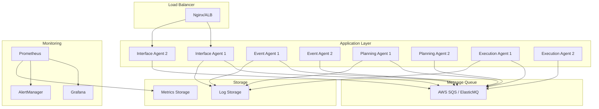

# Guia de Deployment

Este documento fornece instruções detalhadas para deploy do sistema de agentes autônomos em diferentes ambientes.

## 📋 Índice

- [Visão Geral](#visão-geral)
- [Pré-requisitos](#pré-requisitos)
- [Configuração de Ambiente](#configuração-de-ambiente)
- [Deploy Local](#deploy-local)
- [Deploy em Staging](#deploy-em-staging)
- [Deploy em Produção](#deploy-em-produção)
- [Configurações de Segurança](#configurações-de-segurança)
- [Monitoramento e Observabilidade](#monitoramento-e-observabilidade)
- [Backup e Recuperação](#backup-e-recuperação)
- [Troubleshooting](#troubleshooting)
- [Rollback](#rollback)

## 🎯 Visão Geral

O sistema suporta diferentes estratégias de deployment:

- **Local**: Desenvolvimento e testes
- **Staging**: Testes de integração e validação
- **Produção**: Ambiente live com alta disponibilidade

### Arquitetura de Deploy



## 🔧 Pré-requisitos

### Infraestrutura Mínima

#### Desenvolvimento
- **CPU**: 2 cores
- **RAM**: 4GB
- **Disk**: 10GB
- **OS**: Windows 10+, macOS 10.15+, Ubuntu 18.04+

#### Staging
- **CPU**: 4 cores
- **RAM**: 8GB
- **Disk**: 50GB SSD
- **Network**: 100Mbps

#### Produção
- **CPU**: 8+ cores
- **RAM**: 16GB+
- **Disk**: 100GB+ SSD
- **Network**: 1Gbps+
- **Redundância**: Multi-AZ

### Software

```bash
# Versões mínimas
Node.js >= 18.0.0
npm >= 8.0.0
Docker >= 20.10.0
Docker Compose >= 2.0.0

# Opcional para produção
Kubernetes >= 1.24
Helm >= 3.8
Terraform >= 1.0
```

### Serviços Externos

- **AWS SQS** (produção) ou **ElasticMQ** (desenvolvimento)
- **Prometheus** para métricas
- **Grafana** para dashboards
- **Load Balancer** (Nginx, ALB, etc.)

## ⚙️ Configuração de Ambiente

### Variáveis de Ambiente por Ambiente

#### Development (.env.development)
```bash
# Ambiente
NODE_ENV=development
LOG_LEVEL=debug
DEBUG=agent:*

# Agentes
INTERFACE_AGENT_PORT=3000
EVENT_AGENT_PORT=3001
PLANNING_AGENT_PORT=3002
EXECUTION_AGENT_PORT=3003

# SQS Local
SQS_ENDPOINT=http://localhost:9324
AWS_REGION=us-east-1
AWS_ACCESS_KEY_ID=dummy
AWS_SECRET_ACCESS_KEY=dummy

# Monitoramento
PROMETHEUS_PORT=9090
GRAFANA_PORT=3100
METRICS_ENABLED=true

# Performance
REQUEST_TIMEOUT=30000
CIRCUIT_BREAKER_THRESHOLD=5
RETRY_ATTEMPTS=3
```

#### Staging (.env.staging)
```bash
# Ambiente
NODE_ENV=staging
LOG_LEVEL=info

# Agentes
INTERFACE_AGENT_PORT=3000
EVENT_AGENT_PORT=3001
PLANNING_AGENT_PORT=3002
EXECUTION_AGENT_PORT=3003

# SQS AWS
SQS_ENDPOINT=https://sqs.us-east-1.amazonaws.com
AWS_REGION=us-east-1
AWS_ACCESS_KEY_ID=${AWS_ACCESS_KEY_ID}
AWS_SECRET_ACCESS_KEY=${AWS_SECRET_ACCESS_KEY}

# Filas
INTERFACE_EVENTS_QUEUE=staging-interface-events
EVENT_PROCESSING_QUEUE=staging-event-processing
PLANNING_REQUESTS_QUEUE=staging-planning-requests
EXECUTION_REQUESTS_QUEUE=staging-execution-requests

# Segurança
RATE_LIMIT_WINDOW_MS=60000
RATE_LIMIT_MAX_REQUESTS=100
CORS_ORIGIN=https://staging.example.com

# Performance
REQUEST_TIMEOUT=15000
CIRCUIT_BREAKER_THRESHOLD=3
RETRY_ATTEMPTS=2
WORKER_POOL_SIZE=4
```

#### Production (.env.production)
```bash
# Ambiente
NODE_ENV=production
LOG_LEVEL=warn

# Agentes
INTERFACE_AGENT_PORT=3000
EVENT_AGENT_PORT=3001
PLANNING_AGENT_PORT=3002
EXECUTION_AGENT_PORT=3003

# SQS AWS
SQS_ENDPOINT=https://sqs.us-east-1.amazonaws.com
AWS_REGION=us-east-1
AWS_ACCESS_KEY_ID=${AWS_ACCESS_KEY_ID}
AWS_SECRET_ACCESS_KEY=${AWS_SECRET_ACCESS_KEY}

# Filas
INTERFACE_EVENTS_QUEUE=prod-interface-events
EVENT_PROCESSING_QUEUE=prod-event-processing
PLANNING_REQUESTS_QUEUE=prod-planning-requests
EXECUTION_REQUESTS_QUEUE=prod-execution-requests

# Segurança
RATE_LIMIT_WINDOW_MS=60000
RATE_LIMIT_MAX_REQUESTS=1000
CORS_ORIGIN=https://app.example.com
HELMET_ENABLED=true
HTTPS_ONLY=true

# Performance
REQUEST_TIMEOUT=10000
CIRCUIT_BREAKER_THRESHOLD=2
RETRY_ATTEMPTS=1
WORKER_POOL_SIZE=8
CLUSTER_MODE=true

# Monitoramento
METRICS_ENABLED=true
TRACING_ENABLED=true
APM_SERVER_URL=${APM_SERVER_URL}
ERROR_TRACKING_DSN=${SENTRY_DSN}

# Alertas
SLACK_WEBHOOK_URL=${SLACK_WEBHOOK_URL}
EMAIL_SMTP_HOST=${SMTP_HOST}
EMAIL_SMTP_USER=${SMTP_USER}
EMAIL_SMTP_PASS=${SMTP_PASS}
```

## 🏠 Deploy Local

### Usando Docker Compose

```bash
# 1. Clonar repositório
git clone <repository-url>
cd agentesautonomos

# 2. Configurar ambiente
cp .env.example .env
npm run start:dev

# 3. Ou manualmente
cp .env.example .env
npm install
npm run docker:up

# 4. Verificar status
npm run health
npm run monitor
```

### Usando Node.js diretamente

```bash
# 1. Instalar dependências
npm install

# 2. Iniciar serviços de infraestrutura
docker-compose up -d elasticmq prometheus grafana

# 3. Iniciar agentes
npm run start:interface &
npm run start:event &
npm run start:planning &
npm run start:execution &

# 4. Verificar
npm run health
```

## 🧪 Deploy em Staging

### Preparação

```bash
# 1. Configurar AWS CLI
aws configure
aws sts get-caller-identity

# 2. Criar filas SQS
aws sqs create-queue --queue-name staging-interface-events
aws sqs create-queue --queue-name staging-event-processing
aws sqs create-queue --queue-name staging-planning-requests
aws sqs create-queue --queue-name staging-execution-requests

# 3. Configurar IAM roles
aws iam create-role --role-name StagingAgentsRole --assume-role-policy-document file://iam/trust-policy.json
aws iam attach-role-policy --role-name StagingAgentsRole --policy-arn arn:aws:iam::aws:policy/AmazonSQSFullAccess
```

### Deploy com Docker

```bash
# 1. Build das imagens
docker build -t agents/interface:staging -f docker/Dockerfile.interface .
docker build -t agents/event:staging -f docker/Dockerfile.event .
docker build -t agents/planning:staging -f docker/Dockerfile.planning .
docker build -t agents/execution:staging -f docker/Dockerfile.execution .

# 2. Push para registry
docker tag agents/interface:staging your-registry/agents/interface:staging
docker push your-registry/agents/interface:staging

# 3. Deploy
docker-compose -f docker-compose.staging.yml up -d

# 4. Verificar
curl https://staging-api.example.com/health
```

### Deploy com Kubernetes

```yaml
# k8s/staging/namespace.yaml
apiVersion: v1
kind: Namespace
metadata:
  name: agents-staging
---
# k8s/staging/configmap.yaml
apiVersion: v1
kind: ConfigMap
metadata:
  name: agents-config
  namespace: agents-staging
data:
  NODE_ENV: "staging"
  LOG_LEVEL: "info"
  SQS_ENDPOINT: "https://sqs.us-east-1.amazonaws.com"
  AWS_REGION: "us-east-1"
---
# k8s/staging/deployment.yaml
apiVersion: apps/v1
kind: Deployment
metadata:
  name: interface-agent
  namespace: agents-staging
spec:
  replicas: 2
  selector:
    matchLabels:
      app: interface-agent
  template:
    metadata:
      labels:
        app: interface-agent
    spec:
      containers:
      - name: interface-agent
        image: your-registry/agents/interface:staging
        ports:
        - containerPort: 3000
        envFrom:
        - configMapRef:
            name: agents-config
        - secretRef:
            name: agents-secrets
        resources:
          requests:
            memory: "256Mi"
            cpu: "250m"
          limits:
            memory: "512Mi"
            cpu: "500m"
        livenessProbe:
          httpGet:
            path: /health
            port: 3000
          initialDelaySeconds: 30
          periodSeconds: 10
        readinessProbe:
          httpGet:
            path: /ready
            port: 3000
          initialDelaySeconds: 5
          periodSeconds: 5
```

```bash
# Deploy no Kubernetes
kubectl apply -f k8s/staging/

# Verificar status
kubectl get pods -n agents-staging
kubectl logs -f deployment/interface-agent -n agents-staging
```

## 🚀 Deploy em Produção

### Preparação de Infraestrutura

#### Terraform (Infraestrutura como Código)

```hcl
# terraform/main.tf
provider "aws" {
  region = var.aws_region
}

# VPC
resource "aws_vpc" "agents_vpc" {
  cidr_block           = "10.0.0.0/16"
  enable_dns_hostnames = true
  enable_dns_support   = true
  
  tags = {
    Name = "agents-vpc"
    Environment = "production"
  }
}

# Subnets
resource "aws_subnet" "private" {
  count             = 2
  vpc_id            = aws_vpc.agents_vpc.id
  cidr_block        = "10.0.${count.index + 1}.0/24"
  availability_zone = data.aws_availability_zones.available.names[count.index]
  
  tags = {
    Name = "agents-private-${count.index + 1}"
    Type = "private"
  }
}

resource "aws_subnet" "public" {
  count                   = 2
  vpc_id                  = aws_vpc.agents_vpc.id
  cidr_block              = "10.0.${count.index + 10}.0/24"
  availability_zone       = data.aws_availability_zones.available.names[count.index]
  map_public_ip_on_launch = true
  
  tags = {
    Name = "agents-public-${count.index + 1}"
    Type = "public"
  }
}

# SQS Queues
resource "aws_sqs_queue" "interface_events" {
  name                      = "prod-interface-events"
  delay_seconds             = 0
  max_message_size          = 262144
  message_retention_seconds = 1209600
  receive_wait_time_seconds = 10
  
  redrive_policy = jsonencode({
    deadLetterTargetArn = aws_sqs_queue.interface_events_dlq.arn
    maxReceiveCount     = 3
  })
  
  tags = {
    Environment = "production"
  }
}

resource "aws_sqs_queue" "interface_events_dlq" {
  name = "prod-interface-events-dlq"
  
  tags = {
    Environment = "production"
  }
}

# ECS Cluster
resource "aws_ecs_cluster" "agents" {
  name = "agents-production"
  
  setting {
    name  = "containerInsights"
    value = "enabled"
  }
  
  tags = {
    Environment = "production"
  }
}

# Application Load Balancer
resource "aws_lb" "agents" {
  name               = "agents-alb"
  internal           = false
  load_balancer_type = "application"
  security_groups    = [aws_security_group.alb.id]
  subnets            = aws_subnet.public[*].id
  
  enable_deletion_protection = true
  
  tags = {
    Environment = "production"
  }
}
```

#### Deploy com ECS

```json
{
  "family": "interface-agent",
  "networkMode": "awsvpc",
  "requiresCompatibilities": ["FARGATE"],
  "cpu": "512",
  "memory": "1024",
  "executionRoleArn": "arn:aws:iam::ACCOUNT:role/ecsTaskExecutionRole",
  "taskRoleArn": "arn:aws:iam::ACCOUNT:role/AgentsTaskRole",
  "containerDefinitions": [
    {
      "name": "interface-agent",
      "image": "your-registry/agents/interface:latest",
      "portMappings": [
        {
          "containerPort": 3000,
          "protocol": "tcp"
        }
      ],
      "environment": [
        {
          "name": "NODE_ENV",
          "value": "production"
        },
        {
          "name": "AWS_REGION",
          "value": "us-east-1"
        }
      ],
      "secrets": [
        {
          "name": "AWS_ACCESS_KEY_ID",
          "valueFrom": "arn:aws:ssm:us-east-1:ACCOUNT:parameter/agents/aws-access-key-id"
        },
        {
          "name": "AWS_SECRET_ACCESS_KEY",
          "valueFrom": "arn:aws:ssm:us-east-1:ACCOUNT:parameter/agents/aws-secret-access-key"
        }
      ],
      "logConfiguration": {
        "logDriver": "awslogs",
        "options": {
          "awslogs-group": "/ecs/interface-agent",
          "awslogs-region": "us-east-1",
          "awslogs-stream-prefix": "ecs"
        }
      },
      "healthCheck": {
        "command": [
          "CMD-SHELL",
          "curl -f http://localhost:3000/health || exit 1"
        ],
        "interval": 30,
        "timeout": 5,
        "retries": 3,
        "startPeriod": 60
      }
    }
  ]
}
```

### Pipeline de Deploy

#### GitHub Actions

```yaml
# .github/workflows/deploy-production.yml
name: Deploy to Production

on:
  push:
    branches: [main]
    tags: ['v*']

jobs:
  test:
    runs-on: ubuntu-latest
    steps:
      - uses: actions/checkout@v3
      - uses: actions/setup-node@v3
        with:
          node-version: '18'
          cache: 'npm'
      
      - run: npm ci
      - run: npm run test
      - run: npm run test:integration
      - run: npm run lint
      
  build:
    needs: test
    runs-on: ubuntu-latest
    outputs:
      image-tag: ${{ steps.meta.outputs.tags }}
    steps:
      - uses: actions/checkout@v3
      
      - name: Configure AWS credentials
        uses: aws-actions/configure-aws-credentials@v2
        with:
          aws-access-key-id: ${{ secrets.AWS_ACCESS_KEY_ID }}
          aws-secret-access-key: ${{ secrets.AWS_SECRET_ACCESS_KEY }}
          aws-region: us-east-1
      
      - name: Login to Amazon ECR
        id: login-ecr
        uses: aws-actions/amazon-ecr-login@v1
      
      - name: Extract metadata
        id: meta
        uses: docker/metadata-action@v4
        with:
          images: ${{ steps.login-ecr.outputs.registry }}/agents
          tags: |
            type=ref,event=branch
            type=ref,event=pr
            type=semver,pattern={{version}}
            type=semver,pattern={{major}}.{{minor}}
      
      - name: Build and push Docker images
        uses: docker/build-push-action@v4
        with:
          context: .
          file: ./docker/Dockerfile.interface
          push: true
          tags: ${{ steps.meta.outputs.tags }}
          labels: ${{ steps.meta.outputs.labels }}
  
  deploy:
    needs: build
    runs-on: ubuntu-latest
    environment: production
    steps:
      - uses: actions/checkout@v3
      
      - name: Configure AWS credentials
        uses: aws-actions/configure-aws-credentials@v2
        with:
          aws-access-key-id: ${{ secrets.AWS_ACCESS_KEY_ID }}
          aws-secret-access-key: ${{ secrets.AWS_SECRET_ACCESS_KEY }}
          aws-region: us-east-1
      
      - name: Deploy to ECS
        run: |
          aws ecs update-service \
            --cluster agents-production \
            --service interface-agent \
            --force-new-deployment
          
          aws ecs wait services-stable \
            --cluster agents-production \
            --services interface-agent
      
      - name: Verify deployment
        run: |
          # Aguardar estabilização
          sleep 60
          
          # Verificar health
          curl -f https://api.example.com/health
          
          # Verificar métricas
          curl -f https://api.example.com/metrics
```

### Blue-Green Deployment

```bash
#!/bin/bash
# scripts/blue-green-deploy.sh

set -e

CLUSTER="agents-production"
SERVICE="interface-agent"
IMAGE_TAG="$1"

if [ -z "$IMAGE_TAG" ]; then
  echo "Usage: $0 <image-tag>"
  exit 1
fi

echo "Starting Blue-Green deployment for $SERVICE with image tag $IMAGE_TAG"

# 1. Criar nova task definition
echo "Creating new task definition..."
NEW_TASK_DEF=$(aws ecs describe-task-definition --task-definition $SERVICE --query 'taskDefinition' --output json | \
  jq --arg IMAGE_TAG "$IMAGE_TAG" '.containerDefinitions[0].image = $IMAGE_TAG' | \
  jq 'del(.taskDefinitionArn, .revision, .status, .requiresAttributes, .placementConstraints, .compatibilities, .registeredAt, .registeredBy)')

NEW_REVISION=$(echo $NEW_TASK_DEF | aws ecs register-task-definition --cli-input-json file:///dev/stdin --query 'taskDefinition.revision' --output text)

echo "New task definition revision: $NEW_REVISION"

# 2. Atualizar serviço com nova task definition
echo "Updating service with new task definition..."
aws ecs update-service \
  --cluster $CLUSTER \
  --service $SERVICE \
  --task-definition "$SERVICE:$NEW_REVISION"

# 3. Aguardar estabilização
echo "Waiting for service to stabilize..."
aws ecs wait services-stable --cluster $CLUSTER --services $SERVICE

# 4. Verificar health
echo "Verifying deployment health..."
sleep 30

HEALTH_CHECK=$(curl -s -o /dev/null -w "%{http_code}" https://api.example.com/health)
if [ "$HEALTH_CHECK" != "200" ]; then
  echo "Health check failed! Rolling back..."
  # Rollback para revisão anterior
  PREVIOUS_REVISION=$((NEW_REVISION - 1))
  aws ecs update-service \
    --cluster $CLUSTER \
    --service $SERVICE \
    --task-definition "$SERVICE:$PREVIOUS_REVISION"
  
  aws ecs wait services-stable --cluster $CLUSTER --services $SERVICE
  echo "Rollback completed"
  exit 1
fi

echo "Deployment successful!"

# 5. Cleanup - remover task definitions antigas (manter últimas 5)
echo "Cleaning up old task definitions..."
aws ecs list-task-definitions --family-prefix $SERVICE --status ACTIVE --sort DESC --query 'taskDefinitionArns[5:]' --output text | \
  xargs -r -n1 aws ecs deregister-task-definition --task-definition

echo "Blue-Green deployment completed successfully!"
```

## 🔒 Configurações de Segurança

### SSL/TLS

```nginx
# nginx/production.conf
server {
    listen 80;
    server_name api.example.com;
    return 301 https://$server_name$request_uri;
}

server {
    listen 443 ssl http2;
    server_name api.example.com;
    
    ssl_certificate /etc/ssl/certs/api.example.com.crt;
    ssl_certificate_key /etc/ssl/private/api.example.com.key;
    
    ssl_protocols TLSv1.2 TLSv1.3;
    ssl_ciphers ECDHE-RSA-AES256-GCM-SHA512:DHE-RSA-AES256-GCM-SHA512:ECDHE-RSA-AES256-GCM-SHA384:DHE-RSA-AES256-GCM-SHA384;
    ssl_prefer_server_ciphers off;
    
    add_header Strict-Transport-Security "max-age=63072000" always;
    add_header X-Frame-Options DENY;
    add_header X-Content-Type-Options nosniff;
    add_header X-XSS-Protection "1; mode=block";
    
    location / {
        proxy_pass http://interface-agent:3000;
        proxy_set_header Host $host;
        proxy_set_header X-Real-IP $remote_addr;
        proxy_set_header X-Forwarded-For $proxy_add_x_forwarded_for;
        proxy_set_header X-Forwarded-Proto $scheme;
        
        proxy_connect_timeout 30s;
        proxy_send_timeout 30s;
        proxy_read_timeout 30s;
    }
    
    location /health {
        access_log off;
        proxy_pass http://interface-agent:3000/health;
    }
}
```

### Secrets Management

```bash
# Usar AWS Systems Manager Parameter Store
aws ssm put-parameter \
  --name "/agents/production/aws-access-key-id" \
  --value "$AWS_ACCESS_KEY_ID" \
  --type "SecureString" \
  --description "AWS Access Key ID for Agents"

aws ssm put-parameter \
  --name "/agents/production/aws-secret-access-key" \
  --value "$AWS_SECRET_ACCESS_KEY" \
  --type "SecureString" \
  --description "AWS Secret Access Key for Agents"

# Ou usar AWS Secrets Manager
aws secretsmanager create-secret \
  --name "agents/production/aws-credentials" \
  --description "AWS credentials for Agents" \
  --secret-string '{
    "aws_access_key_id": "'$AWS_ACCESS_KEY_ID'",
    "aws_secret_access_key": "'$AWS_SECRET_ACCESS_KEY'"
  }'
```

### Network Security

```hcl
# terraform/security-groups.tf
resource "aws_security_group" "agents" {
  name_prefix = "agents-"
  vpc_id      = aws_vpc.agents_vpc.id
  
  # Inbound rules
  ingress {
    from_port       = 3000
    to_port         = 3003
    protocol        = "tcp"
    security_groups = [aws_security_group.alb.id]
  }
  
  # Outbound rules
  egress {
    from_port   = 443
    to_port     = 443
    protocol    = "tcp"
    cidr_blocks = ["0.0.0.0/0"]
    description = "HTTPS outbound"
  }
  
  egress {
    from_port   = 80
    to_port     = 80
    protocol    = "tcp"
    cidr_blocks = ["0.0.0.0/0"]
    description = "HTTP outbound"
  }
  
  tags = {
    Name = "agents-sg"
    Environment = "production"
  }
}
```

## 📊 Monitoramento e Observabilidade

### Prometheus Configuration

```yaml
# config/prometheus.production.yml
global:
  scrape_interval: 15s
  evaluation_interval: 15s
  external_labels:
    environment: 'production'
    cluster: 'agents'

rule_files:
  - "alerts/*.yml"

alerting:
  alertmanagers:
    - static_configs:
        - targets:
          - alertmanager:9093

scrape_configs:
  - job_name: 'interface-agent'
    static_configs:
      - targets: ['interface-agent-1:3000', 'interface-agent-2:3000']
    metrics_path: '/metrics'
    scrape_interval: 15s
    scrape_timeout: 10s
    
  - job_name: 'event-agent'
    static_configs:
      - targets: ['event-agent-1:3001', 'event-agent-2:3001']
    metrics_path: '/metrics'
    scrape_interval: 15s
    
  - job_name: 'planning-agent'
    static_configs:
      - targets: ['planning-agent-1:3002', 'planning-agent-2:3002']
    metrics_path: '/metrics'
    scrape_interval: 15s
    
  - job_name: 'execution-agent'
    static_configs:
      - targets: ['execution-agent-1:3003', 'execution-agent-2:3003']
    metrics_path: '/metrics'
    scrape_interval: 15s
    
  - job_name: 'aws-sqs'
    ec2_sd_configs:
      - region: us-east-1
        port: 9324
    relabel_configs:
      - source_labels: [__meta_ec2_tag_Service]
        target_label: service
      - source_labels: [__meta_ec2_tag_Environment]
        target_label: environment
        regex: production
```

### Alerting Rules

```yaml
# config/alerts/agents.yml
groups:
  - name: agents
    rules:
      - alert: AgentDown
        expr: up{job=~".*-agent"} == 0
        for: 1m
        labels:
          severity: critical
        annotations:
          summary: "Agent {{ $labels.job }} is down"
          description: "Agent {{ $labels.job }} on {{ $labels.instance }} has been down for more than 1 minute."
      
      - alert: HighErrorRate
        expr: rate(http_requests_total{status=~"5.."}[5m]) > 0.1
        for: 2m
        labels:
          severity: warning
        annotations:
          summary: "High error rate on {{ $labels.job }}"
          description: "Error rate is {{ $value }} errors per second on {{ $labels.job }}."
      
      - alert: HighLatency
        expr: histogram_quantile(0.95, rate(http_request_duration_seconds_bucket[5m])) > 1
        for: 5m
        labels:
          severity: warning
        annotations:
          summary: "High latency on {{ $labels.job }}"
          description: "95th percentile latency is {{ $value }}s on {{ $labels.job }}."
      
      - alert: QueueBacklog
        expr: sqs_queue_messages_available > 1000
        for: 5m
        labels:
          severity: warning
        annotations:
          summary: "SQS queue backlog"
          description: "Queue {{ $labels.queue_name }} has {{ $value }} messages."
```

### Grafana Dashboards

```json
{
  "dashboard": {
    "title": "Agents Production Overview",
    "panels": [
      {
        "title": "Request Rate",
        "type": "graph",
        "targets": [
          {
            "expr": "sum(rate(http_requests_total[5m])) by (job)",
            "legendFormat": "{{ job }}"
          }
        ]
      },
      {
        "title": "Error Rate",
        "type": "graph",
        "targets": [
          {
            "expr": "sum(rate(http_requests_total{status=~\"5..\"}[5m])) by (job)",
            "legendFormat": "{{ job }} errors"
          }
        ]
      },
      {
        "title": "Response Time",
        "type": "graph",
        "targets": [
          {
            "expr": "histogram_quantile(0.95, sum(rate(http_request_duration_seconds_bucket[5m])) by (le, job))",
            "legendFormat": "{{ job }} p95"
          }
        ]
      }
    ]
  }
}
```

## 💾 Backup e Recuperação

### Backup de Configurações

```bash
#!/bin/bash
# scripts/backup.sh

BACKUP_DATE=$(date +%Y%m%d_%H%M%S)
BACKUP_DIR="backups/$BACKUP_DATE"

mkdir -p $BACKUP_DIR

# Backup de configurações
cp -r config/ $BACKUP_DIR/
cp .env.production $BACKUP_DIR/
cp docker-compose.production.yml $BACKUP_DIR/

# Backup de task definitions ECS
aws ecs describe-task-definition --task-definition interface-agent > $BACKUP_DIR/interface-agent-task-def.json
aws ecs describe-task-definition --task-definition event-agent > $BACKUP_DIR/event-agent-task-def.json

# Backup de configurações SQS
aws sqs get-queue-attributes --queue-url https://sqs.us-east-1.amazonaws.com/ACCOUNT/prod-interface-events --attribute-names All > $BACKUP_DIR/sqs-interface-events.json

# Backup de métricas (últimas 24h)
prometheus_backup_url="http://prometheus:9090/api/v1/query_range?query=up&start=$(date -d '1 day ago' +%s)&end=$(date +%s)&step=300"
curl "$prometheus_backup_url" > $BACKUP_DIR/metrics-backup.json

# Compactar backup
tar -czf "backup_$BACKUP_DATE.tar.gz" $BACKUP_DIR/

# Upload para S3
aws s3 cp "backup_$BACKUP_DATE.tar.gz" s3://agents-backups/

echo "Backup completed: backup_$BACKUP_DATE.tar.gz"
```

### Disaster Recovery

```bash
#!/bin/bash
# scripts/disaster-recovery.sh

BACKUP_FILE="$1"

if [ -z "$BACKUP_FILE" ]; then
  echo "Usage: $0 <backup-file>"
  echo "Available backups:"
  aws s3 ls s3://agents-backups/
  exit 1
fi

echo "Starting disaster recovery from $BACKUP_FILE"

# 1. Download backup
aws s3 cp "s3://agents-backups/$BACKUP_FILE" .
tar -xzf "$BACKUP_FILE"

BACKUP_DIR=$(echo $BACKUP_FILE | sed 's/.tar.gz//')

# 2. Restore configurations
cp $BACKUP_DIR/config/* config/
cp $BACKUP_DIR/.env.production .env

# 3. Recreate SQS queues
aws sqs create-queue --queue-name prod-interface-events
aws sqs create-queue --queue-name prod-event-processing

# 4. Restore ECS task definitions
aws ecs register-task-definition --cli-input-json file://$BACKUP_DIR/interface-agent-task-def.json
aws ecs register-task-definition --cli-input-json file://$BACKUP_DIR/event-agent-task-def.json

# 5. Restart services
aws ecs update-service --cluster agents-production --service interface-agent --force-new-deployment
aws ecs update-service --cluster agents-production --service event-agent --force-new-deployment

# 6. Wait for stabilization
aws ecs wait services-stable --cluster agents-production --services interface-agent event-agent

# 7. Verify recovery
curl -f https://api.example.com/health

echo "Disaster recovery completed successfully"
```

## 🔄 Rollback

### Rollback Automático

```bash
#!/bin/bash
# scripts/auto-rollback.sh

SERVICE="$1"
CLUSTER="agents-production"
MAX_WAIT=300  # 5 minutos

if [ -z "$SERVICE" ]; then
  echo "Usage: $0 <service-name>"
  exit 1
fi

echo "Monitoring deployment of $SERVICE for auto-rollback..."

start_time=$(date +%s)

while true; do
  current_time=$(date +%s)
  elapsed=$((current_time - start_time))
  
  if [ $elapsed -gt $MAX_WAIT ]; then
    echo "Timeout reached. Initiating rollback..."
    break
  fi
  
  # Verificar health do serviço
  HEALTHY_TASKS=$(aws ecs describe-services --cluster $CLUSTER --services $SERVICE --query 'services[0].runningCount' --output text)
  DESIRED_TASKS=$(aws ecs describe-services --cluster $CLUSTER --services $SERVICE --query 'services[0].desiredCount' --output text)
  
  if [ "$HEALTHY_TASKS" = "$DESIRED_TASKS" ] && [ "$HEALTHY_TASKS" -gt 0 ]; then
    # Verificar endpoint health
    HEALTH_STATUS=$(curl -s -o /dev/null -w "%{http_code}" https://api.example.com/health)
    
    if [ "$HEALTH_STATUS" = "200" ]; then
      echo "Deployment successful. No rollback needed."
      exit 0
    fi
  fi
  
  echo "Waiting for deployment to stabilize... ($elapsed/${MAX_WAIT}s)"
  sleep 30
done

# Executar rollback
echo "Executing rollback for $SERVICE"

# Obter revisão anterior
CURRENT_REVISION=$(aws ecs describe-services --cluster $CLUSTER --services $SERVICE --query 'services[0].taskDefinition' --output text | grep -o '[0-9]*$')
PREVIOUS_REVISION=$((CURRENT_REVISION - 1))

if [ $PREVIOUS_REVISION -lt 1 ]; then
  echo "No previous revision available for rollback"
  exit 1
fi

echo "Rolling back from revision $CURRENT_REVISION to $PREVIOUS_REVISION"

# Executar rollback
aws ecs update-service \
  --cluster $CLUSTER \
  --service $SERVICE \
  --task-definition "$SERVICE:$PREVIOUS_REVISION"

# Aguardar estabilização
aws ecs wait services-stable --cluster $CLUSTER --services $SERVICE

echo "Rollback completed successfully"

# Notificar equipe
curl -X POST -H 'Content-type: application/json' \
  --data '{"text":"🚨 Auto-rollback executed for '$SERVICE' from revision '$CURRENT_REVISION' to '$PREVIOUS_REVISION'"}' \
  $SLACK_WEBHOOK_URL
```

### Rollback Manual

```bash
# Listar revisões disponíveis
aws ecs list-task-definitions --family-prefix interface-agent --status ACTIVE

# Rollback para revisão específica
aws ecs update-service \
  --cluster agents-production \
  --service interface-agent \
  --task-definition interface-agent:42

# Aguardar estabilização
aws ecs wait services-stable \
  --cluster agents-production \
  --services interface-agent

# Verificar status
curl https://api.example.com/health
```

## 📋 Checklist de Deploy

### Pré-Deploy
- [ ] Testes passando (unit, integration, e2e)
- [ ] Code review aprovado
- [ ] Documentação atualizada
- [ ] Variáveis de ambiente configuradas
- [ ] Secrets atualizados
- [ ] Backup realizado
- [ ] Equipe notificada

### Durante Deploy
- [ ] Monitoramento ativo
- [ ] Logs sendo observados
- [ ] Health checks passando
- [ ] Métricas normais
- [ ] Performance aceitável

### Pós-Deploy
- [ ] Smoke tests executados
- [ ] Funcionalidades críticas testadas
- [ ] Alertas configurados
- [ ] Documentação de deploy atualizada
- [ ] Equipe notificada do sucesso
- [ ] Rollback plan validado

---

**Última atualização**: $(date)
**Versão**: 1.0.0

Para mais informações:
- [Troubleshooting](./TROUBLESHOOTING.md)
- [Desenvolvimento](./DEVELOPMENT.md)
- [Arquitetura](./ARCHITECTURE.md)