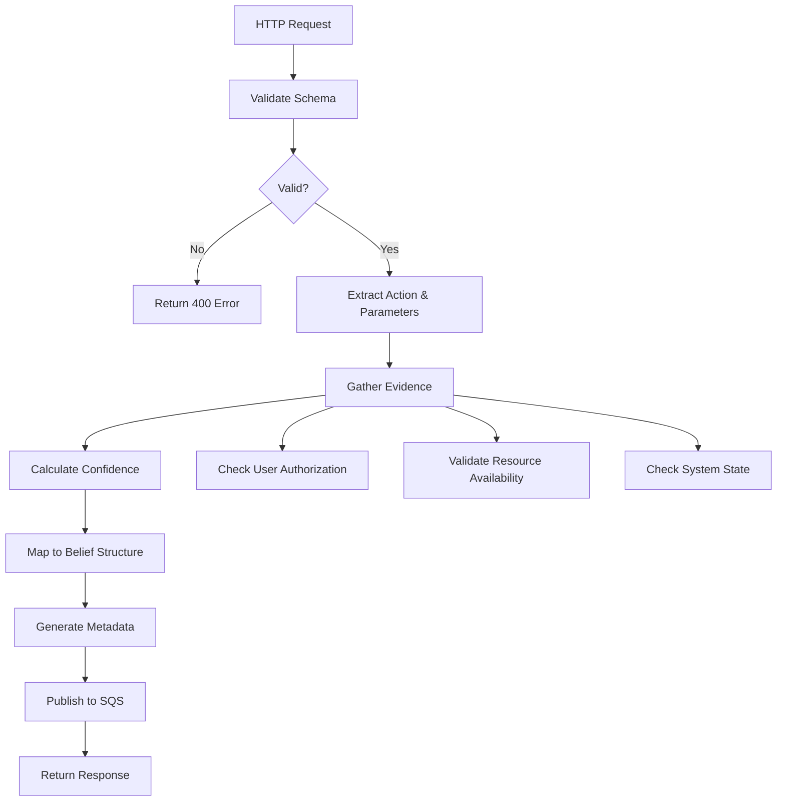

# Especificações Técnicas - Componentes BDI+MARL

## 1. Interface Agent - Especificação Técnica Detalhada

### 1.1 Visão Geral
O Interface Agent evoluído mantém suas responsabilidades atuais e adiciona capacidades de mapeamento para estruturas BDI (Belief-Desire-Intention).

### 1.2 Requisitos Funcionais
- **RF001**: Receber requisições HTTP e converter para crenças BDI
- **RF002**: Validar esquemas de entrada contra modelos BDI
- **RF003**: Gerar identificadores únicos para rastreamento
- **RF004**: Calcular métricas de confiança para crenças
- **RF005**: Manter compatibilidade com formato atual de eventos

### 1.3 Arquitetura Interna
```
┌─────────────────────────────────────────────────────────────┐
│                  Interface Agent (BDI)                     │
├─────────────────────────────────────────────────────────────┤
│  ┌─────────────┐  ┌─────────────┐  ┌─────────────────────┐  │
│  │   HTTP      │  │   Request   │  │      Belief         │  │
│  │  Handler    │  │  Validator  │  │     Mapper          │  │
│  └─────────────┘  └─────────────┘  └─────────────────────┘  │
│         │                 │                    │            │
│         └─────────────────┼────────────────────┘            │
│                           │                                 │
│  ┌─────────────────────────────────────────────────────────┐  │
│  │              SQS Publisher Engine                      │  │
│  │  ┌─────────────┐  ┌─────────────┐  ┌─────────────────┐  │  │
│  │  │   Message   │  │   Queue     │  │     Metrics     │  │  │
│  │  │  Formatter  │  │  Selector   │  │   Collector     │  │  │
│  │  └─────────────┘  └─────────────┘  └─────────────────┘  │  │
│  └─────────────────────────────────────────────────────────┘  │
└─────────────────────────────────────────────────────────────┘
```

### 1.4 Esquemas JSON

#### 1.4.1 Esquema de Entrada (HTTP Request)
```json
{
  "$schema": "http://json-schema.org/draft-07/schema#",
  "type": "object",
  "properties": {
    "action": {
      "type": "string",
      "enum": ["process_document", "analyze_data", "generate_report", "execute_workflow"]
    },
    "parameters": {
      "type": "object",
      "properties": {
        "priority": {
          "type": "string",
          "enum": ["low", "medium", "high", "critical"]
        },
        "deadline": {
          "type": "string",
          "format": "date-time"
        },
        "resourceRequirements": {
          "type": "object",
          "properties": {
            "cpu": {"type": "number", "minimum": 0, "maximum": 1},
            "memory": {"type": "number", "minimum": 0},
            "storage": {"type": "number", "minimum": 0}
          }
        }
      },
      "required": ["priority"]
    },
    "context": {
      "type": "object",
      "properties": {
        "userId": {"type": "string"},
        "sessionId": {"type": "string"},
        "organizationId": {"type": "string"}
      },
      "required": ["userId"]
    }
  },
  "required": ["action", "parameters", "context"]
}
```

#### 1.4.2 Esquema de Saída (Belief Message)
```json
{
  "$schema": "http://json-schema.org/draft-07/schema#",
  "type": "object",
  "properties": {
    "messageType": {
      "type": "string",
      "const": "belief"
    },
    "timestamp": {
      "type": "string",
      "format": "date-time"
    },
    "source": {
      "type": "string",
      "const": "interface-agent"
    },
    "belief": {
      "type": "object",
      "properties": {
        "type": {
          "type": "string",
          "enum": ["user_request", "system_event", "external_trigger"]
        },
        "content": {
          "type": "object"
        },
        "confidence": {
          "type": "number",
          "minimum": 0,
          "maximum": 1
        },
        "context": {
          "type": "object"
        },
        "evidence": {
          "type": "array",
          "items": {
            "type": "object",
            "properties": {
              "source": {"type": "string"},
              "weight": {"type": "number", "minimum": 0, "maximum": 1},
              "data": {"type": "object"}
            }
          }
        }
      },
      "required": ["type", "content", "confidence"]
    },
    "metadata": {
      "type": "object",
      "properties": {
        "correlationId": {"type": "string"},
        "traceId": {"type": "string"},
        "version": {"type": "string"},
        "priority": {"type": "integer", "minimum": 1, "maximum": 10}
      },
      "required": ["correlationId", "traceId"]
    }
  },
  "required": ["messageType", "timestamp", "source", "belief", "metadata"]
}
```

### 1.5 Regras de Mapeamento

#### 1.5.1 Mapeamento de Ação para Tipo de Crença
```javascript
const actionToBeliefMapping = {
  'process_document': {
    beliefType: 'user_request',
    baseConfidence: 0.9,
    requiredEvidence: ['document_exists', 'user_authorized']
  },
  'analyze_data': {
    beliefType: 'user_request',
    baseConfidence: 0.85,
    requiredEvidence: ['data_available', 'analysis_tools_ready']
  },
  'generate_report': {
    beliefType: 'user_request',
    baseConfidence: 0.8,
    requiredEvidence: ['data_complete', 'template_available']
  },
  'execute_workflow': {
    beliefType: 'user_request',
    baseConfidence: 0.95,
    requiredEvidence: ['workflow_defined', 'resources_available']
  }
};
```

#### 1.5.2 Cálculo de Confiança
```javascript
class ConfidenceCalculator {
  calculateConfidence(action, parameters, context, evidence) {
    const mapping = actionToBeliefMapping[action];
    let confidence = mapping.baseConfidence;
    
    // Ajuste baseado na prioridade
    const priorityWeight = {
      'low': 0.7,
      'medium': 0.85,
      'high': 0.95,
      'critical': 1.0
    };
    confidence *= priorityWeight[parameters.priority];
    
    // Ajuste baseado na evidência disponível
    const evidenceScore = this.calculateEvidenceScore(evidence, mapping.requiredEvidence);
    confidence *= evidenceScore;
    
    // Ajuste baseado no contexto
    if (context.sessionId && context.userId) {
      confidence *= 1.1; // Boost para sessões autenticadas
    }
    
    return Math.min(confidence, 1.0);
  }
  
  calculateEvidenceScore(evidence, required) {
    if (!required || required.length === 0) return 1.0;
    
    const availableEvidence = evidence.map(e => e.source);
    const matchedEvidence = required.filter(r => availableEvidence.includes(r));
    
    return matchedEvidence.length / required.length;
  }
}
```

### 1.6 Fluxo de Processamento



### 1.7 Artefatos de Engenharia Gerados

#### 1.7.1 Configuração de Filas SQS
```json
{
  "queues": {
    "beliefs-queue": {
      "name": "beliefs-queue",
      "visibilityTimeout": 30,
      "messageRetentionPeriod": 1209600,
      "maxReceiveCount": 3,
      "deadLetterQueue": "beliefs-dlq",
      "tags": {
        "Environment": "${ENVIRONMENT}",
        "Component": "interface-agent",
        "MessageType": "belief"
      }
    }
  }
}
```

#### 1.7.2 Métricas Prometheus
```javascript
const promClient = require('prom-client');

const beliefMetrics = {
  beliefsGenerated: new promClient.Counter({
    name: 'interface_agent_beliefs_generated_total',
    help: 'Total number of beliefs generated',
    labelNames: ['belief_type', 'priority', 'confidence_range']
  }),
  
  confidenceDistribution: new promClient.Histogram({
    name: 'interface_agent_belief_confidence',
    help: 'Distribution of belief confidence scores',
    buckets: [0.1, 0.2, 0.3, 0.4, 0.5, 0.6, 0.7, 0.8, 0.9, 1.0]
  }),
  
  processingTime: new promClient.Histogram({
    name: 'interface_agent_processing_duration_seconds',
    help: 'Time spent processing requests',
    buckets: [0.001, 0.005, 0.01, 0.05, 0.1, 0.5, 1.0]
  })
};
```

## 2. Event Agent - Especificação Técnica Detalhada

### 2.1 Visão Geral
O Event Agent evoluído processa crenças BDI e gera desejos baseados em regras de trigger avançadas.

### 2.2 Requisitos Funcionais
- **RF001**: Processar crenças recebidas da fila SQS
- **RF002**: Aplicar regras de trigger baseadas em padrões BDI
- **RF003**: Gerar desejos priorizados
- **RF004**: Manter histórico de crenças para análise temporal
- **RF005**: Detectar padrões e anomalias em crenças

### 2.3 Modelo de Regras de Trigger

#### 2.3.1 Estrutura de Regra
```json
{
  "$schema": "http://json-schema.org/draft-07/schema#",
  "type": "object",
  "properties": {
    "id": {"type": "string"},
    "name": {"type": "string"},
    "description": {"type": "string"},
    "priority": {"type": "integer", "minimum": 1, "maximum": 10},
    "enabled": {"type": "boolean"},
    "conditions": {
      "type": "object",
      "properties": {
        "beliefType": {"type": "string"},
        "confidenceThreshold": {"type": "number", "minimum": 0, "maximum": 1},
        "contextMatchers": {
          "type": "array",
          "items": {
            "type": "object",
            "properties": {
              "field": {"type": "string"},
              "operator": {"type": "string", "enum": ["eq", "ne", "gt", "lt", "gte", "lte", "in", "contains"]},
              "value": {}
            }
          }
        },
        "temporalConditions": {
          "type": "object",
          "properties": {
            "timeWindow": {"type": "string"},
            "frequency": {"type": "string"},
            "pattern": {"type": "string"}
          }
        }
      }
    },
    "actions": {
      "type": "object",
      "properties": {
        "generateDesire": {
          "type": "object",
          "properties": {
            "type": {"type": "string"},
            "priority": {"type": "integer", "minimum": 1, "maximum": 10},
            "deadline": {"type": "string"},
            "resources": {"type": "object"},
            "constraints": {"type": "object"}
          }
        },
        "updateBelief": {
          "type": "object",
          "properties": {
            "field": {"type": "string"},
            "operation": {"type": "string"},
            "value": {}
          }
        },
        "triggerAlert": {
          "type": "object",
          "properties": {
            "level": {"type": "string", "enum": ["info", "warning", "error", "critical"]},
            "message": {"type": "string"},
            "recipients": {"type": "array", "items": {"type": "string"}}
          }
        }
      }
    }
  },
  "required": ["id", "name", "priority", "conditions", "actions"]
}
```

#### 2.3.2 Exemplos de Regras
```json
{
  "triggerRules": [
    {
      "id": "high_priority_document_processing",
      "name": "High Priority Document Processing",
      "description": "Triggers urgent processing for high priority documents",
      "priority": 9,
      "enabled": true,
      "conditions": {
        "beliefType": "user_request",
        "confidenceThreshold": 0.8,
        "contextMatchers": [
          {
            "field": "belief.content.action",
            "operator": "eq",
            "value": "process_document"
          },
          {
            "field": "belief.content.parameters.priority",
            "operator": "in",
            "value": ["high", "critical"]
          }
        ]
      },
      "actions": {
        "generateDesire": {
          "type": "urgent_document_processing",
          "priority": 9,
          "deadline": "+5m",
          "resources": {
            "cpu": 0.8,
            "memory": "2GB",
            "priority_queue": true
          },
          "constraints": {
            "max_parallel": 3,
            "timeout": "10m"
          }
        }
      }
    },
    {
      "id": "anomaly_detection",
      "name": "System Anomaly Detection",
      "description": "Detects unusual patterns in system behavior",
      "priority": 7,
      "enabled": true,
      "conditions": {
        "beliefType": "system_event",
        "confidenceThreshold": 0.9,
        "temporalConditions": {
          "timeWindow": "5m",
          "frequency": ">10",
          "pattern": "error_spike"
        }
      },
      "actions": {
        "generateDesire": {
          "type": "investigate_anomaly",
          "priority": 8,
          "deadline": "+2m"
        },
        "triggerAlert": {
          "level": "warning",
          "message": "Anomaly detected in system behavior",
          "recipients": ["ops-team@company.com"]
        }
      }
    }
  ]
}
```

### 2.4 Engine de Processamento

```javascript
class EventProcessingEngine {
  constructor() {
    this.ruleEngine = new RuleEngine();
    this.beliefHistory = new BeliefHistory();
    this.patternDetector = new PatternDetector();
  }
  
  async processBelief(belief) {
    // 1. Armazenar crença no histórico
    await this.beliefHistory.store(belief);
    
    // 2. Detectar padrões temporais
    const patterns = await this.patternDetector.analyze(belief, this.beliefHistory);
    
    // 3. Aplicar regras de trigger
    const matchedRules = await this.ruleEngine.evaluate(belief, patterns);
    
    // 4. Gerar desejos baseados nas regras
    const desires = [];
    for (const rule of matchedRules) {
      const desire = await this.generateDesire(belief, rule);
      desires.push(desire);
    }
    
    // 5. Priorizar desejos
    const prioritizedDesires = this.prioritizeDesires(desires);
    
    // 6. Publicar desejos
    for (const desire of prioritizedDesires) {
      await this.publishDesire(desire);
    }
    
    return {
      processedBelief: belief,
      matchedRules: matchedRules.length,
      generatedDesires: desires.length,
      patterns: patterns
    };
  }
  
  generateDesire(belief, rule) {
    const desireTemplate = rule.actions.generateDesire;
    
    return {
      messageType: 'desire',
      timestamp: new Date().toISOString(),
      source: 'event-agent',
      desire: {
        type: desireTemplate.type,
        priority: desireTemplate.priority,
        deadline: this.calculateDeadline(desireTemplate.deadline),
        origin: {
          beliefId: belief.metadata.correlationId,
          ruleId: rule.id,
          confidence: belief.belief.confidence
        },
        requirements: {
          resources: desireTemplate.resources || {},
          constraints: desireTemplate.constraints || {},
          preconditions: this.extractPreconditions(belief, rule)
        }
      },
      metadata: {
        correlationId: belief.metadata.correlationId,
        traceId: belief.metadata.traceId,
        parentId: belief.metadata.correlationId,
        priority: desireTemplate.priority
      }
    };
  }
}
```

## 3. BDI Planning Agent - Especificação Técnica Detalhada

### 3.1 Modelo BDI Completo

#### 3.1.1 Estrutura de Crenças (Beliefs)
```javascript
class BeliefBase {
  constructor() {
    this.beliefs = new Map();
    this.beliefHistory = [];
    this.confidenceThreshold = 0.7;
  }
  
  addBelief(belief) {
    const key = this.generateBeliefKey(belief);
    
    if (belief.confidence >= this.confidenceThreshold) {
      this.beliefs.set(key, {
        ...belief,
        timestamp: new Date(),
        source: belief.source,
        evidence: belief.evidence || []
      });
      
      this.beliefHistory.push({
        action: 'add',
        belief: belief,
        timestamp: new Date()
      });
    }
  }
  
  updateBelief(key, updates) {
    if (this.beliefs.has(key)) {
      const currentBelief = this.beliefs.get(key);
      const updatedBelief = { ...currentBelief, ...updates };
      this.beliefs.set(key, updatedBelief);
      
      this.beliefHistory.push({
        action: 'update',
        belief: updatedBelief,
        timestamp: new Date()
      });
    }
  }
  
  queryBeliefs(query) {
    return Array.from(this.beliefs.values()).filter(belief => 
      this.matchesQuery(belief, query)
    );
  }
}
```

#### 3.1.2 Estrutura de Desejos (Desires)
```javascript
class DesireBase {
  constructor() {
    this.desires = new Set();
    this.achievedDesires = new Set();
    this.conflictResolver = new ConflictResolver();
  }
  
  addDesire(desire) {
    // Verificar conflitos com desejos existentes
    const conflicts = this.detectConflicts(desire);
    
    if (conflicts.length > 0) {
      const resolution = this.conflictResolver.resolve(desire, conflicts);
      this.applyResolution(resolution);
    } else {
      this.desires.add(desire);
    }
  }
  
  detectConflicts(newDesire) {
    return Array.from(this.desires).filter(existingDesire => 
      this.areConflicting(newDesire, existingDesire)
    );
  }
  
  areConflicting(desire1, desire2) {
    // Conflito de recursos
    if (this.hasResourceConflict(desire1, desire2)) return true;
    
    // Conflito temporal
    if (this.hasTemporalConflict(desire1, desire2)) return true;
    
    // Conflito lógico
    if (this.hasLogicalConflict(desire1, desire2)) return true;
    
    return false;
  }
}
```

#### 3.1.3 Estrutura de Intenções (Intentions)
```javascript
class IntentionBase {
  constructor() {
    this.intentions = new Queue();
    this.activeIntentions = new Map();
    this.completedIntentions = [];
  }
  
  formIntention(desire, plan) {
    const intention = {
      id: this.generateIntentionId(),
      desire: desire,
      plan: plan,
      status: 'formed',
      createdAt: new Date(),
      priority: desire.priority,
      deadline: desire.deadline,
      resources: plan.requiredResources,
      steps: plan.steps,
      currentStep: 0,
      context: {
        beliefSnapshot: this.captureRelevantBeliefs(desire),
        assumptions: plan.assumptions
      }
    };
    
    this.intentions.enqueue(intention);
    return intention;
  }
  
  commitToIntention(intention) {
    intention.status = 'committed';
    intention.committedAt = new Date();
    this.activeIntentions.set(intention.id, intention);
  }
  
  executeIntention(intentionId) {
    const intention = this.activeIntentions.get(intentionId);
    if (!intention) throw new Error(`Intention ${intentionId} not found`);
    
    intention.status = 'executing';
    intention.executionStarted = new Date();
    
    return this.executeNextStep(intention);
  }
}
```

### 3.2 Algoritmo de Deliberação BDI

```javascript
class BDIDeliberationEngine {
  constructor(beliefBase, desireBase, intentionBase, planLibrary) {
    this.beliefBase = beliefBase;
    this.desireBase = desireBase;
    this.intentionBase = intentionBase;
    this.planLibrary = planLibrary;
  }
  
  async deliberate() {
    // 1. Atualizar crenças baseadas no estado atual
    await this.updateBeliefs();
    
    // 2. Revisar desejos baseados nas novas crenças
    await this.reviseDesires();
    
    // 3. Filtrar desejos compatíveis
    const compatibleDesires = this.filterCompatibleDesires();
    
    // 4. Selecionar desejos prioritários
    const selectedDesires = this.selectDesires(compatibleDesires);
    
    // 5. Gerar planos para os desejos selecionados
    const plans = await this.generatePlans(selectedDesires);
    
    // 6. Formar intenções
    const newIntentions = this.formIntentions(selectedDesires, plans);
    
    // 7. Comprometer-se com as intenções
    this.commitToIntentions(newIntentions);
    
    return {
      updatedBeliefs: this.beliefBase.beliefs.size,
      revisedDesires: this.desireBase.desires.size,
      selectedDesires: selectedDesires.length,
      formedIntentions: newIntentions.length
    };
  }
  
  filterCompatibleDesires() {
    const currentBeliefs = Array.from(this.beliefBase.beliefs.values());
    const desires = Array.from(this.desireBase.desires);
    
    return desires.filter(desire => {
      // Verificar se as precondições do desejo são satisfeitas pelas crenças
      return this.arePreconditionsSatisfied(desire, currentBeliefs);
    });
  }
  
  selectDesires(compatibleDesires) {
    // Algoritmo de seleção baseado em utilidade
    const scoredDesires = compatibleDesires.map(desire => ({
      desire,
      score: this.calculateDesireUtility(desire)
    }));
    
    // Ordenar por score e selecionar os top N
    scoredDesires.sort((a, b) => b.score - a.score);
    
    const maxDesires = this.calculateMaxSelectableDesires();
    return scoredDesires.slice(0, maxDesires).map(item => item.desire);
  }
  
  calculateDesireUtility(desire) {
    let utility = 0;
    
    // Fator de prioridade (0-10 -> 0-1)
    utility += (desire.priority / 10) * 0.4;
    
    // Fator de urgência baseado no deadline
    const urgency = this.calculateUrgency(desire.deadline);
    utility += urgency * 0.3;
    
    // Fator de viabilidade baseado nos recursos disponíveis
    const feasibility = this.calculateFeasibility(desire);
    utility += feasibility * 0.2;
    
    // Fator de valor de negócio
    const businessValue = this.calculateBusinessValue(desire);
    utility += businessValue * 0.1;
    
    return utility;
  }
}
```

### 3.3 Biblioteca de Planos

#### 3.3.1 Estrutura de Plano
```json
{
  "$schema": "http://json-schema.org/draft-07/schema#",
  "type": "object",
  "properties": {
    "id": {"type": "string"},
    "name": {"type": "string"},
    "description": {"type": "string"},
    "applicableDesires": {
      "type": "array",
      "items": {"type": "string"}
    },
    "preconditions": {
      "type": "array",
      "items": {
        "type": "object",
        "properties": {
          "condition": {"type": "string"},
          "required": {"type": "boolean"}
        }
      }
    },
    "postconditions": {
      "type": "array",
      "items": {
        "type": "object",
        "properties": {
          "condition": {"type": "string"},
          "probability": {"type": "number", "minimum": 0, "maximum": 1}
        }
      }
    },
    "steps": {
      "type": "array",
      "items": {
        "type": "object",
        "properties": {
          "id": {"type": "string"},
          "name": {"type": "string"},
          "type": {"type": "string", "enum": ["action", "decision", "parallel", "loop"]},
          "action": {"type": "string"},
          "parameters": {"type": "object"},
          "timeout": {"type": "string"},
          "retryPolicy": {
            "type": "object",
            "properties": {
              "maxRetries": {"type": "integer"},
              "backoffStrategy": {"type": "string"},
              "retryableErrors": {"type": "array"}
            }
          },
          "successConditions": {"type": "array"},
          "failureHandling": {
            "type": "object",
            "properties": {
              "strategy": {"type": "string"},
              "fallbackPlan": {"type": "string"},
              "escalation": {"type": "object"}
            }
          }
        }
      }
    },
    "requiredResources": {
      "type": "object",
      "properties": {
        "cpu": {"type": "number"},
        "memory": {"type": "string"},
        "storage": {"type": "string"},
        "network": {"type": "string"},
        "externalServices": {"type": "array"}
      }
    },
    "estimatedDuration": {"type": "string"},
    "successProbability": {"type": "number", "minimum": 0, "maximum": 1},
    "cost": {
      "type": "object",
      "properties": {
        "computational": {"type": "number"},
        "financial": {"type": "number"},
        "time": {"type": "string"}
      }
    }
  },
  "required": ["id", "name", "applicableDesires", "steps"]
}
```

#### 3.3.2 Exemplo de Plano
```json
{
  "id": "urgent_document_processing_plan",
  "name": "Urgent Document Processing Plan",
  "description": "High-priority plan for processing critical documents",
  "applicableDesires": ["urgent_document_processing"],
  "preconditions": [
    {
      "condition": "document_available",
      "required": true
    },
    {
      "condition": "processing_resources_available",
      "required": true
    }
  ],
  "postconditions": [
    {
      "condition": "document_processed",
      "probability": 0.95
    },
    {
      "condition": "results_stored",
      "probability": 0.98
    }
  ],
  "steps": [
    {
      "id": "validate_document",
      "name": "Validate Document",
      "type": "action",
      "action": "validate_document_format",
      "parameters": {
        "strict_mode": true,
        "timeout": "30s"
      },
      "timeout": "1m",
      "retryPolicy": {
        "maxRetries": 2,
        "backoffStrategy": "exponential",
        "retryableErrors": ["network_error", "timeout"]
      },
      "successConditions": ["validation_passed"],
      "failureHandling": {
        "strategy": "escalate",
        "escalation": {
          "level": "supervisor",
          "timeout": "2m"
        }
      }
    },
    {
      "id": "allocate_resources",
      "name": "Allocate Processing Resources",
      "type": "action",
      "action": "allocate_high_priority_resources",
      "parameters": {
        "cpu_cores": 4,
        "memory_gb": 8,
        "priority_queue": true
      },
      "timeout": "30s"
    },
    {
      "id": "process_document",
      "name": "Process Document",
      "type": "action",
      "action": "execute_document_processing",
      "parameters": {
        "processing_mode": "high_performance",
        "parallel_workers": 3
      },
      "timeout": "5m",
      "successConditions": ["processing_completed", "quality_check_passed"]
    },
    {
      "id": "store_results",
      "name": "Store Processing Results",
      "type": "action",
      "action": "store_processing_results",
      "parameters": {
        "storage_tier": "high_availability",
        "backup": true
      },
      "timeout": "1m"
    },
    {
      "id": "notify_completion",
      "name": "Notify Completion",
      "type": "action",
      "action": "send_completion_notification",
      "parameters": {
        "channels": ["email", "webhook"],
        "priority": "high"
      },
      "timeout": "30s"
    }
  ],
  "requiredResources": {
    "cpu": 0.8,
    "memory": "8GB",
    "storage": "1GB",
    "network": "high_bandwidth",
    "externalServices": ["document_validator", "notification_service"]
  },
  "estimatedDuration": "7m",
  "successProbability": 0.92,
  "cost": {
    "computational": 15.5,
    "financial": 2.30,
    "time": "7m"
  }
}
```

Esta especificação técnica detalhada fornece a base para implementação dos componentes BDI+MARL integrados com a arquitetura SQS existente. Cada componente mantém compatibilidade com o sistema atual enquanto adiciona capacidades avançadas de raciocínio e aprendizado.