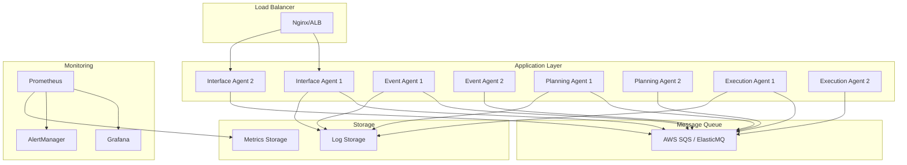

# 🚀 Operações - Sistema de Agentes Autônomos

Este documento fornece instruções completas para deployment, monitoramento, troubleshooting e manutenção do sistema de agentes autônomos.

## 📋 Índice

- [Deployment](#deployment)
- [Monitoramento](#monitoramento)
- [Troubleshooting](#troubleshooting)
- [Backup e Recuperação](#backup-e-recuperação)
- [Manutenção](#manutenção)
- [Segurança](#segurança)

## 🚀 Deployment

### Visão Geral

O sistema suporta diferentes estratégias de deployment:

- **Local**: Desenvolvimento e testes
- **Staging**: Testes de integração e validação
- **Produção**: Ambiente live com alta disponibilidade

### Arquitetura de Deploy



### Pré-requisitos

#### Infraestrutura Mínima

**Desenvolvimento**
- **CPU**: 2 cores
- **RAM**: 4GB
- **Disk**: 10GB
- **OS**: Windows 10+, macOS 10.15+, Ubuntu 18.04+

**Staging**
- **CPU**: 4 cores
- **RAM**: 8GB
- **Disk**: 50GB SSD
- **Network**: 100Mbps

**Produção**
- **CPU**: 8+ cores
- **RAM**: 16GB+
- **Disk**: 100GB+ SSD
- **Network**: 1Gbps+
- **Redundância**: Multi-AZ

#### Software

```bash
# Versões mínimas
Node.js >= 18.0.0
npm >= 8.0.0
Docker >= 20.10.0
Docker Compose >= 2.0.0

# Opcional para produção
Kubernetes >= 1.24
Helm >= 3.8
Terraform >= 1.0
```

### Configuração de Ambiente

#### Development (.env.development)
```bash
# Ambiente
NODE_ENV=development
LOG_LEVEL=debug
DEBUG=agent:*

# Agentes
INTERFACE_AGENT_PORT=3000
EVENT_AGENT_PORT=3001
PLANNING_AGENT_PORT=3002
EXECUTION_AGENT_PORT=3003

# SQS Local
SQS_ENDPOINT=http://localhost:9324
AWS_REGION=us-east-1
AWS_ACCESS_KEY_ID=dummy
AWS_SECRET_ACCESS_KEY=dummy

# Monitoramento
PROMETHEUS_URL=http://localhost:9090
GRAFANA_URL=http://localhost:3100
```

#### Staging (.env.staging)
```bash
# Ambiente
NODE_ENV=staging
LOG_LEVEL=info

# Agentes
INTERFACE_AGENT_PORT=3000
EVENT_AGENT_PORT=3001
PLANNING_AGENT_PORT=3002
EXECUTION_AGENT_PORT=3003

# AWS SQS
AWS_REGION=us-east-1
SQS_QUEUE_PREFIX=staging-

# Database
DB_HOST=staging-db.example.com
DB_NAME=agentes_staging
DB_SSL=true

# Monitoramento
PROMETHEUS_URL=https://prometheus-staging.example.com
GRAFANA_URL=https://grafana-staging.example.com
```

#### Production (.env.production)
```bash
# Ambiente
NODE_ENV=production
LOG_LEVEL=warn

# Agentes
INTERFACE_AGENT_PORT=3000
EVENT_AGENT_PORT=3001
PLANNING_AGENT_PORT=3002
EXECUTION_AGENT_PORT=3003

# AWS SQS
AWS_REGION=us-east-1
SQS_QUEUE_PREFIX=prod-

# Database
DB_HOST=prod-db.example.com
DB_NAME=agentes_production
DB_SSL=true
DB_POOL_SIZE=20

# Monitoramento
PROMETHEUS_URL=https://prometheus.example.com
GRAFANA_URL=https://grafana.example.com

# Segurança
JWT_SECRET=${JWT_SECRET}
API_RATE_LIMIT=1000
CORS_ORIGIN=https://app.example.com
```

### Deploy Local

```bash
# 1. Configuração inicial
npm run setup

# 2. Build das imagens
npm run docker:build

# 3. Iniciar serviços
npm run docker:up

# 4. Verificar saúde
npm run health

# 5. Executar testes
npm run test:integration
```

### Deploy em Staging

```bash
# 1. Preparar ambiente
export NODE_ENV=staging
cp .env.staging .env

# 2. Build e tag das imagens
docker build -t agentes:staging-$(git rev-parse --short HEAD) .
docker tag agentes:staging-$(git rev-parse --short HEAD) agentes:staging-latest

# 3. Deploy
docker-compose -f docker-compose.staging.yml up -d

# 4. Verificar deploy
curl -f https://staging-api.example.com/health

# 5. Executar smoke tests
npm run test:smoke
```

### Deploy em Produção

```bash
# 1. Preparar release
git checkout main
git pull origin main
export VERSION=$(git describe --tags --abbrev=0)

# 2. Build de produção
docker build -t agentes:${VERSION} .
docker tag agentes:${VERSION} agentes:latest

# 3. Push para registry
docker push agentes:${VERSION}
docker push agentes:latest

# 4. Deploy com zero downtime
kubectl set image deployment/interface-agent interface-agent=agentes:${VERSION}
kubectl set image deployment/event-agent event-agent=agentes:${VERSION}
kubectl set image deployment/planning-agent planning-agent=agentes:${VERSION}
kubectl set image deployment/execution-agent execution-agent=agentes:${VERSION}

# 5. Verificar rollout
kubectl rollout status deployment/interface-agent
kubectl rollout status deployment/event-agent
kubectl rollout status deployment/planning-agent
kubectl rollout status deployment/execution-agent

# 6. Verificar saúde
curl -f https://api.example.com/health

# 7. Executar testes de produção
npm run test:production
```

### Rollback

```bash
# Rollback rápido (Kubernetes)
kubectl rollout undo deployment/interface-agent
kubectl rollout undo deployment/event-agent
kubectl rollout undo deployment/planning-agent
kubectl rollout undo deployment/execution-agent

# Rollback para versão específica
kubectl rollout undo deployment/interface-agent --to-revision=2

# Rollback Docker Compose
docker-compose down
docker-compose up -d --scale interface-agent=0
docker tag agentes:previous agentes:latest
docker-compose up -d
```

## 📊 Monitoramento

### Métricas Principais

#### Métricas de Sistema
- **CPU Usage**: < 70% em média
- **Memory Usage**: < 80% em média
- **Disk Usage**: < 85%
- **Network I/O**: Monitorar picos

#### Métricas de Aplicação
- **Response Time**: < 200ms (P95)
- **Error Rate**: < 1%
- **Throughput**: Requests/second
- **Queue Depth**: < 100 mensagens

#### Métricas de Negócio
- **Tasks Completed**: Taxa de conclusão
- **Planning Success Rate**: Taxa de sucesso do planejamento
- **Event Processing Time**: Tempo de processamento de eventos

### Dashboards Grafana

#### Dashboard Principal
```json
{
  "dashboard": {
    "title": "Agentes Autônomos - Overview",
    "panels": [
      {
        "title": "Agent Health",
        "type": "stat",
        "targets": [
          {
            "expr": "up{job=\"agents\"}",
            "legendFormat": "{{instance}}"
          }
        ]
      },
      {
        "title": "Response Time",
        "type": "graph",
        "targets": [
          {
            "expr": "histogram_quantile(0.95, rate(http_request_duration_seconds_bucket[5m]))",
            "legendFormat": "95th percentile"
          }
        ]
      },
      {
        "title": "Error Rate",
        "type": "graph",
        "targets": [
          {
            "expr": "rate(http_requests_total{status=~\"5..\"}[5m])",
            "legendFormat": "5xx errors"
          }
        ]
      }
    ]
  }
}
```

### Alertas

#### Alertas Críticos
```yaml
# prometheus/alerts.yml
groups:
  - name: agents.critical
    rules:
      - alert: AgentDown
        expr: up{job="agents"} == 0
        for: 1m
        labels:
          severity: critical
        annotations:
          summary: "Agent {{ $labels.instance }} is down"
          description: "Agent has been down for more than 1 minute"
      
      - alert: HighErrorRate
        expr: rate(http_requests_total{status=~"5.."}[5m]) > 0.1
        for: 5m
        labels:
          severity: critical
        annotations:
          summary: "High error rate on {{ $labels.instance }}"
          description: "Error rate is {{ $value }} errors per second"
      
      - alert: HighResponseTime
        expr: histogram_quantile(0.95, rate(http_request_duration_seconds_bucket[5m])) > 1
        for: 5m
        labels:
          severity: warning
        annotations:
          summary: "High response time on {{ $labels.instance }}"
          description: "95th percentile response time is {{ $value }}s"
```

### Health Checks

```bash
# Script de health check
#!/bin/bash

# Verificar agentes
for port in 3000 3001 3002 3003; do
  if curl -f http://localhost:$port/health > /dev/null 2>&1; then
    echo "✅ Agent on port $port is healthy"
  else
    echo "❌ Agent on port $port is down"
    exit 1
  fi
done

# Verificar SQS
if aws sqs list-queues --endpoint-url $SQS_ENDPOINT > /dev/null 2>&1; then
  echo "✅ SQS is accessible"
else
  echo "❌ SQS is not accessible"
  exit 1
fi

# Verificar Prometheus
if curl -f $PROMETHEUS_URL/-/healthy > /dev/null 2>&1; then
  echo "✅ Prometheus is healthy"
else
  echo "❌ Prometheus is not healthy"
  exit 1
fi

echo "🎉 All systems are healthy"
```

## 🔧 Troubleshooting

### Problemas de Inicialização

#### Agente não inicia

**Sintomas**:
- Erro "EADDRINUSE" ou "Port already in use"
- Processo termina imediatamente
- Timeout na inicialização

**Diagnóstico**:
```bash
# Verificar portas em uso
netstat -ano | findstr :3000
netstat -ano | findstr :3001
netstat -ano | findstr :3002
netstat -ano | findstr :3003

# Verificar processos Node.js
tasklist | findstr node.exe
```

**Soluções**:

1. **Porta em uso**:
   ```bash
   # Matar processo na porta
   npx kill-port 3000
   
   # Ou alterar porta no .env
   INTERFACE_AGENT_PORT=3010
   ```

2. **Variáveis de ambiente**:
   ```bash
   # Verificar se .env existe
   ls -la .env
   
   # Copiar do exemplo se não existir
   cp .env.example .env
   ```

3. **Dependências**:
   ```bash
   # Reinstalar dependências
   rm -rf node_modules package-lock.json
   npm install
   ```

#### Erro de configuração

**Sintomas**:
- "Cannot read property of undefined"
- "Invalid configuration"
- Agente inicia mas não responde

**Diagnóstico**:
```bash
# Verificar configuração
node -e "console.log(require('dotenv').config())"

# Testar configuração específica
node -e "require('dotenv').config(); console.log(process.env.AWS_REGION)"
```

**Soluções**:

1. **Arquivo .env malformado**:
   ```bash
   # Validar sintaxe do .env
   cat .env | grep -v '^#' | grep -v '^$' | grep -v '='
   
   # Recriar do exemplo
   cp .env.example .env
   ```

2. **Variáveis obrigatórias**:
   ```bash
   # Verificar variáveis essenciais
   grep -E "(NODE_ENV|AWS_REGION|SQS_ENDPOINT)" .env
   ```

### Problemas de Conectividade

#### Agentes não se comunicam

**Sintomas**:
- "ECONNREFUSED"
- "Network timeout"
- Circuit breaker ativado

**Diagnóstico**:
```bash
# Testar conectividade entre agentes
curl http://localhost:3000/health
curl http://localhost:3001/health
curl http://localhost:3002/health
curl http://localhost:3003/health

# Verificar logs de rede
npm run monitor
```

**Soluções**:

1. **Verificar se todos os agentes estão rodando**:
   ```bash
   npm run monitor
   
   # Ou verificar individualmente
   curl -f http://localhost:3000/health || echo "Interface Agent down"
   curl -f http://localhost:3001/health || echo "Event Agent down"
   ```

2. **Resetar circuit breakers**:
   ```bash
   # Reiniciar agentes
   npm run docker:down
   npm run docker:up
   
   # Ou reiniciar processo específico
   pkill -f "interface-agent"
   node src/agents/core/interface-agent/index.js
   ```

#### SQS não conecta

**Sintomas**:
- "Unable to connect to SQS"
- "Queue does not exist"
- Mensagens não são processadas

**Diagnóstico**:
```bash
# Testar conexão SQS
aws sqs list-queues --endpoint-url $SQS_ENDPOINT

# Verificar filas
aws sqs get-queue-attributes --queue-url $QUEUE_URL --endpoint-url $SQS_ENDPOINT
```

**Soluções**:

1. **ElasticMQ não está rodando**:
   ```bash
   # Verificar se ElasticMQ está rodando
   docker ps | grep elasticmq
   
   # Iniciar ElasticMQ
   docker run -d -p 9324:9324 softwaremill/elasticmq
   ```

2. **Filas não existem**:
   ```bash
   # Criar filas necessárias
   npm run sqs:create-queues
   
   # Ou manualmente
   aws sqs create-queue --queue-name events --endpoint-url $SQS_ENDPOINT
   aws sqs create-queue --queue-name tasks --endpoint-url $SQS_ENDPOINT
   ```

### Problemas de Performance

#### Alta latência

**Sintomas**:
- Tempo de resposta > 1s
- Timeouts frequentes
- Filas crescendo

**Diagnóstico**:
```bash
# Verificar métricas de performance
curl http://localhost:3000/metrics

# Verificar uso de CPU/memória
top -p $(pgrep -f "interface-agent")

# Verificar tamanho das filas
aws sqs get-queue-attributes --queue-url $QUEUE_URL --attribute-names ApproximateNumberOfMessages
```

**Soluções**:

1. **Escalar horizontalmente**:
   ```bash
   # Adicionar mais instâncias
   docker-compose up -d --scale interface-agent=3
   docker-compose up -d --scale event-agent=2
   ```

2. **Otimizar configuração**:
   ```bash
   # Aumentar pool de conexões
   DB_POOL_SIZE=20
   
   # Ajustar timeout
   REQUEST_TIMEOUT=30000
   ```

#### Memory leaks

**Sintomas**:
- Uso de memória crescendo constantemente
- "Out of memory" errors
- Performance degradando com o tempo

**Diagnóstico**:
```bash
# Monitorar uso de memória
node --inspect src/agents/core/interface-agent/index.js

# Gerar heap dump
kill -USR2 $(pgrep -f "interface-agent")

# Analisar com clinic.js
npx clinic doctor -- node src/agents/core/interface-agent/index.js
```

**Soluções**:

1. **Reiniciar agentes periodicamente**:
   ```bash
   # Adicionar ao crontab
   0 2 * * * docker-compose restart interface-agent
   ```

2. **Configurar limites de memória**:
   ```bash
   # Limitar memória do Node.js
   node --max-old-space-size=1024 src/agents/core/interface-agent/index.js
   ```

### Problemas de Docker

#### Container não inicia

**Sintomas**:
- "Container exited with code 1"
- "No such file or directory"
- Build falha

**Diagnóstico**:
```bash
# Verificar logs do container
docker-compose logs interface-agent

# Verificar se imagem existe
docker images | grep agentes

# Verificar Dockerfile
docker build --no-cache -t agentes:debug .
```

**Soluções**:

1. **Rebuild das imagens**:
   ```bash
   # Limpar cache e rebuild
   docker-compose down
   docker system prune -f
   docker-compose build --no-cache
   docker-compose up
   ```

2. **Verificar dependências**:
   ```bash
   # Verificar se package.json está correto
   npm audit
   npm install
   ```

### Ferramentas de Diagnóstico

#### Script de diagnóstico completo

```bash
#!/bin/bash
# diagnose.sh

echo "🔍 Diagnóstico do Sistema de Agentes"
echo "====================================="

# Verificar Node.js e npm
echo "📦 Versões:"
node --version
npm --version
docker --version

# Verificar processos
echo "\n🔄 Processos ativos:"
ps aux | grep -E "(node|docker)" | grep -v grep

# Verificar portas
echo "\n🔌 Portas em uso:"
netstat -tulpn | grep -E ":(3000|3001|3002|3003|9090|3100)"

# Verificar saúde dos agentes
echo "\n❤️ Saúde dos agentes:"
for port in 3000 3001 3002 3003; do
  if curl -s -f http://localhost:$port/health > /dev/null; then
    echo "✅ Agent on port $port: OK"
  else
    echo "❌ Agent on port $port: FAIL"
  fi
done

# Verificar Docker
echo "\n🐳 Containers Docker:"
docker ps --format "table {{.Names}}\t{{.Status}}\t{{.Ports}}"

# Verificar logs recentes
echo "\n📋 Logs recentes (últimas 10 linhas):"
tail -n 10 logs/*.log 2>/dev/null || echo "Nenhum log encontrado"

# Verificar espaço em disco
echo "\n💾 Espaço em disco:"
df -h | grep -E "(/$|/var|/tmp)"

# Verificar memória
echo "\n🧠 Uso de memória:"
free -h

echo "\n✅ Diagnóstico concluído"
```

## 💾 Backup e Recuperação

### Estratégia de Backup

#### Dados a fazer backup
- **Configurações**: Arquivos .env, docker-compose.yml
- **Logs**: Arquivos de log dos agentes
- **Métricas**: Dados do Prometheus
- **Estado**: Filas SQS, dados de sessão

#### Backup automatizado

```bash
#!/bin/bash
# backup.sh

BACKUP_DIR="/backup/$(date +%Y%m%d_%H%M%S)"
mkdir -p $BACKUP_DIR

# Backup de configurações
cp .env* $BACKUP_DIR/
cp docker-compose*.yml $BACKUP_DIR/
cp -r config/ $BACKUP_DIR/

# Backup de logs
cp -r logs/ $BACKUP_DIR/

# Backup de métricas do Prometheus
docker exec prometheus tar czf - /prometheus | cat > $BACKUP_DIR/prometheus.tar.gz

# Backup de estado das filas
aws sqs get-queue-attributes --queue-url $EVENTS_QUEUE --attribute-names All > $BACKUP_DIR/queue_events.json
aws sqs get-queue-attributes --queue-url $TASKS_QUEUE --attribute-names All > $BACKUP_DIR/queue_tasks.json

# Compactar backup
tar czf backup_$(date +%Y%m%d_%H%M%S).tar.gz $BACKUP_DIR
rm -rf $BACKUP_DIR

echo "Backup concluído: backup_$(date +%Y%m%d_%H%M%S).tar.gz"
```

### Recuperação

```bash
#!/bin/bash
# restore.sh

BACKUP_FILE=$1

if [ -z "$BACKUP_FILE" ]; then
  echo "Uso: $0 <arquivo_backup.tar.gz>"
  exit 1
fi

# Parar serviços
docker-compose down

# Extrair backup
tar xzf $BACKUP_FILE
BACKUP_DIR=$(tar tzf $BACKUP_FILE | head -1 | cut -f1 -d"/")

# Restaurar configurações
cp $BACKUP_DIR/.env* .
cp $BACKUP_DIR/docker-compose*.yml .
cp -r $BACKUP_DIR/config/ .

# Restaurar logs
cp -r $BACKUP_DIR/logs/ .

# Restaurar Prometheus
cat $BACKUP_DIR/prometheus.tar.gz | docker run --rm -i -v prometheus_data:/prometheus alpine tar xzf - -C /

# Reiniciar serviços
docker-compose up -d

# Limpar
rm -rf $BACKUP_DIR

echo "Recuperação concluída"
```

## 🔒 Segurança

### Configurações de Segurança

#### Autenticação e Autorização
```bash
# JWT Configuration
JWT_SECRET=<strong-secret-key>
JWT_EXPIRATION=1h
JWT_REFRESH_EXPIRATION=7d

# API Rate Limiting
RATE_LIMIT_WINDOW=15m
RATE_LIMIT_MAX=1000

# CORS
CORS_ORIGIN=https://app.example.com
CORS_METHODS=GET,POST,PUT,DELETE
CORS_HEADERS=Content-Type,Authorization
```

#### Segurança de Rede
```yaml
# docker-compose.security.yml
version: '3.8'
services:
  interface-agent:
    networks:
      - frontend
      - backend
    ports:
      - "3000:3000"
  
  event-agent:
    networks:
      - backend
    # Não expor porta publicamente
  
  planning-agent:
    networks:
      - backend
    # Não expor porta publicamente
  
  execution-agent:
    networks:
      - backend
    # Não expor porta publicamente

networks:
  frontend:
    driver: bridge
  backend:
    driver: bridge
    internal: true
```

#### Monitoramento de Segurança
```bash
# Verificar tentativas de acesso não autorizado
grep "401\|403\|429" logs/access.log | tail -20

# Monitorar uso de recursos
ps aux --sort=-%cpu | head -10
ps aux --sort=-%mem | head -10

# Verificar conexões de rede
netstat -an | grep :3000 | wc -l
```

### Auditoria

```bash
# Script de auditoria
#!/bin/bash
# audit.sh

echo "🔍 Auditoria de Segurança"
echo "========================"

# Verificar permissões de arquivos
echo "📁 Permissões de arquivos críticos:"
ls -la .env* docker-compose*.yml

# Verificar usuários dos processos
echo "\n👤 Usuários dos processos:"
ps aux | grep -E "(node|docker)" | grep -v grep | awk '{print $1}' | sort | uniq

# Verificar portas abertas
echo "\n🔌 Portas abertas:"
netstat -tulpn | grep LISTEN

# Verificar logs de segurança
echo "\n🚨 Eventos de segurança recentes:"
grep -E "(WARN|ERROR|401|403|429)" logs/*.log | tail -10

# Verificar atualizações de segurança
echo "\n🔄 Verificar atualizações:"
npm audit

echo "\n✅ Auditoria concluída"
```

---

**Última atualização**: Janeiro 2024  
**Versão do Guia**: v2.0  
**Próxima revisão**: Abril 2024

**Suporte**: Para dúvidas ou problemas, abra uma issue no repositório ou consulte a documentação adicional em `/docs`.