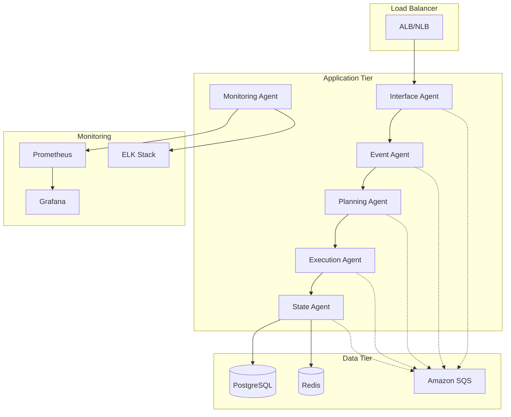

# Manual de Operações e Backup

## Índice

1. [Visão Geral Operacional](#visão-geral-operacional)
2. [Instalação e Configuração](#instalação-e-configuração)
3. [Inicialização do Sistema](#inicialização-do-sistema)
4. [Monitoramento e Saúde](#monitoramento-e-saúde)
5. [Manutenção Preventiva](#manutenção-preventiva)
6. [Procedimentos de Backup](#procedimentos-de-backup)
7. [Recuperação e Continuidade](#recuperação-e-continuidade)
8. [Escalabilidade](#escalabilidade)
9. [Segurança Operacional](#segurança-operacional)
10. [Procedimentos de Emergência](#procedimentos-de-emergência)
11. [Logs e Auditoria](#logs-e-auditoria)
12. [Otimização de Performance](#otimização-de-performance)
13. [Troubleshooting](#troubleshooting)

## Visão Geral Operacional

### Arquitetura de Deploy



### Componentes Principais

| Componente | Função | Porta | Status | Dependências |
|------------|--------|-------|--------|-------------|
| **Interface Agent** | API Gateway | 3001 | Critical | Redis, SQS |
| **Event Agent** | Processamento de Eventos | 3002 | Critical | SQS, PostgreSQL |
| **Planning Agent** | Planejamento BDI | 3003 | Critical | Redis, PostgreSQL |
| **Execution Agent** | Execução de Ações | 3004 | Critical | SQS, PostgreSQL |
| **State Management** | Gerenciamento de Estado | 3005 | Critical | Redis, PostgreSQL |
| **Monitoring Agent** | Monitoramento | 3006 | Important | Prometheus |
| **Security Agent** | Segurança | 3008 | Important | Redis, PostgreSQL |
| **External Gateway** | Gateway Externo | 3007 | Important | SQS |

### Objetivos de Nível de Serviço (SLO)

| Métrica | Objetivo | Medição | Ação se Violado |
|---------|----------|---------|------------------|
| **Disponibilidade** | 99.9% | Uptime mensal | Investigação imediata |
| **Latência P95** | < 500ms | Response time | Otimização de performance |
| **Taxa de Erro** | < 0.1% | Error rate | Análise de root cause |
| **Throughput** | > 1000 req/s | Requests per second | Scale horizontal |
| **MTTR** | < 15 min | Mean time to recovery | Melhoria de processos |

## Instalação e Configuração

### Pré-requisitos do Sistema

#### Hardware Mínimo (Produção)

| Componente | Especificação | Recomendado |
|------------|---------------|-------------|
| **CPU** | 4 cores | 8 cores |
| **RAM** | 8 GB | 16 GB |
| **Storage** | 100 GB SSD | 500 GB SSD |
| **Network** | 1 Gbps | 10 Gbps |

#### Software

```bash
# Sistema Operacional
Ubuntu 20.04 LTS ou superior
CentOS 8 ou superior
Amazon Linux 2

# Runtime
Node.js 18.x LTS
npm 8.x ou superior

# Containerização
Docker 20.x ou superior
Docker Compose 2.x ou superior

# Banco de Dados
PostgreSQL 14.x ou superior
Redis 6.x ou superior
```

### Processo de Instalação

#### 1. Preparação do Ambiente

```bash
# Atualizar sistema
sudo apt update && sudo apt upgrade -y

# Instalar dependências
sudo apt install -y curl wget git build-essential

# Instalar Node.js
curl -fsSL https://deb.nodesource.com/setup_18.x | sudo -E bash -
sudo apt-get install -y nodejs

# Instalar Docker
curl -fsSL https://get.docker.com -o get-docker.sh
sudo sh get-docker.sh
sudo usermod -aG docker $USER

# Instalar Docker Compose
sudo curl -L "https://github.com/docker/compose/releases/latest/download/docker-compose-$(uname -s)-$(uname -m)" -o /usr/local/bin/docker-compose
sudo chmod +x /usr/local/bin/docker-compose
```

#### 2. Deploy da Aplicação

```bash
# Clone do repositório
git clone https://github.com/your-org/agentesautonomos.git
cd agentesautonomos

# Configuração de ambiente
cp config/environments/.env.production.example config/environments/.env.production
nano config/environments/.env.production

# Instalação de dependências
npm ci --production

# Build da aplicação
npm run build

# Inicialização dos serviços
docker-compose -f docker-compose.prod.yml up -d

# Verificação de saúde
npm run health:check
```

#### 3. Configuração de Monitoramento

```bash
# Configurar Prometheus
sudo mkdir -p /etc/prometheus
sudo cp config/monitoring/prometheus.yml /etc/prometheus/

# Configurar Grafana
sudo mkdir -p /var/lib/grafana/dashboards
sudo cp config/grafana/dashboards/* /var/lib/grafana/dashboards/

# Iniciar serviços de monitoramento
docker-compose -f docker-compose.monitoring.yml up -d
```

## Inicialização do Sistema

### Sequência de Inicialização

#### 1. Verificações Pré-Inicialização

```bash
#!/bin/bash
# scripts/pre-startup-checks.sh

echo "🔍 Executando verificações pré-inicialização..."

# Verificar recursos do sistema
echo "📊 Verificando recursos do sistema..."
free -h
df -h

# Verificar conectividade de rede
echo "🌐 Verificando conectividade..."
ping -c 3 8.8.8.8

# Verificar portas disponíveis
echo "🔌 Verificando portas..."
for port in 3001 3002 3003 3004 3005 3006 3007 3008; do
    if lsof -i :$port > /dev/null 2>&1; then
        echo "❌ Porta $port já está em uso"
        exit 1
    else
        echo "✅ Porta $port disponível"
    fi
done

# Verificar variáveis de ambiente
echo "🔧 Verificando configurações..."
if [ -f "config/environments/.env.production" ]; then
    echo "✅ Arquivo de configuração encontrado"
else
    echo "❌ Arquivo de configuração não encontrado"
    exit 1
fi

echo "✅ Todas as verificações passaram!"
```

#### 2. Inicialização Ordenada

```bash
#!/bin/bash
# scripts/startup.sh

echo "🚀 Iniciando Sistema de Agentes Autônomos..."

# Etapa 1: Infraestrutura
echo "📦 Iniciando infraestrutura..."
docker-compose -f docker-compose.infrastructure.yml up -d
sleep 30

# Etapa 2: Bancos de dados
echo "🗄️ Iniciando bancos de dados..."
docker-compose -f docker-compose.data.yml up -d
sleep 30

# Etapa 3: Serviços de mensageria
echo "📬 Iniciando SQS..."
docker-compose -f docker-compose.messaging.yml up -d
sleep 15

# Etapa 4: Agentes core
echo "🤖 Iniciando agentes principais..."
docker-compose -f docker-compose.agents.yml up -d
sleep 45

# Etapa 5: Monitoramento
echo "📊 Iniciando monitoramento..."
docker-compose -f docker-compose.monitoring.yml up -d
sleep 15

# Verificação final
echo "🔍 Verificando saúde do sistema..."
npm run health:check:all

echo "✅ Sistema iniciado com sucesso!"
```

#### 3. Verificação de Saúde Pós-Inicialização

```bash
#!/bin/bash
# scripts/health-check.sh

echo "🏥 Verificando saúde dos componentes..."

# Função para verificar saúde de um serviço
check_health() {
    local service=$1
    local url=$2
    local max_attempts=30
    local attempt=1
    
    while [ $attempt -le $max_attempts ]; do
        if curl -f -s $url > /dev/null 2>&1; then
            echo "✅ $service está saudável"
            return 0
        fi
        echo "⏳ Aguardando $service... (tentativa $attempt/$max_attempts)"
        sleep 2
        ((attempt++))
    done
    
    echo "❌ $service não está respondendo"
    return 1
}

# Verificar cada agente
check_health "Interface Agent" "http://localhost:3001/health"
check_health "Event Agent" "http://localhost:3002/health"
check_health "Planning Agent" "http://localhost:3003/health"
check_health "Execution Agent" "http://localhost:3004/health"
check_health "State Management" "http://localhost:3005/health"
check_health "Monitoring Agent" "http://localhost:3006/health"
check_health "External Gateway" "http://localhost:3007/health"
check_health "Security Agent" "http://localhost:3008/health"

# Verificar infraestrutura
check_health "Prometheus" "http://localhost:9090/-/healthy"
check_health "Grafana" "http://localhost:3000/api/health"

echo "🎉 Verificação de saúde concluída!"
```

## Monitoramento e Saúde

### Métricas Principais

#### Métricas de Sistema

```yaml
# config/monitoring/system-metrics.yml
metrics:
  system:
    - name: cpu_usage_percent
      type: gauge
      description: "Uso de CPU em porcentagem"
      threshold:
        warning: 70
        critical: 85
    
    - name: memory_usage_percent
      type: gauge
      description: "Uso de memória em porcentagem"
      threshold:
        warning: 80
        critical: 90
    
    - name: disk_usage_percent
      type: gauge
      description: "Uso de disco em porcentagem"
      threshold:
        warning: 80
        critical: 90
    
    - name: network_io_bytes
      type: counter
      description: "Bytes de I/O de rede"
```

#### Métricas de Aplicação

```yaml
# config/monitoring/app-metrics.yml
metrics:
  application:
    - name: http_requests_total
      type: counter
      description: "Total de requisições HTTP"
      labels: [method, status, endpoint]
    
    - name: http_request_duration_seconds
      type: histogram
      description: "Duração das requisições HTTP"
      buckets: [0.1, 0.25, 0.5, 1, 2.5, 5, 10]
    
    - name: agent_events_processed_total
      type: counter
      description: "Total de eventos processados por agente"
      labels: [agent, event_type, status]
    
    - name: queue_size
      type: gauge
      description: "Tamanho das filas SQS"
      labels: [queue_name]
```

### Dashboards Grafana

#### Dashboard Principal

```json
{
  "dashboard": {
    "title": "Sistema de Agentes Autônomos - Overview",
    "panels": [
      {
        "title": "Status dos Agentes",
        "type": "stat",
        "targets": [
          {
            "expr": "up{job=\"agents\"}",
            "legendFormat": "{{instance}}"
          }
        ]
      },
      {
        "title": "Throughput de Requisições",
        "type": "graph",
        "targets": [
          {
            "expr": "rate(http_requests_total[5m])",
            "legendFormat": "{{method}} {{status}}"
          }
        ]
      },
      {
        "title": "Latência P95",
        "type": "graph",
        "targets": [
          {
            "expr": "histogram_quantile(0.95, rate(http_request_duration_seconds_bucket[5m]))",
            "legendFormat": "P95"
          }
        ]
      },
      {
        "title": "Taxa de Erro",
        "type": "graph",
        "targets": [
          {
            "expr": "rate(http_requests_total{status=~\"5..\"}[5m]) / rate(http_requests_total[5m])",
            "legendFormat": "Error Rate"
          }
        ]
      }
    ]
  }
}
```

### Alertas

#### Configuração de Alertas

```yaml
# config/monitoring/alerts.yml
groups:
  - name: system_alerts
    rules:
      - alert: HighCPUUsage
        expr: cpu_usage_percent > 85
        for: 5m
        labels:
          severity: critical
        annotations:
          summary: "Alto uso de CPU detectado"
          description: "CPU usage is above 85% for more than 5 minutes"
      
      - alert: HighMemoryUsage
        expr: memory_usage_percent > 90
        for: 5m
        labels:
          severity: critical
        annotations:
          summary: "Alto uso de memória detectado"
          description: "Memory usage is above 90% for more than 5 minutes"
      
      - alert: AgentDown
        expr: up{job="agents"} == 0
        for: 1m
        labels:
          severity: critical
        annotations:
          summary: "Agente fora do ar"
          description: "Agent {{$labels.instance}} is down"
      
      - alert: HighErrorRate
        expr: rate(http_requests_total{status=~"5.."}[5m]) / rate(http_requests_total[5m]) > 0.01
        for: 2m
        labels:
          severity: warning
        annotations:
          summary: "Alta taxa de erro"
          description: "Error rate is above 1% for more than 2 minutes"
```

## Manutenção Preventiva

### Cronograma de Manutenção

| Frequência | Atividade | Responsável | Duração |
|------------|-----------|-------------|----------|
| **Diária** | Verificação de logs | DevOps | 15 min |
| **Diária** | Backup incremental | Automático | 30 min |
| **Semanal** | Análise de performance | SRE | 1 hora |
| **Semanal** | Atualização de dependências | Dev Team | 2 horas |
| **Mensal** | Backup completo | Automático | 4 horas |
| **Mensal** | Teste de recuperação | SRE | 4 horas |
| **Trimestral** | Auditoria de segurança | Security Team | 1 dia |
| **Semestral** | Revisão de arquitetura | Architects | 2 dias |

### Scripts de Manutenção

#### Limpeza de Logs

```bash
#!/bin/bash
# scripts/maintenance/cleanup-logs.sh

echo "🧹 Iniciando limpeza de logs..."

# Definir diretórios de logs
LOG_DIRS=(
    "/var/log/agents"
    "/var/log/docker"
    "/var/log/nginx"
)

# Manter logs dos últimos 30 dias
RETENTION_DAYS=30

for dir in "${LOG_DIRS[@]}"; do
    if [ -d "$dir" ]; then
        echo "📁 Limpando $dir..."
        find "$dir" -name "*.log" -mtime +$RETENTION_DAYS -delete
        find "$dir" -name "*.log.gz" -mtime +$RETENTION_DAYS -delete
        echo "✅ $dir limpo"
    fi
done

# Compactar logs antigos
echo "📦 Compactando logs antigos..."
find /var/log/agents -name "*.log" -mtime +7 -exec gzip {} \;

echo "✅ Limpeza de logs concluída!"
```

#### Otimização de Banco de Dados

```bash
#!/bin/bash
# scripts/maintenance/optimize-database.sh

echo "🗄️ Iniciando otimização do banco de dados..."

# Conectar ao PostgreSQL
PGPASSWORD=$POSTGRES_PASSWORD psql -h $POSTGRES_HOST -U $POSTGRES_USER -d $POSTGRES_DB << EOF

-- Analisar tabelas
ANALYZE;

-- Vacuum completo
VACUUM FULL;

-- Reindexar tabelas principais
REINDEX TABLE events;
REINDEX TABLE agent_states;
REINDEX TABLE execution_logs;

-- Estatísticas de uso
SELECT 
    schemaname,
    tablename,
    attname,
    n_distinct,
    correlation
FROM pg_stats 
WHERE schemaname = 'public'
ORDER BY tablename, attname;

EOF

echo "✅ Otimização do banco concluída!"
```

#### Verificação de Integridade

```bash
#!/bin/bash
# scripts/maintenance/integrity-check.sh

echo "🔍 Verificando integridade do sistema..."

# Verificar integridade dos containers
echo "🐳 Verificando containers..."
docker ps --format "table {{.Names}}\t{{.Status}}\t{{.Ports}}"

# Verificar uso de recursos
echo "📊 Verificando recursos..."
docker stats --no-stream

# Verificar logs de erro
echo "📋 Verificando logs de erro..."
grep -r "ERROR" /var/log/agents/ | tail -20

# Verificar conectividade entre serviços
echo "🌐 Verificando conectividade..."
for port in 5432 6379 4566; do
    if nc -z localhost $port; then
        echo "✅ Porta $port acessível"
    else
        echo "❌ Porta $port inacessível"
    fi
done

echo "✅ Verificação de integridade concluída!"
```

## Procedimentos de Backup

### Estratégia de Backup

#### Visão Geral

O sistema implementa uma estratégia de backup em múltiplas camadas para garantir a proteção completa dos dados e a capacidade de recuperação em diferentes cenários de falha.

#### Tipos de Backup

| Tipo | Frequência | Retenção | Objetivo | Tecnologia |
|------|------------|----------|----------|------------|
| **Incremental** | A cada 4 horas | 7 dias | Recuperação rápida | pg_dump + rsync |
| **Diferencial** | Diário | 30 dias | Recuperação de dados | pg_dump + AWS S3 |
| **Completo** | Semanal | 12 semanas | Recuperação completa | pg_basebackup + S3 |
| **Snapshot** | Antes de deploys | 4 snapshots | Rollback rápido | EBS Snapshots |
| **Replicação** | Contínua | Tempo real | Alta disponibilidade | PostgreSQL Streaming |

### Configuração de Backup

#### Backup do PostgreSQL

```bash
#!/bin/bash
# scripts/backup/postgres-backup.sh

set -e

# Configurações
BACKUP_DIR="/backup/postgres"
S3_BUCKET="agentes-backup-prod"
RETENTION_DAYS=30
TIMESTAMP=$(date +"%Y%m%d_%H%M%S")

# Criar diretório de backup
mkdir -p $BACKUP_DIR

echo "📦 Iniciando backup do PostgreSQL..."

# Backup completo
echo "🗄️ Criando backup completo..."
PGPASSWORD=$POSTGRES_PASSWORD pg_dump \
    -h $POSTGRES_HOST \
    -U $POSTGRES_USER \
    -d $POSTGRES_DB \
    -F c \
    -b \
    -v \
    -f "$BACKUP_DIR/postgres_full_$TIMESTAMP.backup"

# Backup de esquema apenas
echo "📋 Criando backup de esquema..."
PGPASSWORD=$POSTGRES_PASSWORD pg_dump \
    -h $POSTGRES_HOST \
    -U $POSTGRES_USER \
    -d $POSTGRES_DB \
    -s \
    -f "$BACKUP_DIR/postgres_schema_$TIMESTAMP.sql"

# Compactar backups
echo "📦 Compactando backups..."
gzip "$BACKUP_DIR/postgres_full_$TIMESTAMP.backup"
gzip "$BACKUP_DIR/postgres_schema_$TIMESTAMP.sql"

# Upload para S3
echo "☁️ Enviando para S3..."
aws s3 cp "$BACKUP_DIR/postgres_full_$TIMESTAMP.backup.gz" \
    "s3://$S3_BUCKET/postgres/full/"
aws s3 cp "$BACKUP_DIR/postgres_schema_$TIMESTAMP.sql.gz" \
    "s3://$S3_BUCKET/postgres/schema/"

# Limpeza local
echo "🧹 Limpando backups antigos..."
find $BACKUP_DIR -name "*.gz" -mtime +$RETENTION_DAYS -delete

# Verificação de integridade
echo "🔍 Verificando integridade..."
if aws s3 ls "s3://$S3_BUCKET/postgres/full/postgres_full_$TIMESTAMP.backup.gz" > /dev/null; then
    echo "✅ Backup verificado com sucesso!"
else
    echo "❌ Falha na verificação do backup!"
    exit 1
fi

echo "✅ Backup do PostgreSQL concluído!"
```

#### Backup do Redis

```bash
#!/bin/bash
# scripts/backup/redis-backup.sh

set -e

# Configurações
BACKUP_DIR="/backup/redis"
S3_BUCKET="agentes-backup-prod"
TIMESTAMP=$(date +"%Y%m%d_%H%M%S")

echo "📦 Iniciando backup do Redis..."

# Criar snapshot
echo "📸 Criando snapshot..."
redis-cli -h $REDIS_HOST -p $REDIS_PORT BGSAVE

# Aguardar conclusão
echo "⏳ Aguardando conclusão do snapshot..."
while [ $(redis-cli -h $REDIS_HOST -p $REDIS_PORT LASTSAVE) -eq $(redis-cli -h $REDIS_HOST -p $REDIS_PORT LASTSAVE) ]; do
    sleep 1
done

# Copiar arquivo RDB
echo "📁 Copiando arquivo RDB..."
mkdir -p $BACKUP_DIR
cp /var/lib/redis/dump.rdb "$BACKUP_DIR/redis_$TIMESTAMP.rdb"

# Compactar
echo "📦 Compactando..."
gzip "$BACKUP_DIR/redis_$TIMESTAMP.rdb"

# Upload para S3
echo "☁️ Enviando para S3..."
aws s3 cp "$BACKUP_DIR/redis_$TIMESTAMP.rdb.gz" \
    "s3://$S3_BUCKET/redis/"

echo "✅ Backup do Redis concluído!"
```

#### Backup de Configurações

```bash
#!/bin/bash
# scripts/backup/config-backup.sh

set -e

# Configurações
BACKUP_DIR="/backup/config"
S3_BUCKET="agentes-backup-prod"
TIMESTAMP=$(date +"%Y%m%d_%H%M%S")

echo "📦 Iniciando backup de configurações..."

# Criar diretório
mkdir -p $BACKUP_DIR

# Backup de configurações
echo "⚙️ Copiando configurações..."
tar -czf "$BACKUP_DIR/config_$TIMESTAMP.tar.gz" \
    config/ \
    docker-compose*.yml \
    package.json \
    package-lock.json \
    .env.production

# Backup de scripts
echo "📜 Copiando scripts..."
tar -czf "$BACKUP_DIR/scripts_$TIMESTAMP.tar.gz" scripts/

# Upload para S3
echo "☁️ Enviando para S3..."
aws s3 cp "$BACKUP_DIR/config_$TIMESTAMP.tar.gz" \
    "s3://$S3_BUCKET/config/"
aws s3 cp "$BACKUP_DIR/scripts_$TIMESTAMP.tar.gz" \
    "s3://$S3_BUCKET/scripts/"

echo "✅ Backup de configurações concluído!"
```

### Cronograma de Backup

```cron
# /etc/crontab - Cronograma de backups

# Backup incremental a cada 4 horas
0 */4 * * * root /opt/agentes/scripts/backup/incremental-backup.sh

# Backup diferencial diário às 2:00
0 2 * * * root /opt/agentes/scripts/backup/postgres-backup.sh

# Backup do Redis diário às 3:00
0 3 * * * root /opt/agentes/scripts/backup/redis-backup.sh

# Backup de configurações diário às 4:00
0 4 * * * root /opt/agentes/scripts/backup/config-backup.sh

# Backup completo semanal aos domingos às 1:00
0 1 * * 0 root /opt/agentes/scripts/backup/full-backup.sh

# Limpeza de backups antigos diária às 5:00
0 5 * * * root /opt/agentes/scripts/backup/cleanup-backups.sh
```

## Recuperação e Continuidade

### Objetivos de Recuperação

| Cenário | RTO (Recovery Time Objective) | RPO (Recovery Point Objective) | Prioridade |
|---------|-------------------------------|--------------------------------|------------|
| **Falha de Agente Individual** | < 2 minutos | 0 (sem perda) | P1 |
| **Falha de Banco de Dados** | < 15 minutos | < 4 horas | P1 |
| **Falha de Infraestrutura** | < 30 minutos | < 4 horas | P1 |
| **Disaster Recovery** | < 4 horas | < 24 horas | P2 |
| **Corrupção de Dados** | < 2 horas | < 24 horas | P2 |

### Procedimentos de Recuperação

#### Recuperação de Agente Individual

```bash
#!/bin/bash
# scripts/recovery/recover-agent.sh

AGENT_NAME=$1

if [ -z "$AGENT_NAME" ]; then
    echo "❌ Uso: $0 <agent-name>"
    exit 1
fi

echo "🔄 Recuperando agente: $AGENT_NAME"

# Parar agente com falha
echo "⏹️ Parando agente com falha..."
docker-compose stop $AGENT_NAME

# Verificar logs de erro
echo "📋 Verificando logs..."
docker-compose logs --tail=50 $AGENT_NAME

# Limpar estado corrompido
echo "🧹 Limpando estado..."
redis-cli DEL "agent:$AGENT_NAME:*"

# Reiniciar agente
echo "🚀 Reiniciando agente..."
docker-compose up -d $AGENT_NAME

# Aguardar inicialização
echo "⏳ Aguardando inicialização..."
sleep 30

# Verificar saúde
echo "🏥 Verificando saúde..."
if curl -f "http://localhost:300X/health" > /dev/null 2>&1; then
    echo "✅ Agente $AGENT_NAME recuperado com sucesso!"
else
    echo "❌ Falha na recuperação do agente $AGENT_NAME"
    exit 1
fi
```

#### Recuperação de Banco de Dados

```bash
#!/bin/bash
# scripts/recovery/recover-database.sh

BACKUP_FILE=$1

if [ -z "$BACKUP_FILE" ]; then
    echo "❌ Uso: $0 <backup-file>"
    exit 1
fi

echo "🗄️ Recuperando banco de dados..."

# Parar aplicação
echo "⏹️ Parando aplicação..."
docker-compose stop

# Backup do estado atual
echo "📦 Fazendo backup do estado atual..."
PGPASSWORD=$POSTGRES_PASSWORD pg_dump \
    -h $POSTGRES_HOST \
    -U $POSTGRES_USER \
    -d $POSTGRES_DB \
    -f "/backup/pre_recovery_$(date +%Y%m%d_%H%M%S).sql"

# Restaurar backup
echo "🔄 Restaurando backup..."
if [[ $BACKUP_FILE == *.gz ]]; then
    gunzip -c $BACKUP_FILE | PGPASSWORD=$POSTGRES_PASSWORD pg_restore \
        -h $POSTGRES_HOST \
        -U $POSTGRES_USER \
        -d $POSTGRES_DB \
        -c \
        -v
else
    PGPASSWORD=$POSTGRES_PASSWORD pg_restore \
        -h $POSTGRES_HOST \
        -U $POSTGRES_USER \
        -d $POSTGRES_DB \
        -c \
        -v \
        $BACKUP_FILE
fi

# Verificar integridade
echo "🔍 Verificando integridade..."
PGPASSWORD=$POSTGRES_PASSWORD psql \
    -h $POSTGRES_HOST \
    -U $POSTGRES_USER \
    -d $POSTGRES_DB \
    -c "SELECT COUNT(*) FROM events;"

# Reiniciar aplicação
echo "🚀 Reiniciando aplicação..."
docker-compose up -d

echo "✅ Recuperação do banco concluída!"
```

### Teste de Recuperação

#### Script de Teste Mensal

```bash
#!/bin/bash
# scripts/recovery/test-recovery.sh

echo "🧪 Iniciando teste de recuperação..."

# Criar ambiente de teste
echo "🏗️ Criando ambiente de teste..."
docker-compose -f docker-compose.test.yml up -d

# Aguardar inicialização
sleep 60

# Simular falha
echo "💥 Simulando falha..."
docker-compose -f docker-compose.test.yml stop postgres

# Tentar recuperação
echo "🔄 Testando recuperação..."
./scripts/recovery/recover-database.sh /backup/latest/postgres_full.backup.gz

# Verificar resultado
echo "🔍 Verificando resultado..."
if curl -f "http://localhost:3001/health" > /dev/null 2>&1; then
    echo "✅ Teste de recuperação bem-sucedido!"
else
    echo "❌ Teste de recuperação falhou!"
fi

# Limpar ambiente de teste
echo "🧹 Limpando ambiente de teste..."
docker-compose -f docker-compose.test.yml down -v

echo "✅ Teste de recuperação concluído!"
```

## Escalabilidade

### Estratégias de Escala

#### Escala Horizontal

```yaml
# config/scaling/horizontal-scaling.yml
scaling:
  agents:
    interface:
      min_instances: 2
      max_instances: 10
      target_cpu: 70
      target_memory: 80
    
    event:
      min_instances: 3
      max_instances: 15
      target_cpu: 60
      target_memory: 75
    
    planning:
      min_instances: 2
      max_instances: 8
      target_cpu: 80
      target_memory: 85
    
    execution:
      min_instances: 3
      max_instances: 12
      target_cpu: 70
      target_memory: 80
```

#### Auto Scaling

```bash
#!/bin/bash
# scripts/scaling/auto-scale.sh

AGENT_TYPE=$1
CURRENT_LOAD=$(docker stats --no-stream --format "table {{.CPUPerc}}" | grep $AGENT_TYPE | cut -d'%' -f1)

if (( $(echo "$CURRENT_LOAD > 80" | bc -l) )); then
    echo "🔼 Escalando $AGENT_TYPE para cima..."
    docker-compose up -d --scale $AGENT_TYPE=3
elif (( $(echo "$CURRENT_LOAD < 30" | bc -l) )); then
    echo "🔽 Escalando $AGENT_TYPE para baixo..."
    docker-compose up -d --scale $AGENT_TYPE=1
fi
```

## Segurança Operacional

### Controles de Acesso

#### Matriz de Permissões

| Role | Leitura | Escrita | Deploy | Admin |
|------|---------|---------|--------|-------|
| **Developer** | ✅ | ✅ | ❌ | ❌ |
| **DevOps** | ✅ | ✅ | ✅ | ❌ |
| **SRE** | ✅ | ✅ | ✅ | ✅ |
| **Security** | ✅ | ❌ | ❌ | ✅ |
| **Auditor** | ✅ | ❌ | ❌ | ❌ |

### Auditoria de Segurança

```bash
#!/bin/bash
# scripts/security/security-audit.sh

echo "🔒 Iniciando auditoria de segurança..."

# Verificar permissões de arquivos
echo "📁 Verificando permissões..."
find /opt/agentes -type f -perm /o+w -exec ls -l {} \;

# Verificar usuários com acesso sudo
echo "👥 Verificando usuários sudo..."
grep -Po '^sudo.+:\K.*$' /etc/group

# Verificar portas abertas
echo "🔌 Verificando portas abertas..."
netstat -tuln

# Verificar logs de autenticação
echo "🔐 Verificando logs de auth..."
tail -50 /var/log/auth.log

echo "✅ Auditoria de segurança concluída!"
```

## Procedimentos de Emergência

### Plano de Resposta a Incidentes

#### Classificação de Incidentes

| Severidade | Descrição | Tempo de Resposta | Escalação |
|------------|-----------|-------------------|----------|
| **P1 - Crítico** | Sistema completamente indisponível | 15 minutos | Imediata |
| **P2 - Alto** | Funcionalidade principal afetada | 1 hora | 30 minutos |
| **P3 - Médio** | Funcionalidade secundária afetada | 4 horas | 2 horas |
| **P4 - Baixo** | Problema cosmético ou menor | 24 horas | 8 horas |

#### Procedimento de Emergência

```bash
#!/bin/bash
# scripts/emergency/emergency-response.sh

SEVERITY=$1
DESCRIPTION=$2

echo "🚨 PROCEDIMENTO DE EMERGÊNCIA ATIVADO"
echo "Severidade: $SEVERITY"
echo "Descrição: $DESCRIPTION"
echo "Timestamp: $(date)"

# Notificar equipe
echo "📢 Notificando equipe..."
curl -X POST $SLACK_WEBHOOK \
    -H 'Content-type: application/json' \
    --data "{\"text\":\"🚨 INCIDENTE $SEVERITY: $DESCRIPTION\"}"

# Coletar informações do sistema
echo "📊 Coletando informações do sistema..."
mkdir -p /tmp/incident_$(date +%Y%m%d_%H%M%S)
cd /tmp/incident_$(date +%Y%m%d_%H%M%S)

# Status dos containers
docker ps > docker_status.txt
docker stats --no-stream > docker_stats.txt

# Logs recentes
docker-compose logs --tail=100 > recent_logs.txt

# Métricas do sistema
top -b -n1 > system_metrics.txt
df -h > disk_usage.txt
free -h > memory_usage.txt

# Compactar e enviar
tar -czf incident_data.tar.gz .
aws s3 cp incident_data.tar.gz s3://agentes-incidents/

echo "✅ Dados do incidente coletados e enviados"
```

## Logs e Auditoria

### Configuração de Logs

#### Estrutura de Logs

```json
{
  "timestamp": "2024-01-15T10:30:00.000Z",
  "level": "info",
  "service": "interface-agent",
  "traceId": "abc123def456",
  "userId": "user123",
  "action": "process_event",
  "eventType": "user_action",
  "duration": 150,
  "status": "success",
  "metadata": {
    "ip": "192.168.1.100",
    "userAgent": "Mozilla/5.0...",
    "requestId": "req_789xyz"
  }
}
```

#### Retenção de Logs

| Tipo de Log | Retenção | Localização | Formato |
|-------------|----------|-------------|----------|
| **Application** | 90 dias | ELK Stack | JSON |
| **Access** | 180 dias | Nginx/ALB | Combined |
| **Security** | 1 ano | SIEM | JSON |
| **Audit** | 7 anos | S3 Glacier | JSON |
| **Debug** | 7 dias | Local | Text |

### Auditoria

#### Eventos Auditáveis

```yaml
# config/audit/audit-events.yml
audit_events:
  authentication:
    - login_success
    - login_failure
    - logout
    - password_change
  
  authorization:
    - permission_granted
    - permission_denied
    - role_change
  
  data_access:
    - data_read
    - data_write
    - data_delete
    - export_data
  
  system:
    - config_change
    - service_start
    - service_stop
    - backup_created
    - backup_restored
```

## Otimização de Performance

### Métricas de Performance

#### Benchmarks

| Métrica | Baseline | Target | Atual |
|---------|----------|--------|---------|
| **Throughput** | 500 req/s | 1000 req/s | 850 req/s |
| **Latência P95** | 800ms | 500ms | 650ms |
| **CPU Usage** | 60% | 70% | 55% |
| **Memory Usage** | 70% | 80% | 65% |
| **Error Rate** | 0.5% | 0.1% | 0.2% |

### Otimizações Implementadas

#### Cache Strategy

```javascript
// config/cache/cache-strategy.js
const cacheConfig = {
  redis: {
    host: process.env.REDIS_HOST,
    port: process.env.REDIS_PORT,
    ttl: {
      user_sessions: 3600,      // 1 hora
      agent_states: 1800,       // 30 minutos
      planning_cache: 600,      // 10 minutos
      metrics: 300              // 5 minutos
    }
  },
  
  memory: {
    max_size: '100mb',
    ttl: 300,                   // 5 minutos
    check_period: 60            // 1 minuto
  }
};
```

## Troubleshooting

### Problemas Comuns

#### Agente Não Responde

**Sintomas:**
- Health check falha
- Timeout em requisições
- Logs param de ser gerados

**Diagnóstico:**
```bash
# Verificar status do container
docker ps | grep agent-name

# Verificar logs
docker logs agent-name --tail=50

# Verificar recursos
docker stats agent-name --no-stream

# Verificar conectividade
telnet localhost 3001
```

**Solução:**
```bash
# Reiniciar agente
docker-compose restart agent-name

# Se persistir, recriar container
docker-compose up -d --force-recreate agent-name
```

#### Alta Latência

**Sintomas:**
- P95 > 1000ms
- Timeouts frequentes
- Filas SQS crescendo

**Diagnóstico:**
```bash
# Verificar métricas
curl http://localhost:9090/api/v1/query?query=http_request_duration_seconds

# Verificar filas
aws sqs get-queue-attributes --queue-url $QUEUE_URL --attribute-names All

# Verificar banco de dados
PGPASSWORD=$POSTGRES_PASSWORD psql -h $POSTGRES_HOST -U $POSTGRES_USER -d $POSTGRES_DB -c "SELECT * FROM pg_stat_activity;"
```

**Solução:**
```bash
# Escalar horizontalmente
docker-compose up -d --scale event-agent=3

# Otimizar queries
PGPASSWORD=$POSTGRES_PASSWORD psql -h $POSTGRES_HOST -U $POSTGRES_USER -d $POSTGRES_DB -c "ANALYZE;"

# Limpar cache
redis-cli FLUSHDB
```

#### Erro de Conectividade

**Sintomas:**
- Connection refused
- DNS resolution failed
- Network timeout

**Diagnóstico:**
```bash
# Verificar rede Docker
docker network ls
docker network inspect agentes_default

# Verificar DNS
nslookup postgres
nslookup redis

# Verificar portas
netstat -tuln | grep LISTEN
```

**Solução:**
```bash
# Recriar rede
docker-compose down
docker network prune
docker-compose up -d

# Verificar configuração
cat docker-compose.yml | grep networks -A 5
```

Este manual fornece uma base sólida para operação, manutenção e troubleshooting do Sistema de Agentes Autônomos, garantindo alta disponibilidade e performance em ambiente de produção.