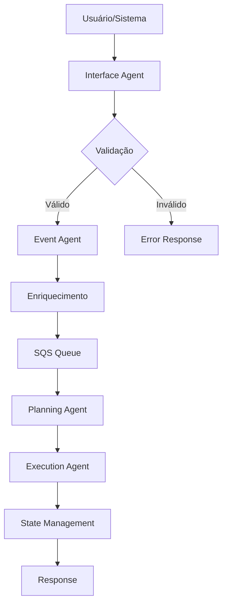
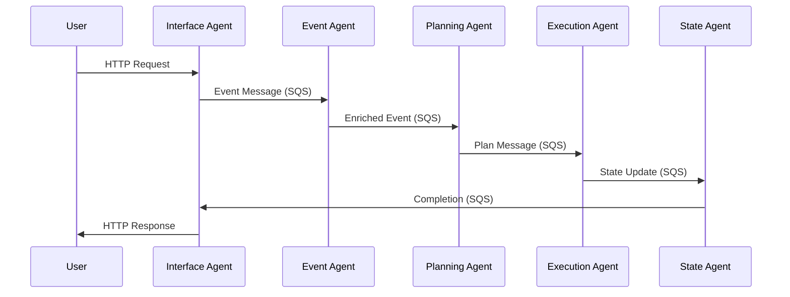

# Visão Geral do Sistema de Agentes Autônomos

## Índice

1. [Propósito e Objetivos](#propósito-e-objetivos)
2. [Contexto e Aplicação](#contexto-e-aplicação)
3. [Arquitetura de Módulos](#arquitetura-de-módulos)
4. [Guia de Desenvolvimento](#guia-de-desenvolvimento)
5. [Como Testar Eventos](#como-testar-eventos)
6. [Fluxos de Dados](#fluxos-de-dados)
7. [Plano de Desenvolvimento (TODO)](#plano-de-desenvolvimento-todo)
8. [Referências e Recursos](#referências-e-recursos)

## Propósito e Objetivos

### Propósito Principal

O Sistema de Agentes Autônomos é uma plataforma distribuída avançada projetada para processamento inteligente de eventos, planejamento colaborativo e execução coordenada de tarefas complexas através de uma arquitetura multiagente baseada em BDI (Belief-Desire-Intention) e MARL (Multi-Agent Reinforcement Learning).

### Objetivos Estratégicos

#### 🤖 Automação Inteligente
- Processamento autônomo de eventos complexos em tempo real
- Tomada de decisão distribuída baseada em inteligência artificial
- Adaptação dinâmica a mudanças no ambiente operacional
- Aprendizado contínuo através de reinforcement learning

#### 📈 Escalabilidade Horizontal
- Arquitetura distribuída para alta performance
- Capacidade de adicionar novos agentes dinamicamente
- Balanceamento automático de carga entre agentes
- Suporte para milhares de operações concorrentes

#### 🛡️ Resiliência e Confiabilidade
- Tolerância a falhas com recuperação automática
- Dead Letter Queues (DLQ) para tratamento de erros
- Retry automático com backoff exponencial
- Monitoramento proativo com alertas em tempo real

#### 👁️ Observabilidade Completa
- Métricas detalhadas de performance e saúde do sistema
- Logs estruturados para auditoria e debugging
- Dashboard em tempo real com Prometheus e Grafana
- Rastreamento distribuído de transações

## Contexto e Aplicação

### Cenário de Aplicação

O sistema foi desenvolvido para ambientes empresariais que necessitam de:

- **Processamento de Alto Volume**: Milhares de eventos por segundo
- **Decisões Complexas**: Análise multi-critério com dependências
- **Coordenação Distribuída**: Múltiplos sistemas e serviços
- **Disponibilidade Crítica**: Uptime de 99.9% ou superior

### Premissas

#### Tecnológicas
- **Node.js 18+**: Runtime principal para todos os agentes
- **Docker**: Containerização para desenvolvimento e produção
- **AWS SQS**: Sistema de mensageria para comunicação inter-agentes
- **PostgreSQL**: Banco de dados principal para persistência
- **Redis**: Cache distribuído e sessões
- **Prometheus/Grafana**: Stack de monitoramento

#### Operacionais
- **Ambiente Cloud-First**: Projetado para AWS, adaptável para outros clouds
- **DevOps**: CI/CD automatizado com testes e deploy
- **Microservices**: Cada agente é um serviço independente
- **Event-Driven**: Arquitetura baseada em eventos assíncronos

### Benefícios

#### Para o Negócio
- **Redução de Custos**: Automação de processos manuais
- **Aumento de Eficiência**: Processamento paralelo e otimizado
- **Melhoria na Qualidade**: Decisões baseadas em dados e IA
- **Escalabilidade**: Crescimento sem reengenharia

#### Para a Operação
- **Visibilidade**: Monitoramento em tempo real
- **Confiabilidade**: Alta disponibilidade e recuperação automática
- **Manutenibilidade**: Código modular e bem documentado
- **Flexibilidade**: Fácil adição de novos agentes e funcionalidades

### Problemas que Resolve

#### Problemas Técnicos
- **Acoplamento**: Sistemas monolíticos difíceis de manter
- **Escalabilidade**: Gargalos em processamento sequencial
- **Falhas**: Pontos únicos de falha
- **Observabilidade**: Falta de visibilidade em sistemas distribuídos

#### Problemas de Negócio
- **Latência**: Tempo de resposta lento em decisões críticas
- **Consistência**: Dados inconsistentes entre sistemas
- **Compliance**: Dificuldade em auditoria e rastreabilidade
- **Inovação**: Dificuldade em implementar novas funcionalidades

## Arquitetura de Módulos

### Hierarquia de Módulos

```
src/agents/
├── core/                    # Agentes principais do sistema
├── auxiliary/               # Agentes de suporte e monitoramento
├── infrastructure/          # Agentes de infraestrutura
├── management/              # Agentes de gerenciamento
├── marl/                    # Agentes de aprendizado multiagente
├── mediation/               # Agentes de mediação e orquestração
└── shared/                  # Serviços e utilitários compartilhados
```

### Classificação por Criticidade

#### 🔴 Críticos (Core)
- **Interface Agent**: Ponto de entrada para requisições externas
- **Event Agent**: Processamento e enriquecimento de eventos
- **Planning Agent**: Planejamento inteligente baseado em BDI
- **Execution Agent**: Execução coordenada de ações
- **State Management Agent**: Gerenciamento de estado distribuído

#### 🟡 Importantes (Auxiliary)
- **Monitoring Agent**: Coleta de métricas e saúde do sistema
- **Security Agent**: Autenticação, autorização e auditoria
- **Recovery Agent**: Recuperação automática de falhas
- **Health Checker**: Verificação contínua de saúde

#### 🟢 Opcionais (Enhancement)
- **MARL Agents**: Aprendizado por reforço multiagente
- **Mediation Agents**: Mediação e orquestração avançada
- **Advanced Analytics**: Análise preditiva e insights

### Agentes Core

#### Interface Agent
**Responsabilidades:**
- Recepção de requisições HTTP/REST
- Validação de entrada e autenticação
- Roteamento para agentes apropriados
- Formatação de respostas

**Tecnologias:**
- Express.js para API REST
- Joi para validação de schemas
- JWT para autenticação
- Rate limiting para proteção

#### Event Agent
**Responsabilidades:**
- Processamento de eventos de entrada
- Enriquecimento com contexto adicional
- Normalização e transformação
- Distribuição para agentes downstream

**Tecnologias:**
- SQS para mensageria
- JSON Schema para validação
- Winston para logging
- Prometheus para métricas

#### Planning Agent
**Responsabilidades:**
- Análise de eventos e contexto
- Geração de planos de ação
- Otimização baseada em objetivos
- Coordenação com outros agentes

**Tecnologias:**
- Algoritmos BDI
- Heurísticas de otimização
- Cache Redis para performance
- PostgreSQL para persistência

#### Execution Agent
**Responsabilidades:**
- Execução de planos gerados
- Coordenação de ações distribuídas
- Monitoramento de progresso
- Tratamento de falhas

**Tecnologias:**
- Workflow engine customizado
- Circuit breakers para resiliência
- Retry com backoff exponencial
- Dead Letter Queues para falhas

#### State Management Agent
**Responsabilidades:**
- Manutenção de estado global
- Sincronização entre agentes
- Versionamento de estado
- Recuperação de estado

**Tecnologias:**
- Redis para cache distribuído
- PostgreSQL para persistência
- Event sourcing para auditoria
- CQRS para separação read/write

### Matriz de Responsabilidades

| Funcionalidade | Interface | Event | Planning | Execution | State | Monitoring |
|----------------|-----------|-------|----------|-----------|-------|------------|
| **Recepção de Requisições** | 🔴 | ⚪ | ⚪ | ⚪ | ⚪ | ⚪ |
| **Processamento de Eventos** | ⚪ | 🔴 | 🟡 | ⚪ | ⚪ | 🟡 |
| **Planejamento** | ⚪ | ⚪ | 🔴 | 🟡 | 🟡 | ⚪ |
| **Execução** | ⚪ | ⚪ | ⚪ | 🔴 | 🟡 | 🟡 |
| **Gerenciamento de Estado** | ⚪ | 🟡 | 🟡 | 🟡 | 🔴 | 🟡 |
| **Monitoramento** | 🟡 | 🟡 | 🟡 | 🟡 | 🟡 | 🔴 |
| **Logging** | 🟡 | 🟡 | 🟡 | 🟡 | 🟡 | 🔴 |
| **Métricas** | 🟡 | 🟡 | 🟡 | 🟡 | 🟡 | 🔴 |

**Legenda:**
- 🔴 Responsabilidade Principal
- 🟡 Responsabilidade Secundária
- ⚪ Não Responsável

## Guia de Desenvolvimento

### 🚀 Início Rápido

#### Configuração Completa (Recomendado)

```bash
# Configurar todo o ambiente do zero
npm run dev
```

Este comando executa:
1. ✅ Verificação e instalação de dependências
2. 🐳 Configuração e inicialização do Docker
3. 📬 Criação de filas SQS no LocalStack
4. 🤖 Inicialização de todos os agentes
5. 🧪 Execução de testes de eventos
6. 📊 Verificação final do sistema

#### Comandos Alternativos

```bash
# Configuração rápida (assume Docker já rodando)
npm run dev:quick

# Apenas executar testes de eventos
npm run dev:test

# Limpar ambiente completamente
npm run dev:clean
```

### 📋 Pré-requisitos

#### Software Necessário
- **Node.js** (v18 ou superior)
- **npm** (v8 ou superior)
- **Docker** (v20 ou superior)
- **Docker Compose** (v2 ou superior)

#### Verificação dos Pré-requisitos

```bash
node --version    # v18+
npm --version     # v8+
docker --version  # v20+
docker-compose --version  # v2+
```

### 🔧 Configuração do Ambiente

#### Variáveis de Ambiente

```bash
# Copiar arquivo de exemplo
cp config/environments/.env.example config/environments/.env.development

# Editar configurações
nano config/environments/.env.development
```

#### Configurações Essenciais

```env
# Ambiente
NODE_ENV=development
PORT=3000

# AWS LocalStack
AWS_REGION=us-east-1
SQS_ENDPOINT=http://localhost:4566

# Banco de Dados
POSTGRES_HOST=localhost
POSTGRES_PORT=5432
POSTGRES_DB=agentes_dev

# Redis
REDIS_HOST=localhost
REDIS_PORT=6379

# Monitoramento
PROMETHEUS_PORT=9090
GRAFANA_PORT=3000
```

### 🏗️ Estrutura do Projeto

```
agentesautonomos/
├── src/
│   ├── agents/              # Código dos agentes
│   ├── config/              # Configurações
│   ├── services/            # Serviços compartilhados
│   └── utils/               # Utilitários
├── config/
│   ├── environments/        # Arquivos .env
│   ├── grafana/            # Configurações Grafana
│   └── monitoring/         # Configurações monitoramento
├── scripts/                # Scripts de automação
├── tests/                  # Testes automatizados
├── docs/                   # Documentação
└── infrastructure/         # Infraestrutura como código
```

### 🧪 Desenvolvimento e Testes

#### Scripts de Desenvolvimento

```bash
# Desenvolvimento
npm run dev                 # Ambiente completo
npm run dev:watch          # Com hot reload
npm run dev:debug          # Com debug

# Testes
npm test                   # Todos os testes
npm run test:unit          # Testes unitários
npm run test:integration   # Testes de integração
npm run test:e2e           # Testes end-to-end

# Qualidade
npm run lint               # ESLint
npm run format             # Prettier
npm run type:check         # TypeScript
```

#### Estrutura de Testes

```
tests/
├── unit/                   # Testes unitários
│   ├── agents/            # Testes dos agentes
│   └── services/          # Testes dos serviços
├── integration/           # Testes de integração
│   ├── api/               # Testes de API
│   └── agents/            # Testes inter-agentes
└── e2e/                   # Testes end-to-end
    ├── scenarios/         # Cenários de teste
    └── fixtures/          # Dados de teste
```

## Como Testar Eventos

### Status da Aplicação

✅ **Aplicação rodando com sucesso!**

A aplicação foi configurada e está funcionando corretamente. Os seguintes componentes estão ativos:

#### Agentes em Execução
- **Interface Agent** (porta 3001) - Status: Healthy
- **Event Agent** (porta 3002) - Status: Healthy
- **Planning Agent** (porta 3003) - Status: Healthy
- **Execution Agent** (porta 3004) - Status: Healthy
- **State Management Agent** (porta 3005) - Status: Healthy
- **Monitoring Agent** (porta 3006) - Status: Healthy
- **Security Agent** (porta 3008) - Status: Healthy
- **External Gateway** (porta 3007) - Status: Healthy

#### Serviços Docker
- **LocalStack** (porta 4566) - AWS services locais
- **PostgreSQL** (porta 5432) - Banco de dados
- **Redis** (porta 6379) - Cache e mensageria
- **Prometheus** (porta 9090) - Métricas
- **Grafana** (porta 3000) - Dashboards
- **PgAdmin** (porta 8080) - Interface do PostgreSQL
- **Redis Commander** (porta 8081) - Interface do Redis

### Como Enviar Eventos para Teste

#### 1. Via API REST (Interface Agent)

**Endpoint:** `http://localhost:3001/api/events`

```bash
# Evento simples
curl -X POST http://localhost:3001/api/events \
  -H "Content-Type: application/json" \
  -d '{
    "type": "user_action",
    "data": {
      "action": "login",
      "userId": "user123",
      "timestamp": "2024-01-15T10:30:00Z"
    }
  }'

# Evento complexo
curl -X POST http://localhost:3001/api/events \
  -H "Content-Type: application/json" \
  -d '{
    "type": "business_process",
    "data": {
      "processId": "proc456",
      "steps": [
        {"id": 1, "action": "validate", "params": {"field": "email"}},
        {"id": 2, "action": "process", "params": {"timeout": 30}},
        {"id": 3, "action": "notify", "params": {"channel": "email"}}
      ],
      "priority": "high",
      "deadline": "2024-01-15T11:00:00Z"
    }
  }'
```

#### 2. Via External Gateway

**Endpoint:** `http://localhost:3007/api/external/events`

```bash
# Evento externo com autenticação
curl -X POST http://localhost:3007/api/external/events \
  -H "Content-Type: application/json" \
  -H "Authorization: Bearer your-jwt-token" \
  -d '{
    "source": "external_system",
    "type": "integration_event",
    "data": {
      "entityId": "ext123",
      "operation": "create",
      "payload": {
        "name": "Test Entity",
        "status": "active"
      }
    }
  }'
```

#### 3. Monitoramento de Eventos

```bash
# Verificar logs em tempo real
docker-compose logs -f interface-agent
docker-compose logs -f event-agent
docker-compose logs -f planning-agent

# Verificar métricas
curl http://localhost:9090/metrics

# Verificar saúde dos agentes
curl http://localhost:3001/health
curl http://localhost:3002/health
curl http://localhost:3003/health
```

### Cenários de Teste Recomendados

#### Teste de Carga
```bash
# Enviar múltiplos eventos
for i in {1..100}; do
  curl -X POST http://localhost:3001/api/events \
    -H "Content-Type: application/json" \
    -d "{\"type\": \"load_test\", \"data\": {\"id\": $i, \"timestamp\": \"$(date -Iseconds)\"}}"
done
```

#### Teste de Falha
```bash
# Evento inválido (deve gerar erro)
curl -X POST http://localhost:3001/api/events \
  -H "Content-Type: application/json" \
  -d '{
    "type": "invalid_event",
    "data": null
  }'
```

#### Teste de Timeout
```bash
# Evento com processamento longo
curl -X POST http://localhost:3001/api/events \
  -H "Content-Type: application/json" \
  -d '{
    "type": "long_process",
    "data": {
      "duration": 60000,
      "steps": 10
    }
  }'
```

## Fluxos de Dados

### Principais Tipos de Dados

| Tipo | Descrição | Formato | Persistência |
|------|-----------|---------|-------------|
| **Eventos** | Dados de entrada do usuário e sistema | JSON | SQS + Database |
| **Beliefs** | Estado de conhecimento dos agentes | JSON/Binary | Redis + Database |
| **Goals** | Objetivos e metas dos agentes | JSON | Database |
| **Plans** | Planos de ação gerados | JSON | Database |
| **Actions** | Ações executadas pelos agentes | JSON | Database + Logs |
| **Rewards** | Sinais de recompensa MARL | Float | Time Series DB |
| **Metrics** | Métricas de sistema e performance | Time Series | Prometheus |
| **Logs** | Logs de aplicação e auditoria | Text/JSON | ELK Stack |

### Fluxo de Dados Principal

```
Usuário → Interface → Event Processing → Agent BDI → Action Execution → Resultado
    ↓         ↓              ↓              ↓              ↓            ↓
  Logs    Validation    Enrichment    Reasoning    Monitoring    Feedback
```

### Fluxo de Entrada de Dados



### Comunicação Inter-Agentes



## Plano de Desenvolvimento (TODO)

### 📊 Resumo Executivo

> **Status do Projeto**: 92% Completo  
> **Última Atualização**: Janeiro 2024  
> **Próxima Revisão**: Semanal

| Categoria | Tarefas | Prioridade | Status | Estimativa |
|-----------|---------|------------|--------|-----------||
| **Testes Automatizados** | 8 | 🔴 ALTA | 15% → 80% | 2-3 semanas |
| **Configurações de Produção** | 6 | 🔴 ALTA | 0% → 100% | 2-3 semanas |
| **Segurança** | 7 | 🔴 ALTA | 30% → 100% | 1-2 semanas |
| **Monitoramento Avançado** | 5 | 🟡 MÉDIA | 40% → 100% | 1-2 semanas |
| **Performance e Otimização** | 6 | 🟡 MÉDIA | 20% → 80% | 2-3 semanas |
| **Documentação Complementar** | 4 | 🟢 BAIXA | 60% → 100% | 1 semana |

### 🔴 PRIORIDADE ALTA

#### 1. Testes Automatizados

**Objetivo**: Elevar cobertura de testes de 15% para 80%  
**Dependências**: Nenhuma - pode ser iniciado imediatamente  
**Estimativa**: 2-3 semanas

**Tarefas:**
- [ ] Testes unitários para todos os agentes (cobertura > 90%)
- [ ] Testes de integração entre agentes
- [ ] Testes end-to-end de cenários completos
- [ ] Testes de carga e performance
- [ ] Testes de falha e recuperação
- [ ] Configuração de CI/CD com testes automatizados
- [ ] Relatórios de cobertura automatizados
- [ ] Testes de regressão

#### 2. Configurações de Produção

**Objetivo**: Preparar sistema para deploy em produção  
**Dependências**: Testes automatizados  
**Estimativa**: 2-3 semanas

**Tarefas:**
- [ ] Configuração de variáveis de ambiente para produção
- [ ] Scripts de deploy automatizado
- [ ] Configuração de load balancer
- [ ] Setup de SSL/TLS
- [ ] Configuração de auto-scaling
- [ ] Backup automatizado

#### 3. Segurança

**Objetivo**: Implementar controles de segurança robustos  
**Dependências**: Configurações de produção  
**Estimativa**: 1-2 semanas

**Tarefas:**
- [ ] Implementação completa de JWT
- [ ] Rate limiting avançado
- [ ] Auditoria de segurança
- [ ] Criptografia de dados sensíveis
- [ ] Validação de entrada robusta
- [ ] Logs de segurança
- [ ] Compliance e certificações

### 🟡 PRIORIDADE MÉDIA

#### 4. Monitoramento Avançado

**Tarefas:**
- [ ] Alertas inteligentes baseados em ML
- [ ] Dashboards customizados por role
- [ ] Métricas de negócio
- [ ] Análise preditiva de falhas
- [ ] Integração com ferramentas externas

#### 5. Performance e Otimização

**Tarefas:**
- [ ] Profiling de performance
- [ ] Otimização de queries de banco
- [ ] Cache distribuído avançado
- [ ] Compressão de dados
- [ ] Otimização de rede
- [ ] Tuning de JVM/Node.js

### 🟢 PRIORIDADE BAIXA

#### 6. Documentação Complementar

**Tarefas:**
- [ ] Guias de troubleshooting avançado
- [ ] Documentação de APIs externas
- [ ] Tutoriais de desenvolvimento
- [ ] Documentação de arquitetura detalhada

## Referências e Recursos

### 📚 Documentação Oficial

#### Node.js e JavaScript

| Recurso | URL | Descrição |
|---------|-----|----------|
| **Node.js Official** | https://nodejs.org/docs/ | Documentação oficial do Node.js |
| **Express.js** | https://expressjs.com/ | Framework web para Node.js |
| **NPM Registry** | https://www.npmjs.com/ | Repositório de pacotes Node.js |
| **JavaScript MDN** | https://developer.mozilla.org/en-US/docs/Web/JavaScript | Referência completa JavaScript |
| **ECMAScript Spec** | https://tc39.es/ecma262/ | Especificação oficial ECMAScript |

#### AWS e Cloud Services

| Recurso | URL | Descrição |
|---------|-----|----------|
| **AWS SQS** | https://docs.aws.amazon.com/sqs/ | Amazon Simple Queue Service |
| **AWS SDK for JavaScript** | https://docs.aws.amazon.com/sdk-for-javascript/ | SDK oficial AWS para Node.js |
| **LocalStack** | https://docs.localstack.cloud/ | Emulador local de serviços AWS |
| **AWS Well-Architected** | https://aws.amazon.com/architecture/well-architected/ | Princípios de arquitetura AWS |

#### Bancos de Dados

| Recurso | URL | Descrição |
|---------|-----|----------|
| **PostgreSQL** | https://www.postgresql.org/docs/ | Documentação oficial PostgreSQL |
| **Redis** | https://redis.io/documentation | Documentação oficial Redis |
| **Sequelize** | https://sequelize.org/docs/ | ORM para Node.js |
| **Prisma** | https://www.prisma.io/docs | ORM moderno para Node.js |

#### Containerização e Orquestração

| Recurso | URL | Descrição |
|---------|-----|----------|
| **Docker** | https://docs.docker.com/ | Documentação oficial Docker |
| **Docker Compose** | https://docs.docker.com/compose/ | Orquestração de containers |
| **Kubernetes** | https://kubernetes.io/docs/ | Orquestração de containers |
| **Helm** | https://helm.sh/docs/ | Gerenciador de pacotes Kubernetes |

### 🏗️ Padrões e Arquiteturas

#### Arquitetura de Software

| Padrão | Descrição | Aplicação no Projeto |
|--------|-----------|----------------------|
| **BDI (Belief-Desire-Intention)** | Arquitetura para agentes inteligentes | Planning Agent |
| **MARL (Multi-Agent RL)** | Aprendizado por reforço multiagente | MARL Agents |
| **Event-Driven Architecture** | Arquitetura baseada em eventos | Todo o sistema |
| **Microservices** | Serviços independentes e desacoplados | Cada agente |
| **CQRS** | Separação de comandos e consultas | State Management |
| **Event Sourcing** | Armazenamento de eventos | Auditoria |

#### Design Patterns

| Pattern | Uso | Implementação |
|---------|-----|---------------|
| **Observer** | Notificações entre agentes | Event system |
| **Strategy** | Algoritmos de planejamento | Planning Agent |
| **Circuit Breaker** | Tolerância a falhas | Execution Agent |
| **Retry** | Recuperação de falhas | Todos os agentes |
| **Bulkhead** | Isolamento de recursos | Agent isolation |

### 🛠️ Ferramentas de Desenvolvimento

#### IDEs e Editores

| Ferramenta | Descrição | Plugins Recomendados |
|------------|-----------|---------------------|
| **VS Code** | Editor leve e extensível | ESLint, Prettier, Docker |
| **WebStorm** | IDE completa para JavaScript | Node.js, Docker, AWS |
| **Vim/Neovim** | Editor de terminal | coc.nvim, ale |

#### Debugging e Profiling

| Ferramenta | Uso | Configuração |
|------------|-----|-------------|
| **Node.js Inspector** | Debug nativo | `--inspect` flag |
| **Chrome DevTools** | Debug visual | chrome://inspect |
| **Clinic.js** | Profiling de performance | `npm install -g clinic` |
| **0x** | Flame graphs | `npm install -g 0x` |

### 📊 Monitoramento e Observabilidade

#### Stack de Monitoramento

| Componente | Função | Configuração |
|------------|--------|-------------|
| **Prometheus** | Coleta de métricas | prometheus.yml |
| **Grafana** | Visualização | dashboards/ |
| **Winston** | Logging estruturado | logger.js |
| **Jaeger** | Tracing distribuído | jaeger-config.yml |

#### Métricas Importantes

| Métrica | Tipo | Threshold |
|---------|------|----------|
| **Response Time** | Histogram | P95 < 500ms |
| **Error Rate** | Counter | < 1% |
| **Throughput** | Gauge | > 1000 req/s |
| **CPU Usage** | Gauge | < 80% |
| **Memory Usage** | Gauge | < 85% |

### 🔒 Segurança

#### Frameworks e Bibliotecas

| Biblioteca | Função | Configuração |
|------------|--------|-------------|
| **Helmet** | Headers de segurança | helmet() |
| **CORS** | Cross-Origin Resource Sharing | cors() |
| **Rate Limiter** | Proteção contra DDoS | express-rate-limit |
| **JWT** | Autenticação | jsonwebtoken |
| **bcrypt** | Hash de senhas | bcryptjs |

#### Boas Práticas

- **Princípio do Menor Privilégio**: Acesso mínimo necessário
- **Defense in Depth**: Múltiplas camadas de segurança
- **Fail Secure**: Falhar de forma segura
- **Security by Design**: Segurança desde o design

### 🚀 Performance e Otimização

#### Técnicas de Otimização

| Técnica | Aplicação | Benefício |
|---------|-----------|----------|
| **Connection Pooling** | Database | Reduz latência |
| **Caching** | Redis | Melhora throughput |
| **Compression** | HTTP | Reduz bandwidth |
| **Load Balancing** | Nginx/ALB | Distribui carga |
| **CDN** | Assets estáticos | Reduz latência |

#### Ferramentas de Performance

| Ferramenta | Uso | Comando |
|------------|-----|--------|
| **Artillery** | Load testing | `artillery run test.yml` |
| **Autocannon** | HTTP benchmarking | `autocannon http://localhost:3000` |
| **Clinic.js** | Node.js profiling | `clinic doctor -- node app.js` |

### 👥 Comunidade e Suporte

#### Comunidades

- **Node.js Community**: https://nodejs.org/community/
- **Express.js Community**: https://expressjs.com/community.html
- **AWS Community**: https://aws.amazon.com/developer/community/
- **Docker Community**: https://www.docker.com/community/

#### Suporte Técnico

- **Stack Overflow**: Perguntas técnicas
- **GitHub Issues**: Bugs e feature requests
- **Discord/Slack**: Discussões em tempo real
- **Reddit**: Discussões da comunidade

### 📖 Cursos e Treinamentos

#### Cursos Online

| Plataforma | Curso | Nível |
|------------|-------|-------|
| **Udemy** | Node.js Complete Guide | Intermediário |
| **Pluralsight** | Microservices Architecture | Avançado |
| **Coursera** | AWS Solutions Architect | Intermediário |
| **edX** | Introduction to Docker | Iniciante |

#### Certificações

- **AWS Certified Solutions Architect**
- **Docker Certified Associate**
- **Kubernetes Administrator (CKA)**
- **Node.js Application Developer**

Este documento serve como ponto de entrada para entender o sistema de agentes autônomos, fornecendo uma visão abrangente desde conceitos básicos até implementação avançada e recursos para desenvolvimento contínuo.