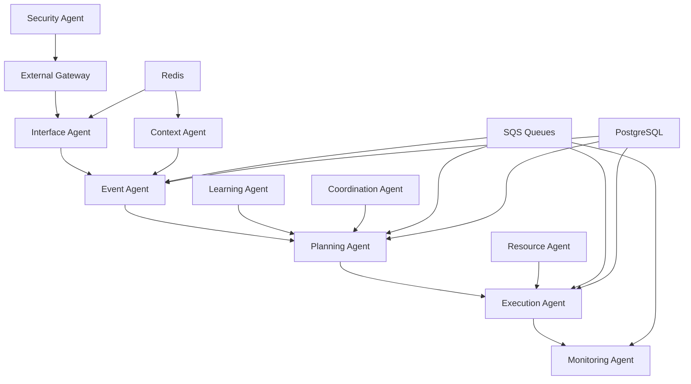

# Agentes Autônomos - Sistema Multi-Agente

## Visão Geral

Sistema distribuído de agentes autônomos para automação inteligente de processos, com arquitetura baseada em microserviços e comunicação assíncrona.

## Arquitetura Simplificada

### Estrutura de Ambientes

#### 🔧 Desenvolvimento Local
- **LocalStack**: Simula todos os serviços AWS
- **Docker Compose**: Orquestração local
- **Script único**: `start-dev-environment.js`

#### ☁️ Produção AWS
- **Serviços AWS reais**: SQS, RDS, ElastiCache, S3
- **Docker Swarm/ECS**: Orquestração em produção
- **Deploy automatizado**: `deploy-production.js`

### Agentes do Sistema

| Agente | Porta | Responsabilidade |
|--------|-------|------------------|
| **External Gateway** | 3001 | API externa e roteamento |
| **Interface Agent** | 3002 | Interface com usuários |
| **Event Agent** | 3003 | Processamento de eventos |
| **Planning Agent** | 3004 | Planejamento de ações |
| **Execution Agent** | 3005 | Execução de tarefas |
| **Monitoring Agent** | 3006 | Monitoramento do sistema |
| **Learning Agent** | 3007 | Aprendizado de máquina |
| **Coordination Agent** | 3008 | Coordenação entre agentes |
| **Resource Agent** | 3009 | Gerenciamento de recursos |
| **Security Agent** | 3010 | Segurança e autenticação |
| **Context Agent** | 3011 | Contexto e memória |

## Início Rápido

### Desenvolvimento Local

```bash
# 1. Clonar repositório
git clone <repository-url>
cd agentesautonomos

# 2. Instalar dependências
npm install

# 3. Iniciar ambiente completo
node dev/scripts/start-dev-environment.js
```

### Produção AWS

```bash
# 1. Configurar credenciais AWS
aws configure

# 2. Configurar variáveis de ambiente
cp .env.production.example .env.production
# Editar .env.production com valores reais

# 3. Deploy
node deploy/aws/deploy-production.js
```

## Estrutura do Projeto

```
agentesautonomos/
├── agents/                          # Código dos agentes
│   ├── core/                       # Agentes principais
│   │   ├── event-agent/
│   │   ├── planning-agent/
│   │   ├── execution-agent/
│   │   └── monitoring-agent/
│   ├── auxiliary/                  # Agentes auxiliares
│   │   ├── learning-agent/
│   │   ├── coordination-agent/
│   │   ├── resource-agent/
│   │   ├── security-agent/
│   │   └── context-agent/
│   └── external/                   # Gateway externo
│       └── gateway/
├── shared/                         # Código compartilhado
│   ├── utils/
│   ├── config/
│   └── types/
├── dev/                           # Scripts de desenvolvimento
│   └── scripts/
│       ├── start-dev-environment.js
│       ├── setup-local-environment.js
│       ├── monitor.js
│       └── test-system.js
├── deploy/                        # Scripts de deploy
│   └── aws/
│       ├── deploy-production.js
│       ├── setup.js
│       └── verify.js
├── config/                        # Configurações
│   ├── prometheus.yml
│   └── grafana/
├── docs/                          # Documentação
│   ├── LOCAL_DEVELOPMENT.md
│   ├── AWS_DEPLOYMENT.md
│   └── ARCHITECTURE.md
├── docker-compose.dev.yml         # Docker para desenvolvimento
├── docker-compose.aws.yml         # Docker para produção
├── .env.development.local         # Config desenvolvimento
└── .env.production               # Config produção
```

## Tecnologias Utilizadas

### Backend
- **Node.js**: Runtime JavaScript
- **Express.js**: Framework web
- **TypeScript**: Tipagem estática

### Infraestrutura
- **Docker**: Containerização
- **Docker Compose**: Orquestração local
- **LocalStack**: Simulação AWS local

### Banco de Dados
- **PostgreSQL**: Banco principal
- **Redis**: Cache e sessões

### Mensageria
- **AWS SQS**: Filas de mensagens
- **LocalStack SQS**: Simulação local

### Monitoramento
- **Prometheus**: Coleta de métricas
- **Grafana**: Visualização de dados
- **Health Checks**: Verificação de saúde

### AWS (Produção)
- **RDS**: PostgreSQL gerenciado
- **ElastiCache**: Redis gerenciado
- **SQS**: Filas de mensagens
- **S3**: Armazenamento de objetos
- **CloudWatch**: Logs e métricas

## Fluxo de Comunicação



## Configuração de Ambiente

### Variáveis de Ambiente

#### Desenvolvimento Local (`.env.development.local`)
```env
# Redis Local
REDIS_HOST=localhost
REDIS_PORT=6379

# PostgreSQL Local
POSTGRES_HOST=localhost
POSTGRES_PORT=5432
POSTGRES_DB=agentes_autonomos

# LocalStack
LOCALSTACK_ENDPOINT=http://localhost:4566
AWS_REGION=us-east-1
```

#### Produção AWS (`.env.production`)
```env
# AWS Credentials
AWS_REGION=us-east-1
AWS_ACCESS_KEY_ID=your-access-key
AWS_SECRET_ACCESS_KEY=your-secret-key

# RDS PostgreSQL
POSTGRES_HOST=your-rds-endpoint
POSTGRES_PORT=5432
POSTGRES_DB=agentes_autonomos

# ElastiCache Redis
REDIS_HOST=your-elasticache-endpoint
REDIS_PORT=6379

# SQS Queues
SQS_ENDPOINT=https://sqs.us-east-1.amazonaws.com
```

## Scripts Principais

### Desenvolvimento
```bash
# Iniciar ambiente completo
node dev/scripts/start-dev-environment.js

# Configurar apenas infraestrutura
node dev/scripts/setup-local-environment.js

# Monitorar sistema
node dev/scripts/monitor.js

# Executar testes
node dev/scripts/test-system.js
```

### Produção
```bash
# Deploy completo
node deploy/aws/deploy-production.js

# Configurar recursos AWS
node deploy/aws/setup.js

# Verificar deploy
node deploy/aws/verify.js
```

## Monitoramento

### URLs de Monitoramento
- **Grafana**: http://localhost:3000 (admin/admin123)
- **Prometheus**: http://localhost:9090
- **PgAdmin**: http://localhost:8080 (admin@agentes.local/admin123)
- **Redis Commander**: http://localhost:8081

### Métricas Coletadas
- Performance dos agentes
- Latência das requisições
- Throughput das filas
- Uso de recursos (CPU, memória)
- Erros e exceções

## Segurança

### Desenvolvimento
- Credenciais padrão para facilitar desenvolvimento
- Dados locais não persistentes
- CORS liberado para localhost

### Produção
- Credenciais via AWS Secrets Manager
- Criptografia em trânsito e repouso
- CORS restrito
- Rate limiting ativo
- Logs de auditoria

## Testes

### Tipos de Teste
- **Unitários**: Testes de componentes individuais
- **Integração**: Testes entre agentes
- **E2E**: Testes de fluxo completo
- **Performance**: Testes de carga

### Executar Testes
```bash
# Todos os testes
npm test

# Testes unitários
npm run test:unit

# Testes de integração
npm run test:integration

# Testes E2E
npm run test:e2e
```

## Troubleshooting

### Problemas Comuns

1. **Portas em uso**: Verificar processos rodando nas portas
2. **Docker não inicia**: Verificar Docker Desktop
3. **Serviços não conectam**: Verificar logs dos containers
4. **Performance baixa**: Verificar recursos do sistema

### Logs
```bash
# Logs de desenvolvimento
docker-compose -f docker-compose.dev.yml logs -f

# Logs de produção
aws logs tail /aws/ecs/agentes-autonomos --follow
```

## Contribuição

### Fluxo de Desenvolvimento
1. Fork do repositório
2. Criar branch feature
3. Desenvolver localmente
4. Executar testes
5. Criar Pull Request

### Padrões de Código
- **ESLint**: Linting JavaScript/TypeScript
- **Prettier**: Formatação de código
- **Conventional Commits**: Padrão de commits
- **Clean Architecture**: Arquitetura limpa

## Roadmap

### Versão Atual (v1.0)
- ✅ Arquitetura básica dos agentes
- ✅ Comunicação via SQS
- ✅ Ambiente de desenvolvimento
- ✅ Deploy AWS básico

### Próximas Versões
- 🔄 Interface web para administração
- 🔄 Machine Learning avançado
- 🔄 Auto-scaling automático
- 🔄 Multi-região AWS

## Documentação Adicional

- [Desenvolvimento Local](./LOCAL_DEVELOPMENT.md)
- [Deploy AWS](./AWS_DEPLOYMENT.md)
- [Arquitetura Detalhada](./ARCHITECTURE.md)
- [API Reference](./API_REFERENCE.md)
- [Troubleshooting](./TROUBLESHOOTING.md)

## Suporte

- **Issues**: GitHub Issues
- **Documentação**: Pasta `/docs`
- **Logs**: Verificar logs dos serviços
- **Monitoramento**: Grafana dashboards

---

**Versão**: 1.0.0  
**Última atualização**: 2024-01-15  
**Licença**: MIT
