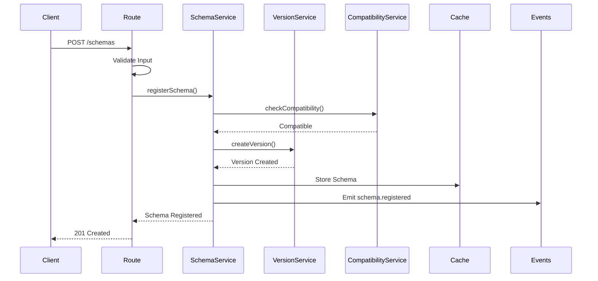
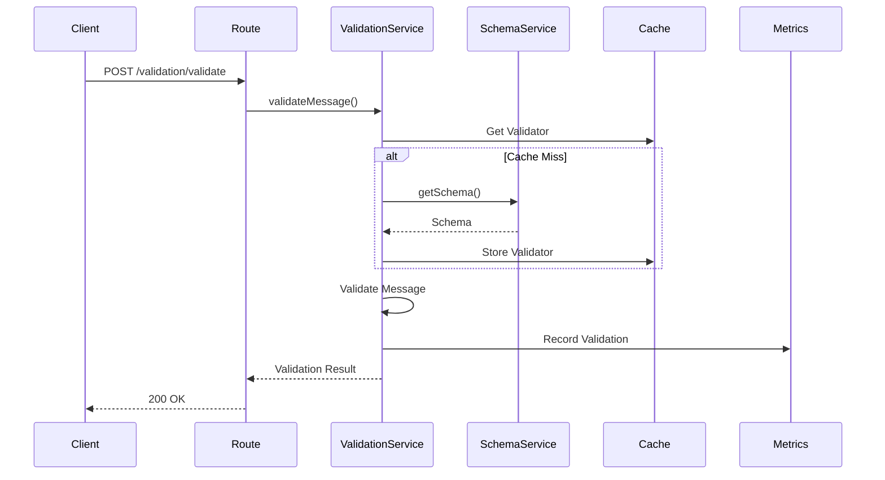
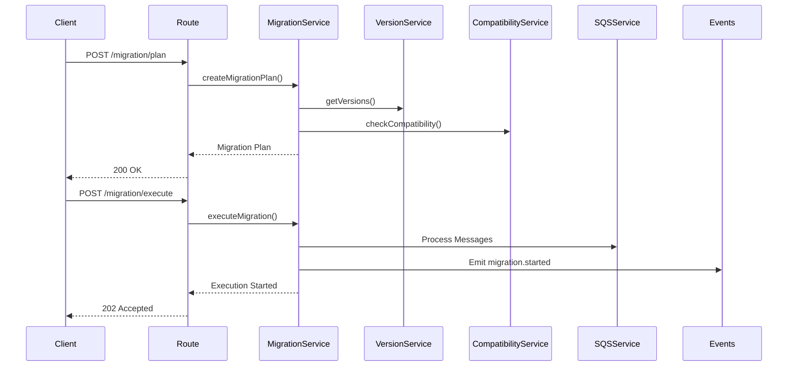

# Arquitetura do Message Schema Registry

Este documento descreve a arquitetura detalhada do Message Schema Registry, incluindo componentes, fluxos de dados, padrões de design e decisões arquiteturais.

## 📋 Índice

- [Visão Geral](#visão-geral)
- [Princípios Arquiteturais](#princípios-arquiteturais)
- [Componentes](#componentes)
- [Fluxos de Dados](#fluxos-de-dados)
- [Padrões de Design](#padrões-de-design)
- [Escalabilidade](#escalabilidade)
- [Segurança](#segurança)
- [Monitoramento](#monitoramento)
- [Decisões Arquiteturais](#decisões-arquiteturais)

## 🎯 Visão Geral

O Message Schema Registry segue uma arquitetura em camadas baseada em microserviços, implementando os princípios de Clean Architecture, Domain-Driven Design (DDD) e Design Modular.

```
┌─────────────────────────────────────────────────────────────┐
│                    Presentation Layer                       │
│  ┌─────────────┐  ┌─────────────┐  ┌─────────────┐        │
│  │   Routes    │  │ Middleware  │  │   Swagger   │        │
│  │   (REST)    │  │  (Express)  │  │    Docs     │        │
│  └─────────────┘  └─────────────┘  └─────────────┘        │
└─────────────────────────────────────────────────────────────┘
                              │
┌─────────────────────────────────────────────────────────────┐
│                   Application Layer                         │
│  ┌─────────────┐  ┌─────────────┐  ┌─────────────┐        │
│  │   Schema    │  │ Validation  │  │   Version   │        │
│  │  Service    │  │  Service    │  │  Service    │        │
│  └─────────────┘  └─────────────┘  └─────────────┘        │
│  ┌─────────────┐  ┌─────────────┐  ┌─────────────┐        │
│  │Compatibility│  │ Migration   │  │   Cache     │        │
│  │  Service    │  │  Service    │  │  Service    │        │
│  └─────────────┘  └─────────────┘  └─────────────┘        │
└─────────────────────────────────────────────────────────────┘
                              │
┌─────────────────────────────────────────────────────────────┐
│                 Infrastructure Layer                        │
│  ┌─────────────┐  ┌─────────────┐  ┌─────────────┐        │
│  │    Redis    │  │   AWS SQS   │  │ Prometheus  │        │
│  │    Cache    │  │   Queues    │  │  Metrics    │        │
│  └─────────────┘  └─────────────┘  └─────────────┘        │
│  ┌─────────────┐  ┌─────────────┐  ┌─────────────┐        │
│  │   Health    │  │   Alert     │  │   Logger    │        │
│  │  Monitoring │  │  Service    │  │  (Winston)  │        │
│  └─────────────┘  └─────────────┘  └─────────────┘        │
└─────────────────────────────────────────────────────────────┘
```

## 🏛️ Princípios Arquiteturais

### 1. Clean Architecture
- **Separação de responsabilidades**: Cada camada tem uma responsabilidade específica
- **Inversão de dependências**: Camadas internas não dependem de camadas externas
- **Testabilidade**: Componentes são facilmente testáveis de forma isolada

### 2. Domain-Driven Design (DDD)
- **Bounded Contexts**: Cada serviço representa um contexto delimitado
- **Ubiquitous Language**: Linguagem comum entre domínio e código
- **Aggregates**: Agrupamento de entidades relacionadas

### 3. Design Modular
- **Alta coesão**: Componentes relacionados agrupados
- **Baixo acoplamento**: Dependências mínimas entre módulos
- **Reutilização**: Componentes reutilizáveis e configuráveis

### 4. Event-Driven Architecture
- **Eventos de domínio**: Comunicação assíncrona entre serviços
- **Event Sourcing**: Histórico de mudanças através de eventos
- **CQRS**: Separação entre comandos e consultas

## 🧩 Componentes

### Presentation Layer

#### Routes
```javascript
// Responsabilidades:
// - Definição de endpoints REST
// - Validação de entrada
// - Serialização de resposta
// - Documentação Swagger

schemaRoutes.js      // CRUD de esquemas
validationRoutes.js  // Validação de mensagens
versionRoutes.js     // Gerenciamento de versões
compatibilityRoutes.js // Verificação de compatibilidade
migrationRoutes.js   // Operações de migração
healthRoutes.js      // Health checks
```

#### Middleware
```javascript
// Responsabilidades:
// - Autenticação e autorização
// - Rate limiting
// - CORS e segurança
// - Logging de requisições
// - Tratamento de erros

security.js          // Helmet, CORS, rate limiting
logging.js           // Request/response logging
errorHandler.js      // Tratamento global de erros
validation.js        // Validação de entrada
```

### Application Layer

#### Core Services

##### SchemaService
```javascript
// Responsabilidades:
// - Registro e gerenciamento de esquemas
// - Validação de formato de esquema
// - Cache de esquemas
// - Eventos de ciclo de vida

class SchemaService {
  async registerSchema(subject, schema, options)
  async getSchema(subject, version)
  async updateSchema(subject, schema, options)
  async deleteSchema(subject, version)
  async listSchemas(filters)
}
```

##### ValidationService
```javascript
// Responsabilidades:
// - Validação de mensagens contra esquemas
// - Suporte a múltiplos formatos (JSON Schema, Avro)
// - Cache de validadores
// - Estatísticas de validação

class ValidationService {
  async validateMessage(subject, version, message)
  async batchValidate(validations)
  async getValidationStats()
  async clearValidationCache()
}
```

##### VersionService
```javascript
// Responsabilidades:
// - Versionamento semântico
// - Histórico de versões
// - Tags e aliases
// - Depreciação de versões

class VersionService {
  async createVersion(subject, schema, versionInfo)
  async getVersions(subject, options)
  async tagVersion(subject, version, tag)
  async deprecateVersion(subject, version, reason)
}
```

##### CompatibilityService
```javascript
// Responsabilidades:
// - Verificação de compatibilidade
// - Políticas de compatibilidade
// - Análise de breaking changes
// - Relatórios de compatibilidade

class CompatibilityService {
  async checkCompatibility(subject, schema, version)
  async setCompatibilityPolicy(subject, policy)
  async getCompatibilityPolicy(subject)
  async analyzeBreakingChanges(oldSchema, newSchema)
}
```

##### MigrationService
```javascript
// Responsabilidades:
// - Planejamento de migrações
// - Execução de migrações
// - Rollback de migrações
// - Monitoramento de progresso

class MigrationService {
  async createMigrationPlan(subject, fromVersion, toVersion)
  async executeMigration(planId, options)
  async getMigrationStatus(executionId)
  async rollbackMigration(executionId)
}
```

#### Infrastructure Services

##### CacheService
```javascript
// Responsabilidades:
// - Cache distribuído (Redis)
// - Estratégias de cache
// - Invalidação de cache
// - Métricas de cache

class CacheService {
  async get(key)
  async set(key, value, ttl)
  async del(key)
  async invalidatePattern(pattern)
}
```

##### MetricsService
```javascript
// Responsabilidades:
// - Coleta de métricas
// - Integração com Prometheus
// - Métricas customizadas
// - Dashboards

class MetricsService {
  incrementCounter(name, labels)
  recordHistogram(name, value, labels)
  setGauge(name, value, labels)
  getMetrics()
}
```

## 🔄 Fluxos de Dados

### 1. Registro de Esquema



### 2. Validação de Mensagem



### 3. Migração de Dados



## 🎨 Padrões de Design

### 1. Repository Pattern
```javascript
// Abstração para acesso a dados
class SchemaRepository {
  async save(schema) { /* implementation */ }
  async findById(id) { /* implementation */ }
  async findBySubject(subject) { /* implementation */ }
  async delete(id) { /* implementation */ }
}
```

### 2. Factory Pattern
```javascript
// Criação de validadores baseado no formato
class ValidatorFactory {
  static create(format, schema) {
    switch (format) {
      case 'json-schema':
        return new JSONSchemaValidator(schema)
      case 'avro':
        return new AvroValidator(schema)
      default:
        throw new Error(`Unsupported format: ${format}`)
    }
  }
}
```

### 3. Strategy Pattern
```javascript
// Estratégias de compatibilidade
class CompatibilityStrategy {
  check(oldSchema, newSchema) { /* abstract */ }
}

class BackwardCompatibilityStrategy extends CompatibilityStrategy {
  check(oldSchema, newSchema) {
    // Implementação específica para backward compatibility
  }
}
```

### 4. Observer Pattern
```javascript
// Sistema de eventos
class EventEmitter {
  on(event, listener) { /* implementation */ }
  emit(event, data) { /* implementation */ }
}

// Uso
schemaService.on('schema.registered', (data) => {
  versionService.createVersion(data.subject, data)
})
```

### 5. Decorator Pattern
```javascript
// Cache decorator para serviços
function withCache(service, cacheService) {
  return new Proxy(service, {
    get(target, prop) {
      if (typeof target[prop] === 'function') {
        return async function(...args) {
          const cacheKey = `${prop}:${JSON.stringify(args)}`
          let result = await cacheService.get(cacheKey)
          
          if (!result) {
            result = await target[prop].apply(target, args)
            await cacheService.set(cacheKey, result)
          }
          
          return result
        }
      }
      return target[prop]
    }
  })
}
```

## 📈 Escalabilidade

### Horizontal Scaling

#### Load Balancing
```yaml
# nginx.conf
upstream schema_registry {
    server schema-registry-1:3000;
    server schema-registry-2:3000;
    server schema-registry-3:3000;
}

server {
    listen 80;
    location / {
        proxy_pass http://schema_registry;
        proxy_set_header Host $host;
        proxy_set_header X-Real-IP $remote_addr;
    }
}
```

#### Clustering
```javascript
// server.js
if (config.clustering && cluster.isMaster) {
  const numCPUs = os.cpus().length
  
  for (let i = 0; i < numCPUs; i++) {
    cluster.fork()
  }
  
  cluster.on('exit', (worker) => {
    logger.warn(`Worker ${worker.process.pid} died`)
    cluster.fork()
  })
} else {
  const server = new MessageSchemaRegistryServer()
  server.start()
}
```

### Vertical Scaling

#### Resource Optimization
```javascript
// Configuração de performance
const config = {
  performance: {
    maxConcurrentValidations: 1000,
    validationTimeout: 5000,
    batchSize: 100,
    compression: true
  },
  
  cache: {
    maxSize: '512mb',
    ttl: 3600,
    compression: true
  }
}
```

### Database Scaling

#### Redis Cluster
```yaml
# docker-compose.yml
services:
  redis-node-1:
    image: redis:7-alpine
    command: redis-server --cluster-enabled yes
    
  redis-node-2:
    image: redis:7-alpine
    command: redis-server --cluster-enabled yes
    
  redis-node-3:
    image: redis:7-alpine
    command: redis-server --cluster-enabled yes
```

## 🔒 Segurança

### Authentication & Authorization
```javascript
// JWT middleware
const authenticateJWT = (req, res, next) => {
  const token = req.header('Authorization')?.replace('Bearer ', '')
  
  if (!token) {
    return res.status(401).json({ error: 'Access denied' })
  }
  
  try {
    const decoded = jwt.verify(token, process.env.JWT_SECRET)
    req.user = decoded
    next()
  } catch (error) {
    res.status(400).json({ error: 'Invalid token' })
  }
}
```

### Rate Limiting
```javascript
// Rate limiting por IP
const rateLimit = require('express-rate-limit')

const limiter = rateLimit({
  windowMs: 15 * 60 * 1000, // 15 minutos
  max: 100, // máximo 100 requests por IP
  message: 'Too many requests from this IP'
})
```

### Input Validation
```javascript
// Validação com express-validator
const { body, validationResult } = require('express-validator')

const validateSchema = [
  body('subject').notEmpty().isLength({ max: 255 }),
  body('format').isIn(['json-schema', 'avro']),
  body('schema').isObject(),
  
  (req, res, next) => {
    const errors = validationResult(req)
    if (!errors.isEmpty()) {
      return res.status(400).json({ errors: errors.array() })
    }
    next()
  }
]
```

## 📊 Monitoramento

### Métricas de Aplicação
```javascript
// Métricas customizadas
const prometheus = require('prom-client')

const schemasRegistered = new prometheus.Counter({
  name: 'schemas_registered_total',
  help: 'Total number of schemas registered',
  labelNames: ['subject', 'format']
})

const validationDuration = new prometheus.Histogram({
  name: 'validation_duration_seconds',
  help: 'Duration of message validation',
  labelNames: ['subject', 'version', 'result']
})
```

### Health Checks
```javascript
// Health check detalhado
class HealthService {
  async getDetailedHealth() {
    const checks = await Promise.allSettled([
      this.checkRedis(),
      this.checkSQS(),
      this.checkMemory(),
      this.checkDisk()
    ])
    
    return {
      status: checks.every(c => c.status === 'fulfilled') ? 'healthy' : 'unhealthy',
      timestamp: new Date().toISOString(),
      checks: {
        redis: checks[0].status === 'fulfilled' ? 'up' : 'down',
        sqs: checks[1].status === 'fulfilled' ? 'up' : 'down',
        memory: checks[2].value,
        disk: checks[3].value
      }
    }
  }
}
```

### Alerting
```javascript
// Sistema de alertas
class AlertService {
  async sendAlert(type, severity, message, metadata = {}) {
    const alert = {
      type,
      severity,
      message,
      metadata,
      timestamp: new Date().toISOString(),
      service: 'message-schema-registry'
    }
    
    if (this.config.webhook.enabled) {
      await this.sendWebhookAlert(alert)
    }
    
    if (this.config.email.enabled) {
      await this.sendEmailAlert(alert)
    }
  }
}
```

## 🎯 Decisões Arquiteturais

### ADR-001: Escolha do Node.js
**Status**: Aceito

**Contexto**: Necessidade de alta performance para I/O intensivo

**Decisão**: Usar Node.js com Express.js

**Consequências**:
- ✅ Excelente performance para I/O
- ✅ Ecossistema rico de bibliotecas
- ✅ Facilidade de desenvolvimento
- ❌ Single-threaded (mitigado com clustering)

### ADR-002: Redis como Cache
**Status**: Aceito

**Contexto**: Necessidade de cache distribuído de alta performance

**Decisão**: Usar Redis como cache principal

**Consequências**:
- ✅ Alta performance
- ✅ Estruturas de dados avançadas
- ✅ Persistência opcional
- ❌ Dependência externa adicional

### ADR-003: Event-Driven Architecture
**Status**: Aceito

**Contexto**: Necessidade de baixo acoplamento entre serviços

**Decisão**: Implementar arquitetura orientada a eventos

**Consequências**:
- ✅ Baixo acoplamento
- ✅ Escalabilidade
- ✅ Flexibilidade
- ❌ Complexidade adicional
- ❌ Debugging mais difícil

### ADR-004: Versionamento Semântico
**Status**: Aceito

**Contexto**: Necessidade de versionamento claro e previsível

**Decisão**: Usar Semantic Versioning (SemVer)

**Consequências**:
- ✅ Padrão amplamente adotado
- ✅ Comunicação clara de mudanças
- ✅ Ferramentas disponíveis
- ❌ Pode ser restritivo em alguns casos

### ADR-005: Swagger para Documentação
**Status**: Aceito

**Contexto**: Necessidade de documentação automática da API

**Decisão**: Usar Swagger/OpenAPI 3.0

**Consequências**:
- ✅ Documentação automática
- ✅ Interface interativa
- ✅ Geração de clientes
- ❌ Overhead de manutenção

---

**Última atualização**: 2024
**Versão**: 1.0.0
**Autor**: Schema Registry Team